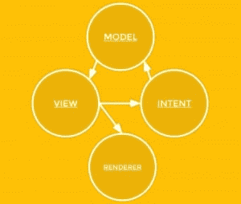
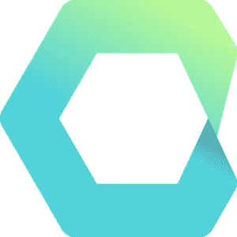

# 开发人员需要了解 MVI 的什么(模型-视图-意图)

> 原文：<https://thenewstack.io/developers-need-know-mvi-model-view-intent/>

[](http://www.meetup.com/London-JavaScript-Community/)

 [卢卡·梅扎丽拉

卢卡·梅扎丽拉是一位拥有 10 多年经验的热情的意大利解决方案架构师，谷歌开发专家，伦敦 Javascript meetup 的经理。Mezzalira 参与了移动(iOS、Android、Blackberry)、桌面、网络、电视、机顶盒和嵌入式设备的前沿项目。他花了很多时间学习和研究面向对象编程、函数式编程和函数式反应编程等主题。他定期向一些技术杂志和网站投稿，并且是 Packt Publishing、practical Bookshelf 和 O'Reilly 的技术评论员。最后，但同样重要的是，他是一位在过去 7 年里发表了 70 多次演讲的演讲者。](http://www.meetup.com/London-JavaScript-Community/) [](http://www.meetup.com/London-JavaScript-Community/)

如今，人们对反应式编程非常感兴趣，出现了许多嵌入这种新范式的新框架，以使用异步数据流并分离对象之间的通信。

如果你从未听说过“[反应式编程](https://thenewstack.io/typesafes-jonas-boner-how-reactive-programming-addresses-the-scale-out-problem/)”，我可以给你简单解释一下什么是反应式编程。先说反应式编程和 React.js 完全没有关系；反应式编程是一种试图解决程序内部处理异步数据流问题的范式。

这种范式对我们许多人来说可能听起来很新，但是深入挖掘一下，我们会发现反应式编程是基于两种非常熟悉的模式，比如观察者和迭代器模式。

> Intent 是一个组件，它的唯一职责是将用户输入事件转换成模型友好的事件。它应该解释用户在模型更新方面试图做什么，并将这些“用户意图”作为事件导出。安德烈·梅德罗斯

我真诚地认为，当我们开始接近这种范式时，主要的障碍是我们需要学习的新词汇，以理解我们可以用它做什么。像冷热可观测量、背压、溪流、弹珠图等词汇可能会在我们面前竖起一道屏障，但经过几个小时的练习，我们会发现很多这些新词汇都是基于非常熟悉的概念。

目前可用的最著名的库之一是[反应式扩展](http://reactivex.io/)，可用于几种编程语言，如 Swift、Javascript、Java、Scala、C#、Ruby 和许多其他语言。

当你在网上搜索关于反应式编程的例子和信息时，你可以从在线书籍、教程、指南等中找到很多资源。但是现在缺少的部分，或者更好的是没有太多讨论的领域，是如何以一种反应式的方式构造一个应用程序！

我花了几个月的时间试图理解是否以及如何用可观测量来构建一个端到端的应用程序，我发现 MVI(模型视图意图)架构模式背后的答案很少。

对于那些在 MVC ( [【模型-视图-控制器】](http://www.codeproject.com/Articles/25057/Simple-Example-of-MVC-Model-View-Controller-Design)应用程序设计方面受过良好教育的人来说，解释什么是模型和视图是多余的，但是你可能有兴趣理解“意图”是什么。

我想从第一篇(如果不是第一篇的话)关于这种架构的博客文章中得到最初的定义，在文章[“反应式 MVC 和虚拟 DOM”Futurice 博客](http://futurice.com/blog/reactive-mvc-and-the-virtual-dom)中，作者是 Andre Medeiros:“Intent 是一个组件，它唯一的职责是将用户输入事件转换成模型友好的事件。它应该解释用户在模型更新方面试图做什么，并将这些“用户意图”作为事件导出。它将“视图习惯用法”翻译成“模型习惯用法”根据定义，意图本身不会改变任何其他东西，因为任何其他典型的反应组件都不会。"

这个架构中的一个关键部分是理解这些不同的对象如何在它们之间进行通信，从而以一种反应式的方式构建应用程序。



首先要注意的是关于通信，从上面的模式中可以看出，通信是单向的。

在我看来，脸书最近与 JavaScript 社区分享的最好的模式之一是 Flux 架构模式。

Flux 不仅仅是一个集成了 [React](https://thenewstack.io/javascripts-history-and-how-it-led-to-reactjs/) 框架的库的名字。它可以创建一个很好的框架来处理我们的应用程序，但它也是与单向数据流性质相关的模式的名称，该模式允许轻松地构建和调试任何应用程序，而无需遵循传统事件驱动架构的复杂性，在传统事件驱动架构中，事件可以从不同的对象冒泡，而没有一致的逻辑。

现在让我们试着更深入地研究一下 MVI 机制；在 MVI 中，视图为意图公开一个可观察对象，以从视图中捕获所有用户交互，并通过可观察对象将数据传递给意图。目的是为模型准备接收到的数据，这些数据再次通过一个可观察对象传递给模型。最后但同样重要的是，模型保存这些数据并更新视图，向视图公开一个可观察对象。

从上面的模式中可以看出，视图不是呈现的 DOM 元素，但是在这种情况下，视图是虚拟 DOM 机制，它通过一个库(例如使用 React 或类似的库)准备要在 DOM 中呈现的数据。

这种架构继承了 Flux 的优点，增加了一种更强大的通过可观察对象在对象之间进行通信的方式。

如果你不熟悉可观测量，你需要知道它们有多灵活和强大。例如，您可以通过一个可观察对象主要向一个或多个观察者广播数据，合并不同的数据源，减少值，操纵它们等等。让我们从 [Staltz GitHub 库](https://github.com/staltz/mvi-example)中挑选一个基本的 MVI 例子，让我们试着理解 MVI 是如何实现的。

我建议首先看一下这个例子，以便更好地理解下面的代码。

为了关注所有不同的实体是如何连接在一起的，让我们看看 [binder.js](https://github.com/staltz/mvi-example/blob/master/src/utils/binder.js) :

```
module.exports  =  function  (model,  view,  intent)  {
if  (view)  {  view.observe(model);  }
if  (intent)  {  intent.observe(view);  }
if  (model)  {  model.observe(intent);  }
};

```

这是我们创建单向流的地方，观察视图中的模型、意图中的视图和模型中的意图。现在让我们来看看视图，检查一下视图的结构如何:

```
function observe(ItemsModel)  {
replicate(ItemsModel.items$,  modelItems$);
}

```

```
var vtree$  =  modelItems$
.map(function  (itemsData)  {
return  h('div.everything',  {},  [
vrenderTopButtons(),
itemsData.map(vrenderItem)
]);
});

```

```
module.exports  =  {
observe:  observe,
vtree$:  vtree$,
removeClicks$:  removeClicks$,
addOneClicks$:  addOneClicks$,
addManyClicks$:  addManyClicks$,
itemColorChanged$:  itemColorChanged$,
itemWidthChanged$:  itemWidthChanged$
};

```

在这种情况下，我只抓取了有趣的部分，因此视图将渲染委托给类似 React.js 的库。因此视图没有直接更改，但它只是准备虚拟树进行渲染，然后它将是另一个有效渲染 DOM 的对象。

请记住，MVI 架构的一个特点是，一个对象不应该操纵或直接调用另一个对象的任何方法；唯一允许的交流是通过观察！

变量末尾的美元符号($)表示存在分配给该变量的可观测量。

现在我们来看看这个意图:

```
function observe(ItemsView)  {
replicate(ItemsView.addOneClicks$,  inputAddOneClicks$);
replicate(ItemsView.addManyClicks$,  inputAddManyClicks$);
replicate(ItemsView.removeClicks$,  inputRemoveClicks$);
replicate(ItemsView.itemColorChanged$,  inputItemColorChanged$);
replicate(ItemsView.itemWidthChanged$,  inputItemWidthChanged$);
}

```

```
var colorChanged$  =  inputItemColorChanged$
.map(function  (inputEvent)  {
return  {
id:  Number(inputEvent.currentTarget.attributes['data-item-id'].value),
color:  inputEvent.currentTarget.value
};
});

```

```
module.exports  =  {
observe:  observe,
addItem$:  addItem$,
removeItem$:  removeItem$,
colorChanged$:  colorChanged$,
widthChanged$:  widthChanged$
};

```

从视图中可以看到每一个单独的可观察对象都是由观察者在意向中观察到的( [replicate](https://github.com/staltz/mvi-example/blob/master/src/utils/replicate.js) 是一个 util 方法来处理对可观察对象的订阅)。

如果我们检查 intent 中的 colorChanged observables，我们可以看到每次用户改变颜色时，intent 都在为模型准备数据，并通过一个将被模型监听的 observable 来分发这些数据。

最后一部分是模型:

```
function observe(ItemsIntent)  {
replicate(ItemsIntent.addItem$,  intentAddItem$);
replicate(ItemsIntent.removeItem$,  intentRemoveItem$);
replicate(ItemsIntent.widthChanged$,  intentWidthChanged$);
replicate(ItemsIntent.colorChanged$,  intentColorChanged$);
}

```

```
var colorChangedMod$  =  intentColorChanged$.map(function(x)  {
return function(listItems)  {
listItems[x.id].color  =  x.color;
return listItems;
};
});

```

```
var items$  =  itemModifications.startWith(
[{id:  0,  color:  'red',  width:  300}]
).scan(function(listItems,  modification)  {
return modification(listItems);
});

```

```
module.exports  =  {
observe:  observe,
items$:  items$
};

```

同样，我们在 observe 方法中从 intent 订阅了 observables，在 colorChangeMod observables 中，我们将颜色分配给 listItem 对象，该对象将是我们可以在演示中动态创建的组件的集合。

我们还公开了项目 observables 中的所有属性，这些属性准备好被视图拾取，视图将通过渲染器库呈现这些更改。

一个非常简单的单向流，几乎没有基本概念，在整个架构中共享和复制。

我不能说使用反应式编程和 MVI 很简单，但是在理解了基本概念之后，我可以向你保证，一切都会比第一次更有意义！

我猜你在想，是否有任何框架可以帮助你在使用 MVI 开发你的 web 应用程序时立刻变得高效。因此，我想给你你一直在寻找的答案:是的，有！

## Cycle.js



[Cycle](http://cycle.js.org/) 是一个全新的框架，由反应社区中最活跃的成员之一 [André Staltz](http://staltz.com/) 创建。

来自官网的定义是:“Cycle 的核心抽象是你作为一个纯函数 main()的应用，其中输入是来自外部世界的读取效果(源)，输出(汇)是影响外部世界的写入效果。外部世界的这些副作用由驱动程序管理:处理 DOM 效果、HTTP 效果等的插件。”

Cycle.js 是在“模块化”的思想下创建的，事实上，跨不同的应用程序创建和重用组件非常容易。为了做到这一点，Staltz 实现了 MVI 作为一个主要的架构模式来使用 Cycle.js 生成应用程序

我想强调 Cycle.js 中实现的几个有趣的方法:

*   不同架构实体之间的唯一通信是通过函数内部注入的可观察对象。
*   这是一个非常轻量级的库，有一个智能库系统，允许通过[驱动程序](http://cycle.js.org/drivers.html)以一种漂亮而简单的方式进行组合。
*   js 建议使用 [virtual-hyperscript](https://github.com/Matt-Esch/virtual-dom/tree/master/virtual-hyperscript) ，这是一个虚拟树的轻量级实现，具有像 React virtual dom 这样的强大区分系统。

您还可以决定对 Cycle.js 使用 React 而不是 hyperscript，因为所有视图状态都存储在模型中，并通过可观察对象与视图共享。

我还建议看一看 [GitHub 示例库](https://github.com/cyclejs/examples)，看看 Cycle.js 是如何工作的。

## 包裹

MVI 是反应式应用的“银弹”架构吗？现在还很难说，但这肯定是一个很好的实现，它很好地分离了关注点、封装并应用了适量的控制反转。

但是，这并不是 Javascript 世界目前唯一可用的反应式架构，请关注 [Calm^2](https://github.com/calmm-js/documentation/blob/master/introduction-to-calmm.md) (阅读“平静的平方”)和 [Tsers](https://github.com/tsers-js) ，它们可能是下一个“大事件”！

对于反应式编程生态系统和前端行业来说，这真是一个令人惊叹的时刻；我们才刚刚开始，在找到“完美”的方法之前，还需要发现和测试很多东西，但这才是乐趣的开始，对吗？我们正处于这场巨大风暴的中心，我们真的可以成为其中的一部分！

<svg xmlns:xlink="http://www.w3.org/1999/xlink" viewBox="0 0 68 31" version="1.1"><title>Group</title> <desc>Created with Sketch.</desc></svg>