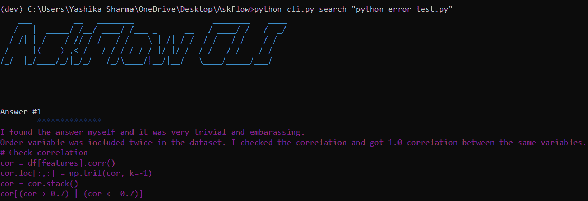

# 开发人员尝试将他们的 GitHub 提交转换成 NFTs

> 原文：<https://thenewstack.io/developers-try-turning-their-github-commits-into-nfts/>

一款名为 GitNFT 的新应用将把你的 GitHub 承诺转化为亲笔签名的(可拍卖的)NFT。简而言之:NFT 代表不可替代令牌，一种独一无二的、存储在区块链的数据块，证明某些相应数字资产的唯一性——这意味着它可以被拥有……和出售。

GitNFT 简单的价值主张？“签名并出售你的 GitHub 提交的 NFT，”推销 [GitNFT 的网页](https://gitnft.quine.sh/)。

“把你的贡献变成一段历史，解释你的杰作背后的脉络(或者只是你当时的心情！)"

不管这个想法有什么优点，也不管目前市场对一些早期产品看起来有多冷淡，这都是对开发者世界的有趣一瞥，也是对他们今天文化的自发快照。浏览 GitNFT marketplace 几乎可以随意看到他们选择保存的东西——或者至少是他们选择出售的东西——以及他们选择纪念的个人项目的种类。有些祭品可能是讽刺的、巧妙的，甚至是对他们第一次犯罪的衷心纪念。

但它们都在 OpenSea.io 上出售给任何感兴趣的买家。

## 迎接市场

OpenSea.io 网站称自己是世界上最大的不可伪造的令牌市场，GitNFT 会自动为它创建的每个 NFT 创建一个列表。“Git 提交存储了大量的收藏价值，或者是因为它们的历史意义，或者是它们内容的酷/美，或者是作者的受欢迎程度，”OpenSea 的 GitNFTs 页面报道，

" GitNFTs 让软件创作者提取价值."

是否有很大的价值有待挖掘还有待观察。在撰写本文时，有 100 个 Git commits 挂牌出售——但似乎只有本月挂牌的一些 NFTs 收到了投标——其中一些远低于卖方的最低标价。事实上，极少数销售似乎已经完成。一位名叫[的开发者欧内斯特·奥珀蒂特](https://www.linkedin.com/in/ernopp)开发了一个工具，这个工具[可以在 Twitter 上建议取消关注谁](https://github.com/ernopp/lessnoise)。在一次提交中，他添加了一个验证 GitNFT 盾图标。他现在已经把那个委托人作为 GitNFT 卖掉了。

胜出的报价是 0.002 以太币，相当于 7.96 美元。

另一名开发者 [Aashutosh Rathi](https://www.linkedin.com/in/aashutoshrathi) 向他的 [Invoicify](https://github.com/2AMDevs/invoicify-app) 账单应用出售了“在 UX 进行重大升级”的承诺，作为 0.01 以太坊(约合 39.70 美元)的 NFT。

但其他开发者仍在追求同样的梦想。大约一年前，在台湾台北，一位名叫[郝平](https://github.com/caaatisgood)的开发人员在 JavaScript 库 Luxon 的自述文件中发现了一个错别字。该文档将 Luxon 描述为“一个用 Javascript 处理日期和时间的库”郝平注意到 JavaScript 中的 S 没有大写，并在 GitHub 上提交了[一个修改来纠正它](https://github.com/moment/luxon/commit/631614ddce25ac4ec5b2dc77fdab370564516679)。

9 个月后，郝平将 GitHub 的委托转化为 NFT，挂牌要价 0.088 ETH(现在价值约 336 美元)。两天后，它的第一个报价来了，一个名为“r0dms”的用户提供 0.001 ETH(约 3.82 美元)。

两个月后，这仍然是唯一的出价——而且远远低于标价。因此，目前还不清楚郝平是否会获得加密货币的横财。

但这可能是可投资艺术品界第一次为一件名为“修复打字错误:JavaScript 到 Javascript”的作品招标。

## 以太疯狂

有趣的是，所有的价格都列在[以太坊](https://thenewstack.io/as-blockchain-hype-fades-developers-give-ethereum-a-serious-look/)中，这是一种数字货币，引起了加密货币投资者的极大兴趣；本周，它的价值飙升 500 美元，周五达到 3960 美元。《福布斯》指出，这比其 6 月下旬的价值翻了一倍还多，几位货币观察家告诉该杂志，至少部分繁荣可以归因于以太坊作为非金融交易的货币。

主持[“全街之狼”播客](https://www.thewolfofallstreets.io/)的加密投资人 Scott Melker 告诉《福布斯》说，非金融信托“正处于一个巨大的繁荣周期”，而[加密对冲基金](https://www.linkedin.com/in/jesseproudman/) [Strix Leviathan](https://strixleviathan.com/) 的联合创始人/首席技术官 Jesse Proudman 也提到了“对 NFT 领域的兴趣激增”

加密货币金融服务公司[瓦尔基里投资](https://valkyrieinvest.com/)的研究主管 Sean Rooney 告诉《福布斯》，“近几个月来，随着市场开始更好地理解现实世界的用例，非加密货币已经占据了中心位置。”

他补充说，“最初关于数字艺术的讨论已经转变为社区和艺术家和创作者使用可编程令牌的新经济。随着以太网价格的上涨，分散融资和非金融交易的轨迹也在上升。”

这一切意味着什么？早在 3 月份，《名利场》就认为这种现象源于比特币和更大的视频游戏文化世界:也就是说，“那些认为在电脑上挖掘和收集这些奇怪的小硬币很酷的书呆子，但他们现在是比特币的亿万富翁。

“真正的艺术世界(如果是这样的话)现在正得到与媒体、好莱坞、音乐产业、游戏、政治以及过去十年中被科技颠覆的其他所有产业相同的待遇。”

[巨蟒剧团](http://www.montypython.com/)的[约翰·克立斯](https://twitter.com/JohnCleese)甚至以 17.7814 ETH(70237 美元)的价格卖掉了布鲁克林大桥(或者至少是他在 iPad 上画的一个快速涂鸦)。尽管他对这个项目的称呼是“无名艺术家”，但他告诉《名利场》，NFT 显然更像是一种商品——另一种投资工具。他似乎更多的是困惑而不是热情，与杂志分享亨利·大卫·梭罗的名言“我们的发明往往是漂亮的玩具，会分散我们对严肃事物的注意力。”

## 供大于求

对 NFTs 的热情似乎并没有蔓延到 GitNFTs——至少现在还没有。但是希望是永恒的，一个名叫[林瀚·雅普](https://www.linkedin.com/in/codler)的瑞典开发商正在出售一个更老的承诺。他是比特币 PHP miner 的创始人，这是一款软件，它的变更日志中列出了两次变更:2011 年的第一次提交，以及 2013 年的一次更新。他自豪地将它的第一个承诺转化为 NFT，并在 8 月收到了. 05 ETH(约 190 美元)的出价。

不幸的是，他的挂牌价是. 3 ETH(约 1144 美元)。因此，也不清楚这次出售是否会带来意外之财。

本周仍在上市的 100 家非上市公司中，似乎只有 5 家收到了报价。这尤其有趣，因为 100 种非功能性食物中有 84 种甚至没有起始“目录”价格。

我不是经济学家，但似乎供过于求。

同样有趣的是，根据 OpenSea 的网页，这 100 个 NFT 仅仅是 49 个“所有者”的作品——表明每个所有者平均创建并列出两个 GitNFTs。即便如此，卖家似乎还是远远多于买家。

不过，看到开发人员决定与世界分享哪些承诺还是很有趣的。

一个 NFT 来自新德里的软件工程师 Yashika Sharma。虽然她的项目专注于神经语言编程、机器学习和数据科学，但她也构建了一个[命令行工具](https://github.com/yashika51/AskFlow)，它扫描代码中的错误，然后搜索[堆栈溢出](https://stackoverflow.com/)以获得建议。她正在推销她作为 NFT 在工具中添加了答案搜索功能的 commit。

目前还没有出价。事实上，OpenSea 还列出了每个列表获得的浏览量；写这篇文章时，夏尔马的《NFT》已经被浏览了…四次。

但是充满希望的拍卖还在继续。一个开发者正在列举他们对 FizzBuzz 的实现。另一个开发人员列出了他们创建自述文件的提交。林瀚·雅普还试图列出一个追踪新冠肺炎在瑞典死亡的 CSV 文件(他已经提交给瑞典疫情应对措施的源数据和工具库)。NFT 的称号？“添加 covid19_sweden_new_deaths.csv。”

OpenSea 说这个页面已经被浏览了三次。

但是你不得不佩服它的创造力。Jorge Rodríguez 是卡洛斯三世大学计算机科学专业的学生，他有一个 GitHub 存储库，里面有他在微积分、物理、线性代数和编程等课程上的所有笔记。两周前，他将自己的最后一次提交——计算机科学第三课的笔记——转换成了 NFT。它的挂牌价？. 02 ETH，约合 7，930 美元。(投标数量？零。)

另一个卖家是最近从加州大学伯克利分校毕业的 Ethan Chiu，他现在是 GitHub 软件工程师，从事 GitHub Actions 的工作。7 月，他将 PythonBuddy 的第一次提交列为 NFT，Python buddy 是他为编程语言 Python 编写的在线语法检查器。(Chiu 为交易笔名？ethanisbadatart。)他列出的交易价格为 1，000 ETH，略低于 380 万美元。

但目前还没有收到任何报价。OpenSea 表示，该页面已经被浏览了 14 次。

高中二年级学生 Ben Soyka 列出了他创建的 Python 包的第一个提交，“用于优雅地处理和生成密码。”在 OpenSea 上呆了近两个月之后，它没有收到任何出价，起拍价仍然是他最初列出的价格:0.0003 ETH——或者 1.13 美元。

但他已经做了另一笔交易。两周前，他已经为他的 [Gravify](https://github.com/bsoyka/gravify) Python 包(生成 Gravatar URLs)卖出了第一条评论的另一个 GitNFT。购买价格？0.0003 埃特(约合 1.19 美元)。

但无论拍卖发生什么，这些生活片段仍可能被永远保存下来。GitNFT 网站称，每个 NFT 也自动存档在[ar weave](https://www.arweave.org/)(git NFT 称之为“permaweb”的分散存储解决方案)。

因此，不管这些默默无闻的开发者的财富会随着他们最珍视的代码系列的出售而上升还是下降，区块链将永远记住他们。

* * *

## WebReduce

<svg xmlns:xlink="http://www.w3.org/1999/xlink" viewBox="0 0 68 31" version="1.1"><title>Group</title> <desc>Created with Sketch.</desc></svg>