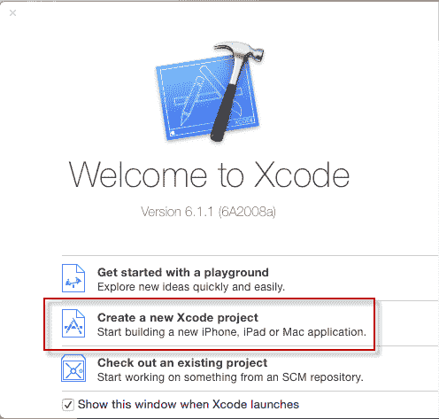
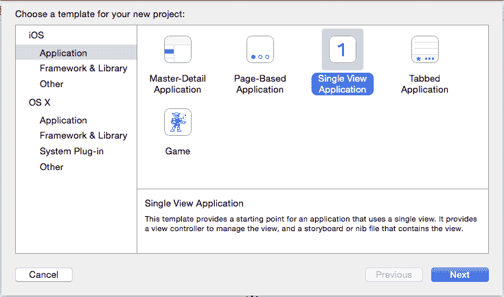
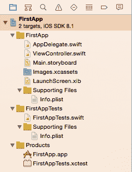
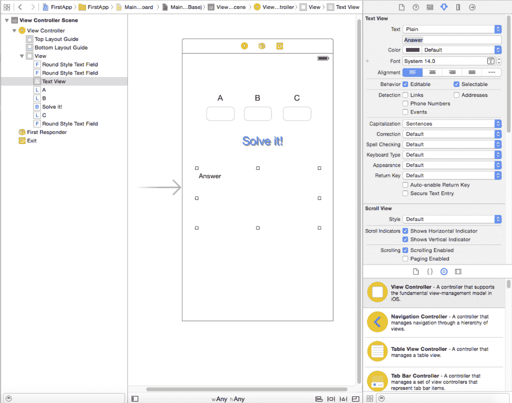
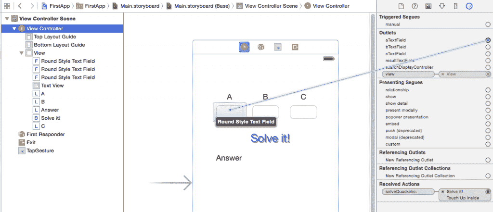
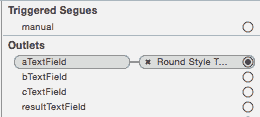

# 开发 Swift 应用程序

> 原文：<https://thenewstack.io/developing-a-swift-app/>

这是帮助您学习 Swift 的系列文章中的第一篇。在每篇文章中，我将开发一个完整的应用程序，源代码在 [Github](https://github.com/thenewstack/FirstApp "Link to FirstApp repository on Github") 上。我们将从头开始，假设你对 Swift 或 iOS 开发一无所知。

要编译和运行 Swift 应用程序，您需要一台运行 OS X 10.6 或更高版本的 Mac 电脑。你还需要下载并安装一份 [Xcode 6](https://itunes.apple.com/gb/app/xcode/id497799835?mt=12 "Link to Xcode 6 in iTunes") ，它可以在 Mac App Store 免费下载。它包括一个模拟器，是指定 iOS 设备的软件版本。这是一种非常方便的测试你的应用程序的方法，只要它不使用像相机这样的硬件。为此，你需要真正的硬件，如果你想在你的 iOS 设备(iPhone 或 iPad)上运行任何应用程序，你需要每年向苹果支付 99 美元，成为注册开发者。这也让你可以开发应用程序，并通过应用程序商店出售或免费赠送。不过还是先学会走路吧。

## Swift 的一些背景

苹果公司在 2014 年 6 月发布了 Swift，不久之后注册开发者就可以使用它了。它是一种强大的编程语言，吸取了 C#、Python、Google Go 等其他编程语言的精华。我会解释你需要知道的事情。Swift 比 Objective-C 更容易阅读，并且有其他优势，但是请记住，自 2008 年以来，开发者已经使用 Objective-C 创建了数百万个应用程序。

## 关于 iOS

这是 iOS 设备的操作系统，以前叫 iPhone 操作系统。你开发的任何应用程序都必须符合 iOS 否则当你开始运行它时，iOS 就会杀死它。这意味着你的应用程序必须在 17 秒内完成初始化和设置。从计算的角度来看，这是一段很长的时间。

在本文中，我们不会担心加速度计、摄像头、GPS 等。把 iPhone 当成一个简单的显示设备，当你触摸它时，它会做出反应。一旦你理解了这一点，那么处理硬件的其余部分就不那么困难了。

## 应用程序的架构

[](https://thenewstack.io/wp-content/uploads/2015/02/xcode.png) 
让我们从创建第一个 Swift 应用程序开始。打开 Xcode，点按“创建新项目”并选择“单视图应用程序”，然后点按“下一步”按钮。在下一个屏幕上，我调用了 FirstApp 应用程序，并将组织标识符设置为 com.thenewstack。语言默认为 Swift，设备默认为 iPhone。在接下来的屏幕上，选择您想要创建项目的位置，Xcode 会让您进入主屏幕。

[](https://thenewstack.io/wp-content/uploads/2015/02/select.png)

左栏显示项目文件。单击右箭头打开它。这两个底层产品将显示为红色，这意味着在您进行构建之前它们是缺失的。为此，请单击顶部菜单上的产品，然后单击构建。

[](https://thenewstack.io/wp-content/uploads/2015/02/projectfiles.png)

我把我的 iPhone 插上电源，所以它默认为这个型号，但是你可以通过点击 Xcode Windows 交通灯右边的 FirstApp >来指定模拟器 iPhone 型号。

[](https://thenewstack.io/wp-content/uploads/2015/02/xcode_top.png)

成功构建后，您可以通过单击绿色交通灯右侧的播放按钮来运行它。

因为我们还没有写任何代码，所以它做不了太多。这将是一个二次方程求解器。如果你有一个二次方程，它描述了一个多项式，比如 a*x^2 + b*x + c，我们想计算出对于一组给定的变量 a，b，c，x 的值是多少，其中二次方程的值是零。注意，要成为二次型，a 的值不能为零。

如果你理解这个有困难，一个二次方程可以在图表上被绘制成一条曲线，我们试图计算出在图表上曲线与 x 轴相交的位置。曲线(y，x)上的每一点都由 y= a*x^2 + b*x + c 定义，那么当 y 为 0 时，x 为？mathisfun.com 网站将绘制一条曲线，这样你就可以看到任何 a、b 和 c 参数的情况。

如果你懂数学，你会知道有一个等式可以解决这个问题。

```
x  =  (-b  +/-  Sqrt(b*b-4*a*c))/2*a

```

因此，我们的应用程序将接受 a、b 和 c 的值，然后或者求解 x，或者告诉我们它是否无法求解。+/-意味着答案中可能有两个值。即曲线在两个地方环绕并穿过 x 轴。分解成这两个方程。

```
x  =  (-b  +  Sqrt(b*b-4*a*c))/2*a

```

和

```
x  =  (-b  -  Sqrt(b*b-4*a*c))/2*a

```

明白了吗？我保证不再学数学了！

所以我们的应用程序会让你输入三个值，然后你点击一个解决它！按钮，它会显示答案。

为此，我们将使用四个控件。一个用于输入值的文本编辑栏，一个点按以计算的按钮，显示文本的标签和一个显示答案的文本区。

## 什么是故事板和笔尖？

如果你在左侧查看 Xcode 中的文件列表，你会看到 LaunchScreen.xib 和 main.storyboard。如果你右键单击其中一个文件，会出现一个菜单，如果你选择打开为，然后在子菜单上选择源代码，你会看到这两个文件都是 XML。这是一种文本文件格式，其中包含项目的层次结构。故事板可以让你描述一系列的视图控制器以及它们如何相互连接，是设计一个有很多屏幕的复杂应用程序的最好方法。一个 nib 文件让你定义一个屏幕控件，它被称为 nib，即使扩展名是. xib。

LaunchScreen.nib 是一个闪屏，当应用程序打开时你会看到它。它由两个文本字符串组成。使用打开方式打开它，但这次选择界面生成器 XIB 文档。您可以看到字符串，双击它们可以进入编辑模式并进行更改。

## 设计应用程序的用户界面

在界面构建器中打开 Main.storyboard，您应该会看到一个中间有三个图标的矩形。图标下方的区域代表屏幕区域。在我们做任何事情之前，让我们改变它的大小来代表 iPhone 的型号。

[](https://thenewstack.io/wp-content/uploads/2015/02/designer.png)

在屏幕右侧，您应该会看到六个图标。如果没有最右边的栏，请点按“视图顶部”菜单，然后点按“实用工具”和“显示属性检查器”。第一个图标看起来像一张纸，上面的角折叠起来，下一个是一个圆圈，里面有一个问号。选择第四个，向下的箭头。您应该看到模拟的指标和五个组合框。点按“大小”并选择您的手机。我的是 iPhone 5，所以我选择了 iPhone 4 英寸。改变它将会调整中间的矩形。

现在在屏幕的右下方，你会看到一串黄色的圆圈。这是一个视图控制器和视图的工具箱。视图只是控件的另一个名称。在工具箱下面，你会看到一个过滤框。在其中输入文字，你会看到现在列表中只有两个条目。文本字段和文本视图。

将文本框拖动到距离顶部大约一英寸的大空矩形上。现在再拖动两个，把它们放在第一个的右边，把它们隔开，这样它们就占据了大部分屏幕。设计师很有帮助，让你把它们排成一行，这样它们就都是水平的。现在将一个文本视图拖到屏幕区域，可能在文本字段下面一英寸处。使用拖动点，以便您可以拉伸它以适应整个屏幕。你会看到它充满了 Lorem ipsum 文本。

接下来，将过滤器文本更改为标签。在每个文本字段上方拖移一个标签，并在文本区域上方拖移一个标签。最后，将过滤文本改为按钮，并在文本字段下方和文本视图上方的某处添加一个按钮。

您可以构建并运行它，但它什么也不做，看起来也不怎么样，但我们会解决这个问题！

确保向下箭头图标(属性检查器)在右侧以蓝色粗体高亮显示。然后，当您选择一个控件时，您将获得该控件的所有设置。用鼠标选择第一个标签。你现在应该看到右边的单词标签和许多不同的设置。下面第二行是当你选择一个标签时标签显示的文本，所以单独选择每个标签并将其更改为 A、B 或 c。然后选择按钮并更改按钮文本来解决它！如果按钮文本消失，单击右侧中间抓取点并向右拉。还选择 Lorem ipsum 标签，并将文本更改为单词 Answer。

## 现在来看一些代码

我们必须从文本字段中获取输入，进行计算，然后更新文本区域。我们使用 outlets 或 IBOutlet 将可视控件连接到代码，以赋予它们正确的名称。首先让我们查看 ViewController.swift 文件的代码。在左侧，确保项目文件可见。如果他们没有选择 8 个图标中的第一个，它看起来就像一个文件夹。

我们将添加四个 IBOutlet 变量，一个用于 A、B 和 C，一个用于 TextView。Swift 是一种面向对象的语言，在 ViewController.swift 文件中有一个 ViewController 类。我们将在课后添加四个插座。

类 view controller:uiview controller {

@ IBOutlet var aTextField:UITextField
@ IBOutlet var bTextField:UITextField
@ IBOutlet var cTextField:UITextField
@ IBOutlet var result textfield:UITextView

另外我们会添加一个函数。在 Swift 和大多数其他编程语言中，函数是放置公共代码的地方，或者只是放置将做一些值得注意的事情的代码。在下面的清单中，这是现在代码的样子。Swift 函数的形式是 func，后跟一个名称，然后是任何输入参数和一个可选的返回值。下面的函数还没有返回任何值，但是我们稍后将使用另一个函数来完成这项工作。

前两个函数是所有 ViewControllers 都开始使用的标准函数。第三个是我添加的，开头有一个@ IBAction。这是需要的，因为当解决它！按钮，它调用这个函数。将每个文本字段和文本视图绑定到变量的粘合剂称为连接。这有点复杂，但经过练习，你会习惯的。

```
import UIKit

class ViewController:  UIViewController  {

@IBOutlet var aTextField  :  UITextField!
@IBOutlet var bTextField  :  UITextField!
@IBOutlet var cTextField  :  UITextField!
@IBOutlet var resultTextField  :  UITextView!

    override func viewDidLoad()  {
        super.viewDidLoad()
        // Do any additional setup after loading the view, typically from a nib.
    }

    override func didReceiveMemoryWarning()  {
        super.didReceiveMemoryWarning()
        // Dispose of any resources that can be recreated.
    }

    @IBAction func solveQuadratic(sender  :  AnyObject){    
        resultTextField.text  =  aTextField.text  +  bTextField.text  +  cTextField.text
    }

}

```

## 将控件连接到代码

在项目文件视图中选择 Main.storyboard，以便带有标签和文本字段的表单可见。在右边的列中选择第六个图标，一个包含指向右边的箭头的圆圈，并选择视图控制器。你会看到几个部分，但我们想要的是出口清单，应该在顶部附近。单击列表中第一个项目右侧的圆圈(应该是“文本字段”),并将其拖到 A 下的文本字段中，然后放开。

[](https://thenewstack.io/wp-content/uploads/2015/02/connecting.png)

现在，您应该看到第一个出口在文本字段周围有一个阴影椭圆，并且该圆已被填充。

[](https://thenewstack.io/wp-content/uploads/2015/02/outlets.png)

对 B 和 C 重复此操作，然后将 resultTextField 拖到答案标签上。最后，查看右侧栏的底部，找到已收到的操作。从圆中拖动一条线到 solveQuadratic 的右边来求解它！按钮。将出现一个浮动菜单—在里面寻找 Touch Up 并单击它。当您单击“求解”按钮时，它将调用 solveQuadratic()函数。此刻那个函数并没有解决问题，它只是把输入的三个数字一个接一个的组合起来。如果你输入 5，6，7 然后点击求解！，答案就变成了 567。

然而，我们正在开发一个可以工作的应用程序。有几个问题需要克服:做正确的计算，只输入数字，当点击“求解”按钮时隐藏键盘。让我们将输入限制为数字，因为目前它会弹出带有字母等的默认键盘。

选择一个文本字段，然后单击属性检查器图标(第四个)。向下看属性，你会看到一个键盘类型的组合。单击组合，并将其更改为数字和标点键盘，因为我们将需要像 3.5 或-7 的数字。不幸的是，我们也得到一堆其他的标点符号。有很多方法可以解决这个问题，但是太长了，无法包含在本教程中。

隐藏键盘很容易。只需将这一行添加到 solveQuadratic()函数中。

它告诉视图结束编辑，关闭键盘。

## 求解二次方程

我们将创建一个 quadraticSolver 函数，它将三个 doubles 作为输入，并返回一个包含答案的字符串。有几种可能的答案。

1.  如果 A 为零，则返回一条消息“请为 A 输入一个非零值”。我们不希望它被零除。
2.  如果 b*b > 4*a*c，那么我们得到两个值。
3.  如果 b*b 等于 4*a*c，那么只有一个答案，因为 Sqrt(b*b-4*a*c)是零，所以 x = (-b )/2a。
4.  如果 b*b 小于 4*a*c，那么我们面临的是求一个负数的平方根。这将我们带入复数的领域，我们将忽略该选项，只返回一条消息“答案有复数根”。

## 提取数字

这三个数字是以文本形式输入的，必须转换成双精度数。Swift 有 Float 和 Double 两种类型来处理浮点数，但我选择了 Double。最简单的方法是调用 C 标准库的一部分 [strtod 函数](http://www.tutorialspoint.com/c_standard_library/c_function_strtod.htm "Link to strtod function documentation")。不要担心这个问题，只需传入字符串和一个零作为第二个参数。现在我们有了三个 double 值 a、b 和 c，我们可以调用 quadraticSolver()函数并返回一个答案。

```
    func quadraticSolver(a:  Double,  b:  Double,  c:  Double)  -&gt;  String  {
        if abs(a)  &lt;  0.00001  {
            return  "Please enter a non zero value for A"
        }
        let b2_4ac  =  b*b  -  (4*a*c)
        if b2_4ac  ==  0  {
            let result  =  -b/(2*a)
            return  "There is one answer \(result)"
        }
        if b2_4ac  &lt;  0  {
            return  "The answer has complex number roots"
        }
        let sq  =  sqrt(b2_4ac)
        let root1  =  (-b  +  sq)  /  (2  *  a)
        let root2  =  (-b  -  sq)  /  (2  *  a)
        return  "Root 1 = \(root1)\nRoot 2 = \(root2)"
    }

```

第一行声明该函数有三个输入值，我再次称之为 a、b 和 c，以及声明的最后一部分，即在{声明它返回一个字符串之前的- >字符串。第一个 if 检查 a 是否不为零(或者在本例中非常小或为零)。如果使用“if value == 0.0”并且值非常小但不为 0，那么检查浮点或双精度变量是否为 0 或非常接近可能会有问题。这个检查捕捉到了这一点，并且 abs()函数调用确保它也能处理非常小的负数。

If 语句类似于其他语言，如 C、C++、C#或 Java，除了(a)你不需要括号，它总是需要大括号{ … }用于条件为真时运行的语句，以及(b)不允许没有大括号的单行 if。

b*b- (4*a*c)的值现在被计算并存储在变量 b2_4ac 中。请注意，Swift 非常喜欢在等号(=或==)周围有空格，因此如果您在一个-旁边得到一个错误，很可能是。

let 语句声明了一个不可变的变量，也就是说，一旦你给它赋值，它就不能被改变。如果你需要一个可变变量，也就是可以改变值的变量，用 **var** 而不是 **let** 来声明它。这个函数中使用的所有变量都不需要改变，所以使用 let。

像在 C 等等中一样，return 语句退出函数并返回一个指定类型的值。

语句“有一个答案\(结果)”将变量 **result** 转换成一个字符串，并将其插入到完整的字符串中。这被称为字符串插值，稍后会在函数中再次使用。“根 1 = \(根 1)\n 根 2 = \(根 2)”中的\ n 也将它分成两行。

您可能会发现对这个函数的调用看起来有点奇怪。

为什么是

```
let result  =  quadraticSolver(a,  b:  b,  c:  c)

```

而不是

```
let result  =  quadraticSolver(a,  b,  c)?

```

这是 Swift 的一个怪癖，显然源于 Objective-c。Swift 允许命名参数(b:和 c:)，但只有第一个参数有一个默认名称，其余的必须显式命名。

## 要尝试的值

试试 a=1，b=8，c= 16，它应该给出一个答案——4。而 a=1，b=-2 和 c=-3 应该给出 3 和-1 作为根。对于复数，使用 a=3，b= 1，c= 2。

<svg xmlns:xlink="http://www.w3.org/1999/xlink" viewBox="0 0 68 31" version="1.1"><title>Group</title> <desc>Created with Sketch.</desc></svg>