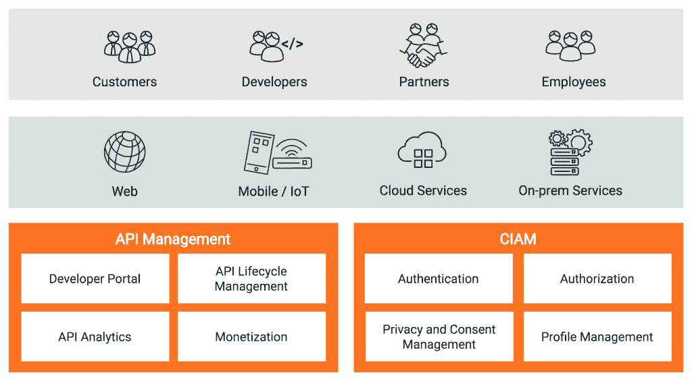
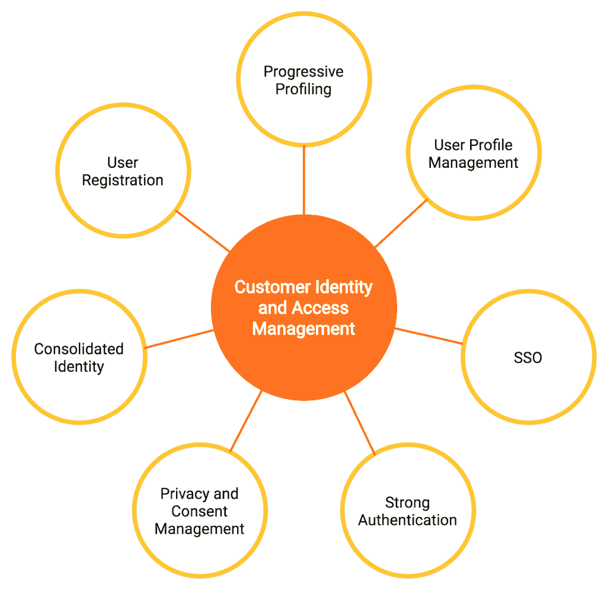
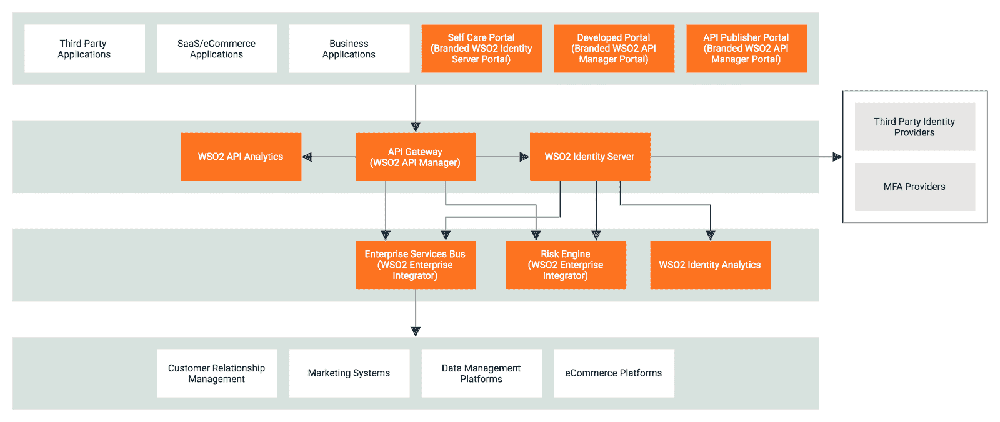

# 开发客户身份和访问管理(CIAM)解决方案

> 原文：<https://thenewstack.io/developing-customer-identity-and-access-management-ciam-solutions/>

[WSO2](https://wso2.com/) 赞助本帖。

 [马利蒂·埃迪里辛赫

Malithi 是 WSO2 身份和访问管理团队的高级技术主管。她加入 WSO2 家族已经 6 年了，为开源 WSO2 身份服务器的开发做出了贡献。她热衷于 IAM 标准和趋势，并帮助开发人员和专业人员简化和解决 IAM 需求。](https://www.linkedin.com/in/malithi-edirisinghe-8b712819/) 

*客户身份和访问管理(CIAM)将 IAM 的安全性与数字客户体验相结合。它使组织能够安全地捕获和管理所有来源和形式的客户身份和档案数据。*

看看手机上的天气 app。你有没有想过所有这些信息是如何实时输入和工作的？天气应用程序上的温度更新是前端微件和天气服务(例如，Weather.com)之间通过应用程序编程接口(API)进行数据交换的结果。今天的应用程序不再只在本地设备上运行。API 在任何地方都被用来连接由一个或多个应用程序提供者公开的服务，以增强应用程序功能、迎合业务用例并提供附加值。

考虑另一个来自优步的例子，它的成功在很大程度上归功于该公司在 API 集成和编排方面的优势。该应用程序依赖谷歌地图进行导航，这是该应用程序的一个关键和核心部分。( [*谷歌已经公开了超过 92 个 API*](https://www.vectoritcgroup.com/en/tech-magazine-en/software-trends-en/55-of-companies-use-apis-as-revenue-streams/)*——包括用于分析、日历和联系人的 APIs 这些 API 被许多其他应用和服务使用*)。同样，优步也提供自己的 API。这使得该公司的服务可以集成到其他应用程序中。[它的一些关键 API 消费者是](https://www.softermii.com/blog/uber-api-integration) Hinge、Expensify、OpenTable、Momento、星巴克、猫途鹰和联合航空。

企业正在使 API 成为其商业模式中的一个重要因素，利用它们为消费者提供增值服务并创造收入。它们允许公司以前所未有的规模与其他公司互动和共享信息。这不仅凸显了数字化转型努力的范围和深度，也显示了软件在我们日常生活中的影响。

## **API 管理**

随着 API 变得越来越重要，企业需要监控其使用情况的方法。公司还必须考虑一些方面，例如限制某些方的流量、提供安全性，以及通过创建、更新、删除和版本化 API 来管理它们。这就是 API 管理的用武之地。它主要涉及管理 API 的生命周期(即创建、测试、记录、发布、发现和货币化)。API 管理有助于通过访问控制、速率限制和使用策略来加强 API 安全性。它还提供对 API 使用情况的分析。

API 管理平台使内部和外部开发人员能够轻松安全地访问企业数据。这进一步增强了企业跨 web 和移动快速装载应用程序的能力，这些应用程序可能位于企业网络边界、云中或混合环境中。

## 为什么 CIAM 对 API 管理很重要？

应用程序的用户——需要从各种位置和设备进行访问——可以是客户、合作伙伴、员工、承包商和开发人员。为了保护和控制对应用程序和有价值数据的访问，必须小心管理上述角色的身份。

对于任何现代企业来说，客户便利、信任和忠诚是成功的关键驱动力。如果一家公司能够通过提供跨渠道的一致和便捷的用户体验来满足客户需求，确保隐私和安全，并遵守法规，人们将继续回到该业务。

API 使信息可访问，但是谁、何时以及哪些信息应该被访问是一个[身份和访问管理(IAM)](https://wso2.com/identity-and-access-management/) 问题，而 CIAM 产品是解决这个问题的专家。这就是为什么 [CIAM 解决方案](https://wso2.com/solutions/ciam/)应该与 API 管理平台集成的原因。

用户注册、社交登录、同意管理、用户档案管理、跨不同用户帐户和数据源整合单一身份以及品牌控制是 CIAM 将为 API 管理平台带来的一些关键功能。这使得数字企业能够通过快速利用数据、有效加入开发人员社区以及适应不断变化的客户和法规遵从性要求来满足敏捷性和安全性需求。图 1 显示了 CIAM 和 API 管理如何在数字业务中协同工作。

图 1:数字商业环境中的 APIM 和 CIAM

## **CIAM 的价值**

有效的 CIAM 解决方案使企业能够与客户建立联系，提供优化的体验，并保持长期关系。它还有助于控制访问和保护隐私和用户数据。

根据 [Gartner research](https://www.gartner.com/en/documents/3902470/key-features-for-customer-identity-and-access-management) 的调查，提供统一的体验、满足 360 度全方位客户视角的要求、替换自主开发的解决方案以及简化运营是推动数字业务对 CIAM 解决方案需求的关键因素。图 2 强调了 CIAM 解决方案的关键价值主张。

图 2:CIAM 的关键价值观

### **用户注册**

API 驱动的数字业务为外部开发者社区打开了 [API 市场](https://thenewstack.io/the-5-types-of-api-marketplaces/)，外部开发者成为企业 API 的消费者。此外，还会有由外部和内部开发人员构建的应用程序供客户使用。这两个角色都成为了最终消费者。他们应该有一个顺畅的在线注册流程，该流程针对他们的角色和需求进行了优化。复杂的入职流程会使用户流失，进而对业务产生负面影响。

CIAM 解决方案可以简化注册过程。它可以提供可定制的自助注册，企业可以利用它来提供优化的企业品牌注册。这也有助于根据人物角色收集最少量的信息。社交注册可以让用户通过外部身份注册，比如 GitHub、脸书、谷歌、LinkedIn 和 Twitter。这不仅简化了注册过程，还节省了时间。此外，成熟的 CIAM 解决方案可以与营销和 CRM 平台集成，以了解潜在客户，例如，从他们第一次匿名与企业互动开始，到他们访问网站和下载白皮书。当用户决定注册和使用服务时，这有助于改善注册体验。有了 CIAM 解决方案，企业可以通过简化的注册体验提高客户转化率。

在验证帐户时，为了平衡安全性和可用性，企业应该能够识别风险因素，并对高风险帐户实施复杂的验证技术，而不是对低风险帐户采取更宽松的方法。CIAM 的解决方案包括验证码验证(又名完全自动化的公共图灵测试，以区分计算机和人类)；使用电子邮件、电话和来自先前交互的基于知识的用户属性进行帐户验证；以及与身份验证平台的集成，以验证政府授权的文档(如身份证、护照、驾驶执照等)。

除了客户注册之外，全面的 CIAM 解决方案还可以帮助处理合作伙伴注册流程，通过与合作伙伴身份平台或委托管理相集成来支持 BYOID，其中提供了一个管理界面来代表用户创建、管理和删除用户帐户和密码。它还可以支持员工注册用例。

### **渐进剖析**

最终用户体验和隐私问题对当今的数字企业至关重要。出于营销目的和身份保证，企业希望基于服务请求和交互逐渐了解更多的客户。

例如，由于耗时的注册体验和隐私问题，在初始注册期间要求某人填写详细的表格会劝阻他们。仅在创建初始配置文件时收集名字、姓氏和电子邮件，然后请求其他信息(如职位、公司名称、送货地址等。)访问更多资源或服务时(例如，下载白皮书、访问数字内容或处理订单时)将有助于提供简化的体验。这也有助于逐步了解客户，并在需要时请求提供所需信息。CIAM 供应商通常支持渐进式剖析功能，具有构建业务独特流的可扩展性。

### 单点登录(SSO)

SSO 是 IAM 实现的一个常见特性。利用 OAuth/OIDC 协议实现 API 安全性的 API 管理解决方案也将提供基本的 SSO 功能。然而，IAM 提供了更多，全面支持所有标准联合协议，如 SAML、OAuth、OIDC、WS-Federation，以及跨多个身份提供者进行出站联合的能力。这为跨多个渠道和应用程序的用户提供了一致的登录体验。此外，有效的 IAM 实施支持跨应用程序和身份提供者的全面会话管理，提供单一注销功能，并支持为会话绑定访问授权令牌，例如，仅在会话活动期间提供访问。将 API 管理解决方案与 IAM 系统集成可以帮助组织安全地管理会话和令牌。

此外，CIAM 解决方案通常还提供帐户链接功能，支持更多面向客户的使用案例。在多种情况下，一个人可能会拥有多个账户。例如，一家保险公司的客户可能有多份保险单(如汽车、住房和人寿保险)，每份都由一个单独的用户帐户管理。或者，一个人可能使用多个社交身份登录到一个用户帐户。CIAM 解决方案可以通过将这些多个帐户与单个身份相关联，利用 SSO 和联合来实现统一的用户体验。

### **用户档案管理**

当客户身份和信息成为数字业务的核心时，提供自助服务功能非常重要，这样用户就可以管理自己的个人资料。他们应该能够查看和更新他们的个人信息、凭据和密码、带有帐户恢复首选项的安全配置文件、多因素身份验证首选项、同意书等。提供客户自助服务门户的 CIAM 解决方案可以轻松支持这些需求。

### **强认证**

基于 API 的数字化转型计划使内部和外部用户可以随时获得业务逻辑和数据。暴露在互联网上的每个应用程序和 API 都增加了攻击面。强身份认证是可以显著提高防止攻击几率的技术之一。通过向身份认证流程添加额外的身份认证因素层，未授权人员更难访问目标。与通常提供基本身份认证因素的 API 管理平台相比，IAM 供应商通过与领先的多因素身份认证(MFA)提供商进行经验证和受支持的集成，提供各种强身份认证因素，如软件令牌、硬件令牌和生物识别。

作为最佳实践，公司需要采用上下文和自适应身份认证流程来增强安全性。对于用户身份验证不会给用户带来不便的客户来说，这一点尤为重要。CIAM 解决方案可以提供无密码、自适应和基于风险的身份验证，支持基于请求、访问通道、用户属性和用户行为环境的多通道安全访问。此外，强客户身份认证现已包括在法规遵从性要求中，如 PSD2。

### **隐私和同意管理**

随着隐私法规(如欧盟的《GDPR》以及加拿大、巴西和加利福尼亚州的《消费者隐私法》)的兴起，客户同意和隐私管理正成为几乎所有企业的头等大事。由于这些法规，企业最终用户必须能够在注册时、在渐进式分析流程中，以及在与通过各种渠道访问的应用程序共享信息时给予同意。客户积极参与决定收集和共享哪些信息；他们应该能够管理个人资料中的同意和隐私设置，并查看哪些信息是共享的，与谁，何时和如何共享，并根据需要撤销。CIAM 解决方案实现了这些功能，并成为应该集成到处理个人身份信息的数字商业环境中的主要组件(PII)。

### **统一身份**

通过聚合各种数据源、营销和 CRM 系统中的身份数据，提供单一的客户视图是 CIAM 解决方案的附加优势。支持集成功能和连接器的 CIAM 供应商通过帮助企业构建全面的客户之旅，同时将所有身份属性整合到一个身份中，减少了集成的难度。

## **API 管理和 CIAM——一起变强**

图 3:集成的 APIM 和 CIAM 平台的参考架构

CIAM 和 API 管理不一定相互依赖；他们可以分开操作。然而，由于需要为合作伙伴建立一个数字生态系统，保持竞争优势，并满足日益增长的消费者需求，企业向开发人员和合作伙伴开放数据和应用程序。这一旅程为各种角色带来了越来越多需要管理的身份。最终，所有这些用户都希望通过多种访问渠道获得统一、一致的体验。他们还想要隐私和同意管理等功能；这些需求可以通过 CIAM 解决。图 3 显示了集成平台的参考架构。*请注意，我们仅使用 WSO2 的产品作为参考。*

开发 CIAM 解决方案越来越成为开发人员的任务，不再由传统的身份管理员管理用户帐户和访问权限。随着设备的激增、向数字化转型的转变以及更好地了解客户旅程的需求，身份和访问管理在使用开发人员友好的 CIAM 解决方案来理解身份数据方面发挥着关键作用。

通过 Pixabay 的特征图像。

<svg xmlns:xlink="http://www.w3.org/1999/xlink" viewBox="0 0 68 31" version="1.1"><title>Group</title> <desc>Created with Sketch.</desc></svg>