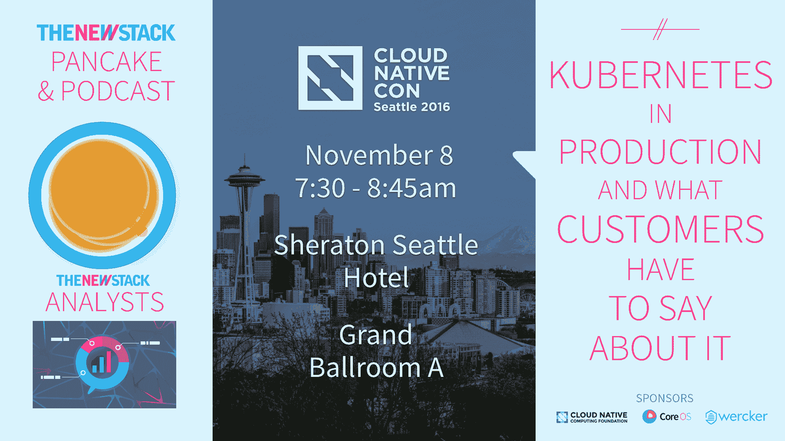

# 增加多样性不仅仅是边缘化群体的责任

> 原文：<https://thenewstack.io/developing-stronger-leadership-increase-diversity-openstack-community/>

在工作场所，女性经常面临“再证明一次”的偏见，她们必须反复证明自己的能力，这样才会被认真对待。作为过去四年来 [OpenStack](https://www.openstack.org/) 技术委员会的一员， [Anne Gentle](https://www.linkedin.com/in/annegentle) 已经遭遇了这些偏见。Gentle [在今天的](https://youtu.be/QmLgcMZ3tj4) [The New Stack Makers](https://thenewstack.io/podcasts/makers/) 播客中分享了她的经历，这是本周在巴塞罗那 OpenStack 峰会上录制的。

“我真的想寻找一种方法来增加技术监督委员会的多样性，”最近辞去委员会职务的 Gentle 说。“我们需要努力培养其他领导者。工作的一半应该是如何让别人成长为那个角色。”

[鼓励 IT 多元化:专访 OpenStack 的 Anne Gentle](https://thenewstack.simplecast.com/episodes/encouraging-it-diversity-an-interview-with-openstacks-anne-gentle)

近年来，科技行业日益多元化已经从讨论变成了行动。1985 年，37%的计算机科学毕业生是女性。这一数字多年来一直在下降，根据国家教育统计中心的数据，如今女性只获得了 18%的计算机科学学位。

在 [OpenStack Austin 2016](https://www.openstack.org/summit/austin-2016/summit-schedule/events/8723) 上，由 [Bitergia](https://bitergia.com/) 的[Daniel Izquierdo CORTázar](https://es.linkedin.com/in/dicortazar)进行的一项最新研究发现，女性占 OpenStack 社区的 11 %,自 2011 年以来仅增长了 0 . 5%。女性占 OpenStack 提交量的 9%，高于 2011 年以来的平均 6.8%。

改变这些数字不仅需要女性参与这些社区，还需要那些处于权力和特权地位的人在技术领域为女性腾出空间，信任她们的技能，并允许她们发挥领导作用。

Gentle 白天是思科的技术产品经理，她之前曾与 NodeJS 社区中的女性讨论过多样性问题，她们是跨性别社区的成员。他们提到，打破对社区及其项目做出贡献的障碍可能很困难。特别是，如果男性是女性积极贡献代码的项目的维护者，他们的贡献通常会被完全抹去或忽略。

[https://www.youtube.com/embed/QmLgcMZ3tj4?feature=oembed](https://www.youtube.com/embed/QmLgcMZ3tj4?feature=oembed)

视频

Gentle 继续指出，打破这些障碍仍然会让人们措手不及，如果他们不知道他们在社区内互动时必须考虑他们特殊的特权地位——即使他们已经处于专注于增加多样性的领导角色。

“在过去的几年里，我一直在为此挣扎。我是香港技术委员会的成员之一。在会议结束时，有人在观众中站起来说，“我们在亚洲，我没有看到任何亚洲人，”我坐在那里，感觉每个人都在看着我，好像在说“你想回答这个问题吗？”我愣住了，”温柔说。

增加社区多样性不仅仅是边缘化群体成员的责任。支持还必须来自盟友，他们应该赋予边缘化群体权力并扩大他们的声音，甚至有时甚至不惜牺牲他们自己的投入。

培养他人的才能对项目整体利益至关重要。

“一对一的导师项目在这方面非常成功。看看[皮拉迪斯](http://www.pyladies.com/)的成功，他们说得很清楚，“这是专门为女性准备的。”有些推广活动需要针对你要接触的群体。其他人则希望有一个核心的同盟团体，希望能带来新的教学人员，并真正让他们更上一层楼，”温柔说。

思科和 GoDaddy 是新堆栈的赞助商。

<svg xmlns:xlink="http://www.w3.org/1999/xlink" viewBox="0 0 68 31" version="1.1"><title>Group</title> <desc>Created with Sketch.</desc></svg>