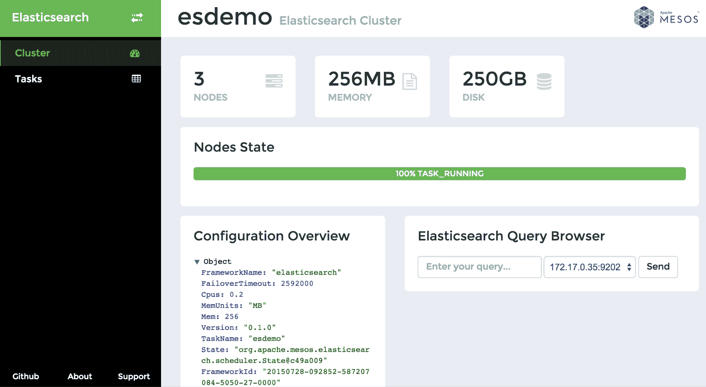

# 为 Mesos 框架开发用户界面以及为什么需要它们

> 原文：<https://thenewstack.io/developing-user-interfaces-for-mesos-frameworks-and-why-they-are-needed/>

Mesosphere 的 [DCOS](https://mesosphere.com/product) 允许使用数据中心，就像它是一台单独的机器一样。它有一个图形用户界面，人们可以从 web 浏览器安装框架和管理数据中心资源。但是对于 Mesos 框架本身的用户界面呢？

## 三个责任领域

如果我们退后一步，从更高的层面来看一个正在运行的 Mesos 集群，我们可以看到有三个主要的责任领域:

*   **资源管理:**这是 Mesos 自己的责任。它确保在每个时间点，运行在集群上的应用程序从 CPU 和内存池中获得足够的处理器和内存，这些处理器和内存由集群中的 Mesos 从设备提供。

*   **应用:**我们的应用是 web 服务器、数据库、批处理作业、数据分析等。在将 Mesos 引入我们的系统之前，我们可能已经在运行这些程序了——它们是这个行业的支柱。

*   **框架:** Mesos 框架是 Mesos 和应用程序之间的层。他们负责启动和扩展应用程序，执行运行状况检查，并对影响其运行的各种情况做出响应。框架可以理解为分布式系统内核(一种虚拟化数据中心)和应用程序之间的集成层。

请注意，除了这三个方面，有时 Mesos 集群中还有其他组件——重叠或互连框架和应用程序，例如分布式服务发现，如 [Zookeeper](https://zookeeper.apache.org/) 或[consult](https://www.consul.io/)，或配置管理工具，如 [etcd](https://github.com/coreos/etcd) 。

## 为什么 Mesos 框架需要图形用户界面

Mesos 本身带有一个 GUI，它传达了当前和已完成任务的列表、资源提供和已安装框架的列表。它还允许用户从浏览器访问日志。Mesos GUI 相当简单(单色显示器用户，您不会错过这里的任何东西)，但它确实实现了它的目的。它不提供任何关于框架健康、性能或特性的信息。它只显示提供给不同框架的资源量。这是正确的，因为框架代表了系统中的另一个责任领域。

然而，作为一个 Mesos 框架的用户，我希望能够快速浏览框架的状态，突出显示重要的指标，因为这使我更容易决定采取什么步骤来实现平稳的操作和更长的正常运行时间。我还希望能够看到框架最近的表现；触发应用程序的缩放；或者快速找到在框架上运行的应用程序的主机名、IP 地址、端口或端点。我可能希望可视化数据，以便看到我在日志或概览表中无法识别的趋势和模式。

我们通常专注于为最终用户提供良好的界面，这就是为什么老年人和年轻人都可以在长途航班上使用机上视频系统。然而，也许因为系统操作员知道他们在命令行上的方式，我们忽略了像 Mesos 这样的系统软件的用户体验。然而，如果好的界面能让最终用户快速做出决策是合乎逻辑的，那么好的界面也能让运营商快速做出决策也是合乎逻辑的。在一个日益复杂的世界中，随着我们转向分布式、分散化和更集中的服务，快速获得系统概况的能力不仅是一个不错的功能，而且实际上是一个关键任务。

[](https://thenewstack.io/wp-content/uploads/2015/07/image003.png)

Elasticsearch Mesos 框架的 GUI

## 框架内的 GUI 应用程序

每个 Mesos 框架由两部分组成:调度器和执行器。调度程序就像一个框架的大脑；它与 Mesos 通信并实现其大部分逻辑。执行人是代理人；它被分发给 Mesos 从设备，支持框架和它所服务的应用程序之间的通信。很自然，因为所有信息都在一个点上通过大脑，所以所有现有的 Mesos 框架都实现了一个 GUI 应用程序，它本质上是一个 web 应用程序，作为调度程序的一部分。

例如，在与思科云基础设施服务的[肯·欧文斯](http://blogs.cisco.com/author/kennethowens)团队合作构建的 [Elasticsearch Mesos 框架](https://github.com/mesos/elasticsearch)中，基于 [Spring Boot](http://projects.spring.io/spring-boot/) 的 GUI 应用程序作为调度程序的主要方法
的一部分启动

```
public void run(String[]  args)  {
       checkEnv();
       try  {
             parseCommandlineOptions(args);
        }  catch  (ParseException  |  IllegalArgumentException  e)  {
             printUsageAndExit();
              return;
        }
        final ElasticsearchScheduler scheduler  =  new ElasticsearchScheduler(configuration,  new TaskInfoFactory());
        HashMap&lt;String,  Object&gt;  properties  =  new HashMap&lt;&gt;();
        properties.put("server.port",  String.valueOf(configuration.getManagementApiPort()));
        new SpringApplicationBuilder(WebApplication.class)
                .properties(properties)
                .initializers(applicationContext  -&gt;  applicationContext.getBeanFactory().registerSingleton("scheduler",  scheduler))
                .initializers(applicationContext  -&gt;  applicationContext.getBeanFactory().registerSingleton("configuration",  configuration))
                .showBanner(false)
                .run(args);
        scheduler.run();
     }

```

这里，Spring Boot web 组件负责服务于基于 AngularJS 的 [web 应用和 RESTful API。如您所见，我们传递的唯一参数是 TCP 端口号。](https://github.com/mesos/elasticsearch/tree/master/scheduler/src/main/resources/public)

## 从设计良好的 API 开始

许多 Mesos 框架 GUI 都是作为浏览器内应用程序开发的，这些应用程序是使用 Javascript 和(通常是 RESTful)框架 API 编写的。这种方法的优点是 GUI 和框架功能之间是松耦合的。实际上，这意味着 GUI 可以被替换，很容易在其他框架中重用(只要它们遵循 API 设计中的一些标准，这是它们最终应该遵循的)，最后但同样重要的是，API 可以由框架的 CLI 工具使用。

举个例子，Elasticsearch Mesos 框架 REST API 目前有这两个端点:

返回集群已知的所有弹性搜索任务的数组:

```
[
 {
   "hostname":  "example4.nodes.cluster",
   "http_address":  "172.18.58.139:9203",
   "id":  "hJLXmY_NTrCytiIMbX4_1g",
    "name":  "example4",
   "started_at":  "2014-11-11T08:40:51.620Z",
   "state":  "TASK_RUNNING",
   "transport_address":  "172.18.58.139:9303",
    "version":  "0.1.1"
 }
]

```

和第二个 API 端点 **GET /v1/cluster** ，返回集群名称和配置:

```
{
  "name":  "my_elastic_cluster",
  "configuration":  {
    "Cpus":  "0.2",
    "Disk":  "250",
    "DiskUnits":  "GB",
    "FailoverTimeout":  "2592000",
    "FrameworkId":  "20150707-102016-1006637484-5050-1-0000",
    "FrameworkName":  "elasticsearch",
    "ManagementApiPort":  "0",
    "Mem":  "512",
    "MemUnits":  "MB",
    "NumberOfHwNodes":  "3",
    "State":  "org.apache.mesos.elasticsearch.scheduler.State@5afac135",
    "TaskName":  "esdemo",
    "Version":  "0.1.1",
    "ZookeeperUrl":  "zk://zookeeper:2181/mesos"
  }
}

```

这意味着我们可以轻松地将 GUI 连接到 Elasticsearch 框架，如上所示，或者将我们的 CLI 连接到该框架。

## 将 Websockets 用于实时数据流

在 GUI 开发过程中，您很快就会发现，您想要显示的大量信息实际上是动态的。节点被创建和删除，性能指标不断变化，不断升级等等。轮询策略(定期向服务器请求更新)的一个很好的替代方案是使用 [websockets](https://developer.mozilla.org/en-US/docs/Web/API/WebSockets_API) 并在事件发生时将事件从服务器推送到浏览器。

## 结论

现在很多开发者都在开发 Mesos 框架。这些开发人员首先关注功能、安全性和稳定性。在这篇文章中，我试图引入几个论点来解释为什么高质量的图形用户界面对于框架的可用性和成功是至关重要的。我们还看到了将 web 应用程序挂接到 Mesos 框架的调度器组件是多么容易。在 Container Solutions，我们相信一个设计良好的接口可以更好地采用 Mesos 框架，我们希望随着时间的推移和我们获得更多开发框架的经验，围绕这个主题完善我们的想法。

Jaroslav 就职于 [Container Solutions](http://container-solutions.com/) ，该公司与思科合作开发了用于 Elasticsearch 的 Mesos 框架。值得注意的是，Jaroslav 将出席 9 月 10 日至 11 日在阿姆斯特丹举行的另一种会议 Software Circus。会议主题是可编程基础设施。但这不仅仅是一个软件会议。这也是一个音乐节。会有马戏团表演。不会是在酒店的地下室会议室。我们要去看软件马戏团，Jaroslav 也是，他说他很乐意在啤酒边的篝火旁讲述他为分布式系统构建用户界面的故事。

思科是新堆栈的赞助商。

专题图片:Micolo J 的《在框架上》由 2.0 在 [CC 下授权。](https://creativecommons.org/licenses/by/2.0/)

<svg xmlns:xlink="http://www.w3.org/1999/xlink" viewBox="0 0 68 31" version="1.1"><title>Group</title> <desc>Created with Sketch.</desc></svg>