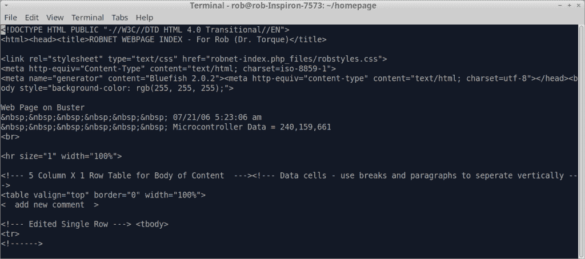
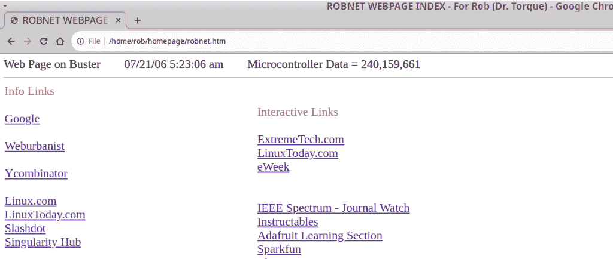
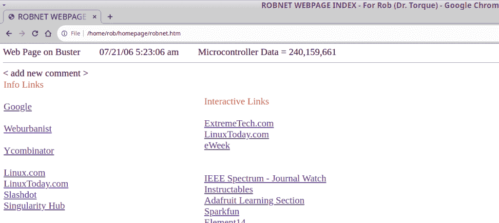

# 开发:基本的 git 分支、交换和合并

> 原文：<https://thenewstack.io/development-basic-git-branching-switching-and-merging/>

[Torq 博士](https://thenewstack.io/author/rob-reilly/)

 [Rob (drtorq) Reilly 是一名独立顾问、作家和演说家，专门研究 Linux/OSS、物理计算、硬件黑客、技术媒体和 DIY/Maker 运动。他为个人客户和公司提供各种工程、商业和特殊项目服务。作为科技媒体的资深人士，Torq 博士已经为顶级科技媒体和印刷媒体发布了数百篇长篇文章。他还在 OSCON 和其他行业场合发表过技术演讲。](https://thenewstack.io/author/rob-reilly/) 

开发代码和内容时，在将任何东西投入生产之前，原型化新功能、修复错误和测试是一个常规过程。直接编辑好的工作代码是有问题的，因此在进行更改时切换到一个替代的、临时的代码环境是一个可行的方法。在 [git](https://git-scm.com/) 中，这个过程叫做分支。稍后，在完成更改后，使用 git 合并将代码带回生产工作流。

我认为一个简单、直接的例子是演示如何在 git 环境中编辑我的个性化 HTML 主页。这个页面只不过是一组有趣的链接，当我浏览我的日常信息收集和 R&D 网页浏览习惯时，很容易点击进入。我喜欢包括每日或每小时更新的网站，如 [YCombinator](https://news.ycombinator.com/news) 、 [Hack-A-Day](https://hackaday.com/) 、 [All3DP](https://all3dp.com/) 和 [the Drudge Report](https://www.drudgereport.com/) 。您可以将链接指向任何类型的资源。多年来，这个文件一直保存在我的个人网站上，因此可以很容易地从任何设备上使用标准的互联网网址获取。几年前我拆除了这个网站。现在，我只是在我的 Linux 笔记本和 Android 手机上本地保存副本。该页面每年或根据需要更新四次有趣的新链接。

今天，我们将看看在主页文件上使用基本的 git 分支和合并过程。

## 编辑我的主页

我的个人主页使用一个名为“robnet.htm”的文件。它位于我的 Linux 笔记本的 home 目录下的一个名为“homepage”的子目录中。因此，我的 Chrome 笔记本浏览器中的主页按钮指向本地的“/home/rob/homepage/robnet.htm”文件。

第一步是初始化 git 环境。我在 Linux 终端中用常用的 git 命令字符串做到了这一点。

`rob% cd homepage
rob% git init
rob% vi robnet.htm
rob% git add robnet.htm
rob% git commit -m "initial save for robnet.htm under git"` 

我从另一个位置将原来的 robnet.htm 文件复制到主页目录，并从那里开始编辑。

要开始编辑主页的临时工作“副本”,使用 git branch 命令。您可以使用-a 选项查看当前已有的分支。

`rob% git branch -a`

此时，列表只显示主分支。现在，让我们添加一个测试分支。

`rob% git branch test
rob% git branch -a` 

请注意，打印输出显示了“主”和“测试”分支。

如果您单击主页按钮，在浏览器中，原始内容会出现，因为 git 仍然指向 robnet.htm 文件的主分支版本。

创建了新的分支，您必须使用 git switch 命令将分支指针移动到新的分支。在任何时候，你都需要一段时间才能直观地意识到你的分行位置。您可以随时使用“git 状态”来显示您的分支位置。

`rob% git switch test`

接下来，编辑 robnet.htm 文件，为可见注释添加一行文本并保存文件。

`rob% vi robnet.htm`

显示添加的新注释的 vi 会话

回到浏览器，点击刷新按钮。请注意，新的注释现在显示在浏览器页面上。记住，我们正在“测试”分支上工作。

像往常一样，添加并提交更改。

`rob% git add robnet.htm
rob% git commit -m "added visible comment to robnet.htm file"` 

切换回“主”分支并刷新浏览器。

`rob% git switch master`

Chrome 浏览器中的 robnet.htm 文件，指向“主”分支

请注意，最近添加的注释消失了，文件以未编辑的原始形式出现。切换回“测试”分支并刷新浏览器。

`rob% git switch test`

Chrome 浏览器中的 robnet.htm 文件，指向“测试”分支

你看怪不怪评论回来了。git 只是移动了一个反映在文件名中的指针(针对 robnet.htm 内容)。我最初对这个概念有相当大的困难，因为我习惯于用独立的目录和文件来思考，尽管这是一回事。试着保持“git”环境的心态，这样做几次就更容易记住了。

好了，再次切换回“主”，刷新浏览器。

`rob% git switch master`

正如您所料，注释仍然没有出现，因为我们正在对“test”分支进行编辑。在您将“测试”分支合并回工作流之前，“主”分支不会发生任何变化。

发出一个 git merge 命令，使用分支名称从“test”分支中获取变更。

`rob% git merge test`

现在刷新浏览器，评论就神奇地出现了。在“测试”分支中所做的更改现在被集成回“主”中。

因为我们不再需要测试分支，所以移除该分支是安全的。传统上，当变更、测试和最终批准完成时，该分支将被删除。

`rob% git branch -d test`

验证分支是否消失。

`rob% git branch -a`

太好了，只有“大师”再次出现在列表中。当然，浏览器的主页按钮也指向“当前”主 robnet.htm 文件版本。

## 包裹

git 中的分支对于为代码和内容构建操作设置开发、原型和测试环境非常有用。一开始，我觉得使用起来有点混乱。如果你使用触摸式输入，手动执行命令将有助于开发你对工作流程的肌肉记忆。

过一会儿，您可以切换到使用内置的 Linux 历史回忆功能。不要第 423 次输入每个 git 命令，而是点击向上/向下箭头，同时在 Linux 命令行中调用各种 git 字符串并节省一些时间。

嘿，我应该把我的 robnet.htm 文件放在 GitHub 或 GitLab 上，因为我目前没有个人网页。然后，我可以再次从任何地方访问我的“主页”。

* * *

*在[doc@drtorq.com](mailto:doc@drtorq.com)或 407-718-3274 联系 [Rob "drtorq" Reilly](/author/rob-reilly/) 咨询、演讲约定和委托项目。*

<svg xmlns:xlink="http://www.w3.org/1999/xlink" viewBox="0 0 68 31" version="1.1"><title>Group</title> <desc>Created with Sketch.</desc></svg>