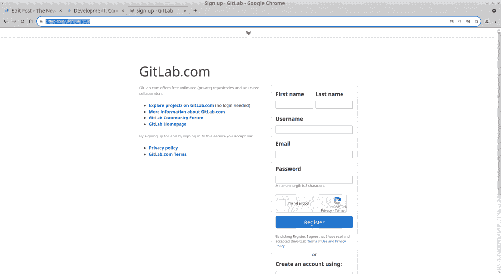
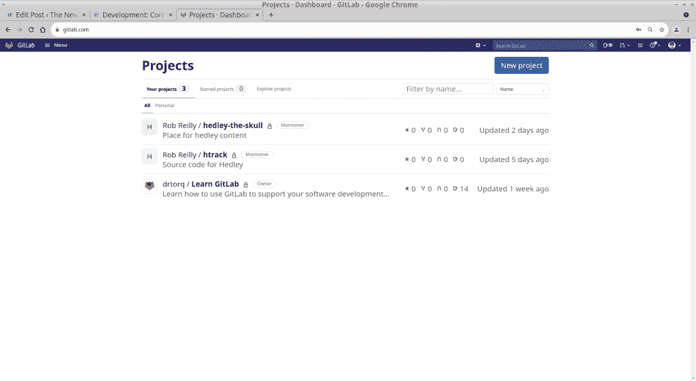
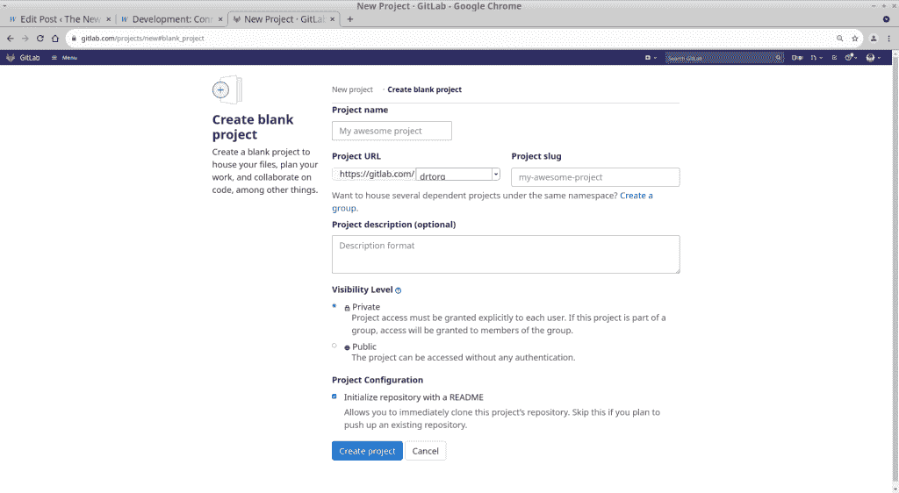
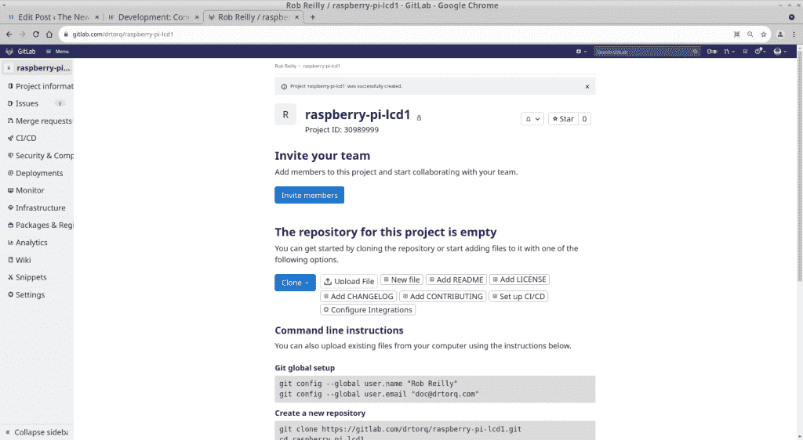

# 开发:为小项目连接 git 到 GitLab

> 原文：<https://thenewstack.io/development-connect-git-to-gitlab-for-small-projects/>

git 分布式版本控制系统与各种在线服务协同工作，提供内容存储和多人访问。我们最近[介绍了如何设置和使用流行的 GitHub 服务的基础知识](https://thenewstack.io/development-connecting-git-to-github-for-small-projects/)。 [GitLab](https://about.gitlab.com/?utm_content=inline-mention) 是另一个常用的服务。GitLab 是今天文章的主题。

从命令行使用 GitLab 存放内容相当简单。

## GitLab 上设置的新用户

以新用户身份进入 [GitLab 主注册页面](http://gitlab.com/users/sign_up)。

GitLab 新用户页面

*   点击蓝色登录按钮正下方的“立即注册”。
*   在 GitLab 主注册页面上，输入以下内容:
    1。名字
    2。姓氏
    3。您想要使用的用户名
    4。您的电子邮件地址
    5。您想要的密码
*   勾选“我不是机器人”框，解决视觉难题。
*   点击蓝色的“注册”按钮。
*   接下来，检查你的电子邮件确认信息。
    点击电子邮件中的“确认您的帐户”链接。
*   返回到您的网络登录并输入您的密码。
*   按下蓝色的“登录”按钮。

将出现“欢迎来到 GitLab，[您的姓名]”页面，您可以输入您的角色、职务、谁将使用这个 GitLab 帐户等等。完成后，按蓝色的“继续”按钮。

至此，基本的 GitLab 帐户已经设置好，可以使用了。

## 建立新的 GitLab Repo

新的 GitLab 用户帐户详细信息确定后，就该建立存储库了。对我来说，这个任务定义模糊不清，因为 GitLab 将存储库称为“项目”，这可能会让一些读者感到困惑。但是添加一个新的库为将你的软件源代码和其他内容上传到 GitLab 服务器铺平了道路。

我的 GitLab 项目页面

当你第一次使用你的用户名和密码登录 GitLab 时，你将进入你的“项目”页面。您当前的存储库将显示为一个列表。单击突出显示的标题，直接转到存储库。要启动一个新的存储库或 GitLab 称之为项目，请按屏幕右上角的蓝色“新建项目”按钮。

在 GitLab 创建新项目页面上，选择“创建空白项目”链接。在“创建空白项目”页面上输入以下信息。

创建新项目(存储库)页面

*   在相应的文本框中输入项目(存储库)名称和可选描述。我使用了“海德利头骨”和“赫德利头骨内容的空间”。
*   选择您的可见性级别，私有或公共。
*   我还建议取消选中“用自述文件初始化存储库”框，这样就不会导致从 Linux 笔记本命令行进行初始内容推送时出现问题。git 有时会抱怨在线存储库已经初始化，新用户不知道如何修复它。只要确保新的网上回购是空的就可以了，以免麻烦。
*   按下蓝色的“创建存储库”按钮。

新创建的 GitLab 项目(存储库)页面

您的新项目(存储库)页面将会出现。向下箭头，您将找到关于如何使用命令行将内容从 Linux 笔记本上传到 GitLab repo 的便捷说明。您还可以在“此项目的存储库为空”标题下使用基于 web 的工具。

请注意，您的存储库将出现在 https://git lab . com/[您的用户名]/[项目名]中。例如，我的新存储库将是 https://gitlab.com/drtorq/hedley-the-skull.

## 向 GitLab 提交一份报告

从命令行将内容发送到 GitLab 类似于任何其他 git 服务。

在本地 Linux 笔记本机器上:
使用您选择的名称创建并移动到新的 repo 目录。
`drtorq%: mkdir [name of your new repo directory]`
`drtorq%: cd [name of your repo directory]`

使用文本编辑器或 vi 创建几个新的文本文件，file1.txt，file2.txt，file3.txt
`drtorq%: git init`

设置远程链接到你的 GitLab repo:
`drtorq%: git remote add origin [your gitlab repository]`
做你的文件添加。
`drtorq%: git add .`
做你的承诺。
`drtorq%: git commit -m “Initial commit”`

如果我尝试在这里做一个常规的 git 推送，我会得到一个错误。我发现使用下面一行就解决了问题:
`drtorq%: git push --set-upstream origin master`
→用户名:[我的 GitLab 用户名]
→p/w:[我的 GitLab 密码]

最后，使用常规的 git push 来同步 GitLab 服务器上的内容。

在浏览器上编辑文本文件，就像在 GitHub 中一样。

从 Linux 笔记本中将变更下载到存储库也同样简单。

`drtorq%: git pull origin`
→用户名:
→ p/w:

对 GitLab 存储库上的文件进行一些编辑，看看它们在一个 pull 请求后如何反映在本地 Linux 笔记本 git 存储库文件中。

还要注意，一旦 GitLab 存储库中有了文件，菜单界面就会改变。如果没有文件，您将被要求邀请其他人加入您的回购，并上传或创建一些新文件。在 Linux 笔记本上创建文件或与 git repo 同步后，从那时起，您将只在 GitLab repo 中看到文件。

## GitLab 还是 GitHub？

当你通过 Linux 命令行与 GitLab 和 GitHub 交互时，它们的操作非常相似。首先，在 Linux 笔记本和服务上设置 git 环境。然后，为命令行连接建立链接。接下来，您编辑、添加、提交内容并将内容推送到服务器。通过拉取，更新从服务器上滚下。

对于我的小项目，这是足够的功能，我可以使用任何一个。当然，随着您的 git 利用率的提高，向前看并探索您的平台如何随着您的增长提高生产率总是谨慎的。

GitLab 自称是一个集成的 DevOps 系统，为管理代码、部署和系统监控提供了一个全面的平台。GitLab 的一个很大的特点是，它一直比 GitHub 更专注于持续集成和持续部署(CI/CD)。测试和跟踪生产内置于 GitLab 中，并由 GitHub 的第三方应用程序提供支持。

企业用户可能会发现 GitLab 提供了更多的价值，例如在 Kubernetes 环境中使用。GitHub 传统上更倾向于组织的软件开发方面。GitHub 最近以[行动](https://github.com/features/actions)的形式发布了他们对 CI/CD 的看法。你可以看看它，看看它是否对你的项目有用。

两者都有非常好的教程部分。查看 [GitLab 文档](https://docs.gitlab.com/ee/)和 [GitHub 文档](https://docs.github.com/en)。我建议您在研究哪种服务适合您的需求时，查看这两套教程。

你也可以看看关于 GitLab 和 GitHub 之间主要区别和相似之处的[讨论](https://kinsta.com/blog/gitlab-vs-github/)。

## 包裹

我发现 GitLab web 界面一般比 GitHub 复杂。两者都为更高级的 git 实践者提供了许多特性。GitLab 将功能扩展到测试和生产中，直到最近，GitHub 还没有涉及到这些。在登录时，这两个服务都将您直接带到您的存储库，这对于我的基本项目需求来说是容易和没有痛苦的。

*在[doc@drtorq.com](mailto:doc@drtorq.com)或 407-718-3274 联系 [Rob "drtorq" Reilly](/author/rob-reilly/) 咨询、演讲约定和委托项目。*

<svg xmlns:xlink="http://www.w3.org/1999/xlink" viewBox="0 0 68 31" version="1.1"><title>Group</title> <desc>Created with Sketch.</desc></svg>