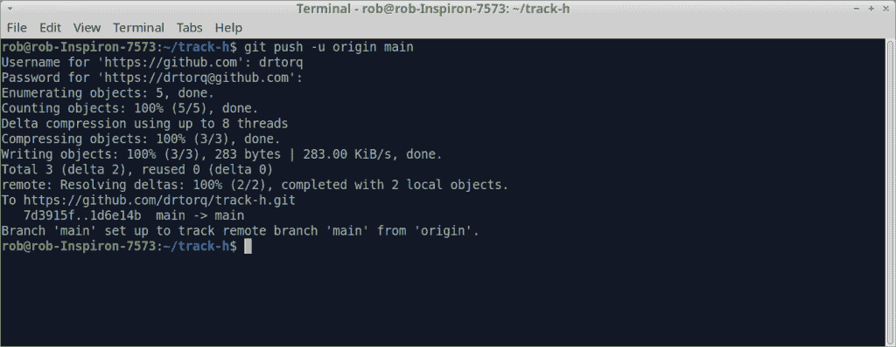
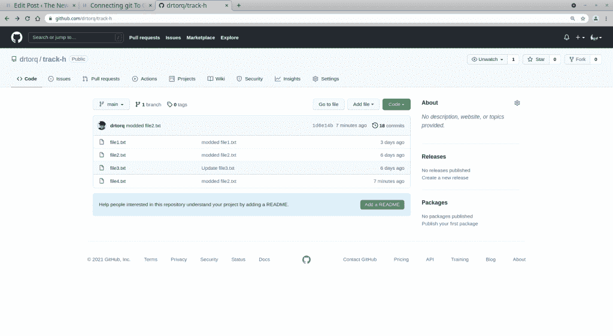
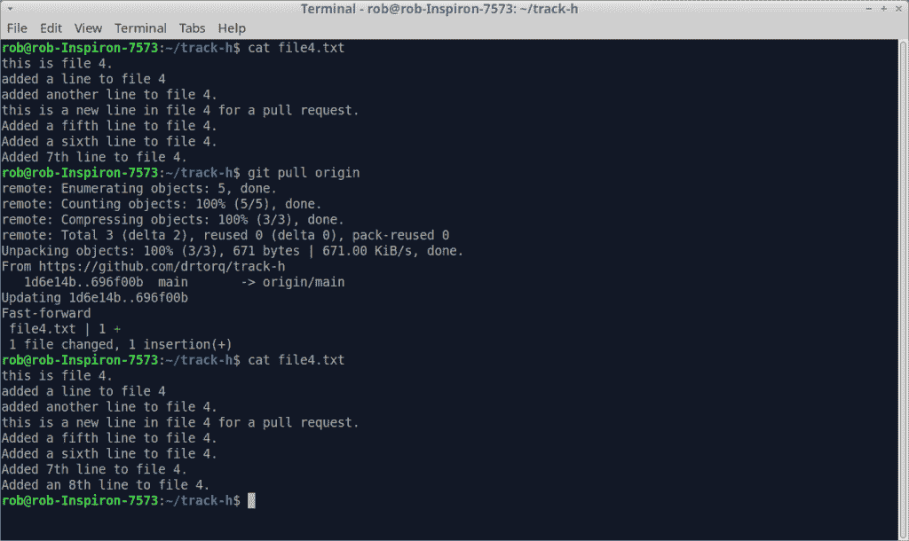

# 开发:为小型项目将 git 连接到 GitHub

> 原文：<https://thenewstack.io/development-connecting-git-to-github-for-small-projects/>

在关于如何使用开源 [git 版本控制软件](https://git-scm.com/)的[上一期](https://thenewstack.io/git-for-managing-small-projects/)中，我们谈到了在一款新型 Linux 笔记本上设置 git。我们回顾了为文件创建目录、初始化 git 环境以跟踪文件以及如何将文件放入存储库中。所有的工作都是在标准的终端窗口中的 Linux 命令行上完成的。

在这一期中，我们将看看如何在互联网上建立一个 GitHub 帐户，如何将本地内容(存储库)发送到您的帐户，以及如何保持一切同步。虽然，我想我们可能会讨论树结构和分析提交，但我将把它推迟到以后。在开始深入研究使用 git 的细节之前，让基本的机制工作起来，这会让事情保持在适当的水平。

我们将以一点如何从 GitHub 获取内容并返回到您的 Linux 笔记本来结束我们的讨论。

## 设置一个新的 GitHub 用户帐户

Git 本来就是本地的。换句话说，无论有没有网络连接或集中存储，它都会跟踪你的文件，并为你的工作制作快照。当您想要与其他人协作或引入外部代码时，连接到 git 服务是有用的。GitHub 就是这样一个 git 服务。从单个用户的角度来看，GitHub 也是将你的作品存档在云中的好方法。

该服务有一个漂亮的基于网络的界面，包括一个内置的文本编辑器，你可以在你的浏览器上使用。网络上的其他人也可以通过一种“只读”模式查看你的项目。我想用 GitHub 来组织和推广我的项目。

在软件开发领域，技术人员首先想知道的是你的 GitHub 地址。对吗？

GitHub 新用户页面

进入 [GitHub 主页](https://github.com)，注册成为新用户。

*   在“欢迎来到 GitHub——让我们开始冒险”页面输入您的电子邮件地址。
*   创建一个密码。
*   输入您想用于该帐户的用户名。
*   选择是或否以接收 GitHub 通知。
*   为了验证你是人类用户，GitHub 会呈现一个普通的谜题来解答。按照指示，解决难题，然后点击“创建帐户”按钮。GitHub 将向您之前输入的电子邮件地址发送一个启动代码。
*   检查您的电子邮件，并在浏览器屏幕的相应框中键入启动代码。
*   跳过“计划类型”页面。
*   按下“免费继续”按钮。这应该会让你进入 GitHub 主屏幕。

有了这个帐户，我们现在可以在 GitHub 上为我们的项目建立一个新的存储库。

*   单击存储库选项卡。你会注意到你在 github . com/[你的用户名]目录。
*   选择“新建”按钮。
*   在“创建新存储库”页面上，确保您是正确的用户。
*   添加新的存储库名称。在我的情况下，它是“轨道 h”。
*   选择能够查看存储库的人。我选择了“公开”选项。
*   跳过创建自述文件。gitignore 等。暂时是文件。
*   按绿色的“创建存储库”按钮。

选择构建自述文件等。当您尝试将 Linux 笔记本上的本地存储库第一次推送到网络上新创建的 GitHub 存储库时，开始时会感到困惑。GitHub 会抱怨你的文件同步问题，甚至在你尝试上传之前。您随时可以在以后添加和编辑自述文件和其他文件。

Torq GitHub 博士报告页面

GitHub 上的新存储库现在应该可以运行了。

在我们从 Linux 笔记本存储库发送任何东西到 GitHub 之前，我们必须获得一个授权令牌。授权令牌于 2021 年 8 月生效。在此之前，您可以简单地使用用户名/密码组合。令牌化访问更加安全，设置或使用起来也不会太难。

在浏览器中进入 GitHub 主屏幕。最简单的方法是在 URL 框中键入 https://github . com/[您的用户名]。同样，如果您由于某种原因在存储库中，请单击屏幕左上角的用户名目录级别。在我的情况下，它可能类似于 drtorq/bio。我会选择 drtorq 部分，因为这是我的用户名。

*   打开屏幕右上角的帐户下拉菜单，选择“设置”按钮。
*   在“帐户设置”菜单下，向下滚动并选择“开发者设置”。
*   点击屏幕左侧 GitHub 应用程序页面上的“个人访问令牌”按钮。
*   按下“生成新令牌”按钮。
*   填写描述性注释，描述存储库中的内容。
*   从菜单中选择有效期。60 天对我来说很合适。
*   选择要使用令牌管理的主题。由于我还不知道所有的项目是什么，所以我只是全部检查了一下。
*   最后，按“生成令牌”按钮。

令牌将出现在屏幕上。你应该仔细地把它写下来以备将来使用。您也可以将令牌保存为文本字符串。我通过[剪贴人](https://docs.xfce.org/panel-plugins/clipman/start)把我的拷贝到我的桌面剪贴板上。这样，当我到达需要使用令牌的地方时，我只需将它粘贴到正确的位置，然后按 enter 键。

## 将存储库推送到 GitHub

一旦正确建立了初始化和令牌，将文件发送到新的 GitHub 存储库就很简单了。

在 Linux 命令行上，我执行了以下内容。

`drtorq-notebook% cd track-h`
`drtorq-notebook% git remote add origin https://github.com/drtorq/track-h.git`
`drtorq-notebook% git branch -M main`

第一行让我进入 track-h 存储库目录。

接下来，git remote 命令将我新创建的 GitHub 存储库的网址连接到一个本地(在 Linux 笔记本上)存储库引用或指针，称为“origin”。

如果您想更改默认的分支名称，git branch -M 命令将起作用。我们在第一次在 Linux 笔记本上设置帐户时已经更改了它，所以这个是可选的。

最后，我用 git push 命令将存储库的最后一次提交推送到 GitHub。

git push 将询问您的用户名，在我的例子中是 drtorq@drtorq.com，然后是密码。键入或粘贴令牌来代替密码。如果一切正常，您应该会看到交易的摘要，如下图所示。看一下总结。我们将在另一个时间进入细节。目前来看，这只是一次成功的推动。

git 推送至 Dr. Torq GitHub 存储库的结果

如果你进入 GitHub 上的库(在你的浏览器中),你可以看到当前的文件，反映了本地 Linux 笔记本上的修改。例如，如果我在 text4.txt 中添加了一个新行，然后进行了提交/推送，那么在 GitHub 帐户的浏览器窗口中单击 text4.txt 文件(在 GitHub 上)时，该文件将显示新行。

track-h 存储库的 Torq GitHub 博士文件列表

## 下拉至 Linux 笔记本电脑

将更新下载到 Linux 笔记本电脑上也不是很麻烦。

假设您仍然在 Linux 笔记本上的 track-h 目录中，使用 git pull 命令很简单。

`drtorq-notebook% git pull origin`

git 拉取请求

上图是 Linux 笔记本上的 file4.txt。然后我在 GitHub 上用他们内置的基于浏览器的编辑器编辑了这个文件，并添加了一行。编辑器底部有一个“提交”按钮，用于提交 GitHub 存储库上的文件。

截图的中间部分显示了 git pull 请求。

最后，在 git pull 确认本地 file4.txt 文件中的行被更新后，您会看到这个文件。

## 包裹

这是我们 git 学习系列的第二部分的一个很好的结束点。

到目前为止，我们已经了解了在 Linux 笔记本上设置 git，并介绍了在 git 服务(如 GitHub)上连接我们的存储库的基础知识。有很多东西需要消化，让你头脑清醒。你可能想仔细阅读 git 的几个[基础视频教程。](https://git-scm.com/videos)

下一次，我将深入研究如何将一些真实世界的内容放入存储库中，并开始使用 git 和 GitHub 来组织项目。看看如何下载其他人的项目并在 Linux 笔记本上本地使用它们可能也是一件好事。git 使得跟踪、组织和分享内容变得非常容易。

*在 doc@drtorq.com[或 407-718-3274 联系](mailto:doc@drtorq.com) [Rob "drtorq" Reilly](/author/rob-reilly/) 咨询、演讲约定和委托项目。*

<svg xmlns:xlink="http://www.w3.org/1999/xlink" viewBox="0 0 68 31" version="1.1"><title>Group</title> <desc>Created with Sketch.</desc></svg>