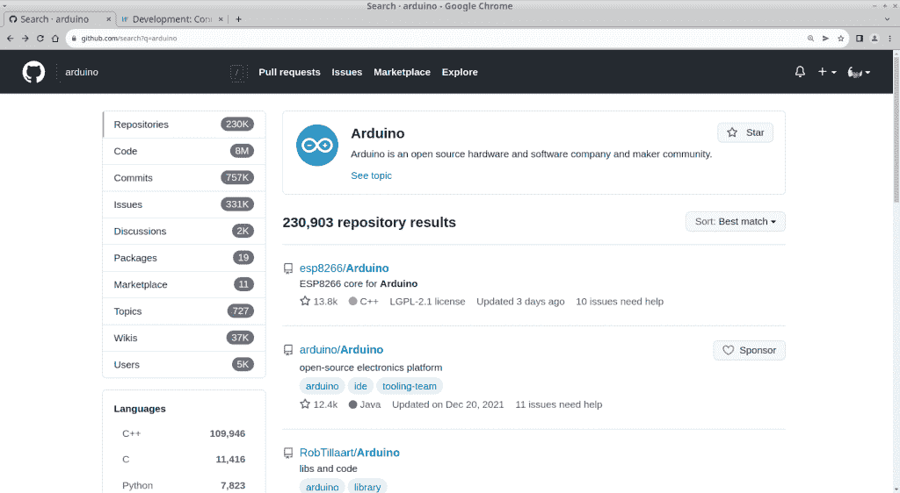
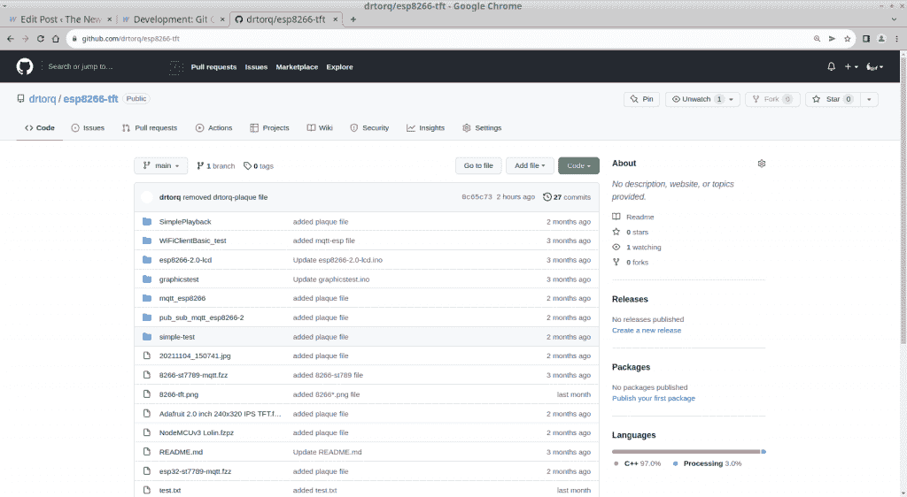
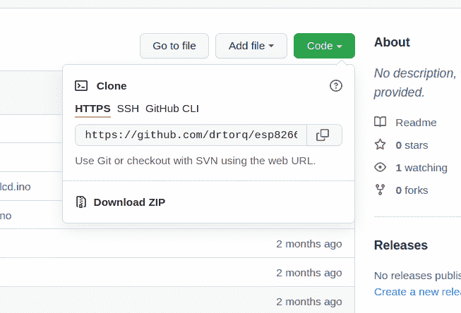
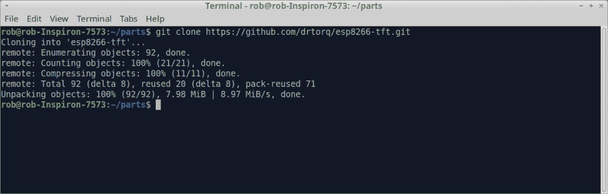
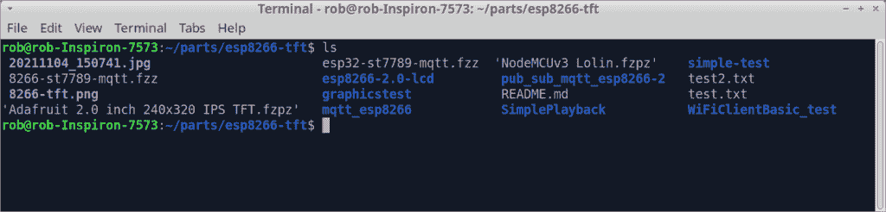
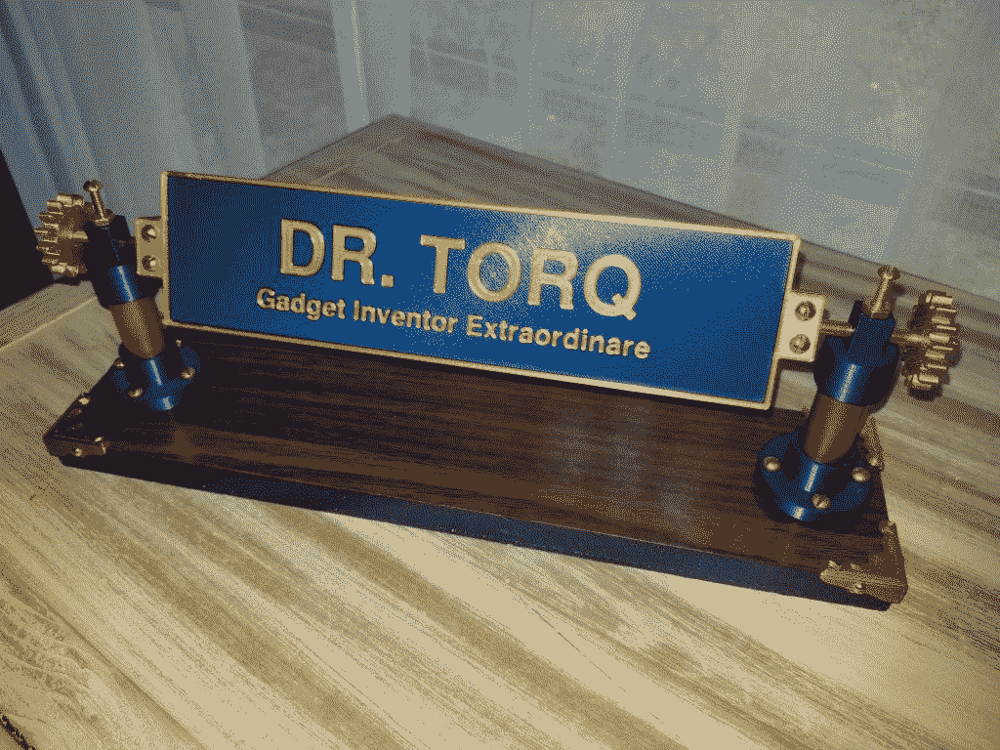

# 开发:Git 克隆一个项目

> 原文：<https://thenewstack.io/development-git-clone-a-project/>

假设您在 GitHub 上发现了一个非常有趣的针对 ESP32 微控制器板的黑客。

你知道 GitHub 上有数以千计的知识库涵盖了 ESP32 模块，对吧？

Arduino 平台、Raspberry Pi 上的 Python 以及其他各种语言/平台也是如此。

有这么多很酷的代码等着被很好地使用，为什么要重新发明轮子呢？

今天，我们将讨论如何抓取 GitHub 内容并将其放在您的本地 Linux 笔记本上。

## Git Linux 笔记本基础复习

[Git](https://git-scm.com/) 是[一个文件管理系统](https://thenewstack.io/tutorial-git-for-absolutely-everyone/)通常用于组织计算机源代码。随着文件的开发和更改，它会对文件的快照修订进行编目。Git 还将您的代码打包成方便的文件集合，称为存储库。

像 [GitHub](https://github.com) 和 [GitLab](https://gitlab.com/) 这样的网站是基于云的设置，包含公共和私有的存储库。在这些网站上推送回购使得与他人分享和管理文件变得容易。

在本地 Linux 笔记本上建立一个存储库是很简单的。初始化环境，将您的文件添加到 git 数据库，并提交任何更改。这些命令看起来像下面这样。

`rob% mkdir [new repo directory]
rob% cd [into new repo directory]
rob% git init
rob% git add [filenames]
rob% git commit`

一旦在您的本地 Linux 机器上建立了存储库，将它发送到 GitHub 或 GitLab 是相当容易的。我们已经在最近的文章[【1】](https://thenewstack.io/development-connecting-git-to-github-for-small-projects/)[【2】](https://thenewstack.io/development-connect-git-to-gitlab-for-small-projects/)中讨论过这个话题。

现在，让我们看看你如何把别人的内容下载到你的机器上。自然，你会希望尊重任何许可条款。

## 从 Git Repo 获取内容

 [托克博士

Rob (drtorq) Reilly 是一名独立顾问、作家和演讲者，专门研究 Linux/OSS、物理计算、硬件黑客、技术媒体和 DIY/Maker 运动。他为个人客户和公司提供各种工程、商业和特殊项目服务。作为科技媒体的资深人士，Torq 博士已经为顶级科技媒体和印刷媒体发布了数百篇长篇文章。他还在 OSCON 和其他行业场合发表过技术演讲。](https://thenewstack.io/author/rob-reilly/) 

有几种不同的方法可以将 GitHub 存储库中的内容下载到您的 Linux 笔记本上。

您可能会在 GitHub 的存储库中找到您喜欢的文件，然后将文本粘贴/复制到您的 Linux 笔记本上的本地文件中。这种方法对于您只想在项目硬件上尝试的单个 Arduino 脚本非常有用。

你甚至可以不把它放在本地的 git 库或者文本文件中，而是直接粘贴到 Arduino IDE 的编辑界面中。从那里，你可以上传和运行你的 Arduino，ESP8266，ESP32，或任何固件。简单。

将内容下载到 Linux 笔记本的另一种方法是使用. zip 文件。这种方法很简单，不管您是想跟踪本地 git 存储库中的文件，还是想让文件驻留在本地目录中，没有任何 git 控制，这种方法都有效。这类似于从头开始建立 git 存储库。

首先，在 GitHub 中找到您选择的存储库。接下来，单击绿色的“代码”按钮。在下拉列表的底部，查找 zip 文件下载链接。点击链接，将文件放入“下载”目录。

打开终端，为 zip 文件创建一个新目录。将 zip 文件复制或移动到新目录中。解压文件。

此时，文件不在 git 的控制之下。它们只是目录中的文件。您可以用文本编辑器修改它们。你可以直接从 Arduino IDE 中打开它们，比如说它们是你的项目硬件的脚本。

它们就像其他普通文件一样。一些压缩的 repos 还包含辅助图形文件、自述文件、文档、CAD 绘图、HTML 代码、脚本甚至二进制/可执行文件。zip 文件是 GitHub 上整个库的快照。在您的 Linux 笔记本上提供一个装满文件的目录(存储库)是一个简单的方法。

一旦文件被解压缩并安全地保存在一个目录中，如果您愿意，可以通过正常的 git 项目启动序列将它们保存在数据库中。

`cd [into new repo directory]
git init
git add [filenames]
git commit`

压缩文件很棒。git clone 命令在您的 Linux 笔记本命令行上工作，使用 web 链接将存储库作为一个包拉下来。

## 从 GitHub 克隆文件

您可以下载。zip 文件并手动执行 git 存储库环境启动，git clone 命令会自动完成整个工作。

上 GitHub，找到您选择的存储库。你可以在 GitHub 搜索栏中输入“Arduino”。我做了，得到了超过 23 万的点击率。

GitHub 上千个“Arduino”回复

为了简单起见，我只使用我现有的一个存储库作为例子。

进入 GitHub 主屏幕，搜索“drtorq/esp8266-tft”。点击回购的链接。

Torq 博士的样品 esp8266-tft repo

请注意屏幕中上方的绿色代码按钮。如果你点击那个按钮，你会看到一个下拉框，里面有 HTTPS、SSH 和 github CLI 的选项。选择 HTTPS 选项卡。在它下面，您会看到一个指向“drtorq/esp8266-tft”存储库的链接。

下拉框在绿色的“代码”按钮下面。

接下来，复制链接，然后回到您的 Linux 笔记本终端。cd 到您想要克隆存储库的目录。我的可能在/home/rob/parts 下面。使用 git clone 命令将存储库放到您的 Linux 笔记本中，如下粘贴 web 链接。

`rob% git clone https://github.com/drtorq/esp8266-tft.git`

请注意，在命令结果列表中，新的存储库被命名为“esp8266-tft ”,并给出了它包含的内容量的指示。

Git 克隆命令结果。

您可以使用“ls”来验证文件，并将列表与 GitHub 存储库中的内容进行比较。

Esp8266-tft git 克隆文件列表在 Linux 笔记本上。

接下来，使用标准的 git 状态来检查您新创建的“esp8266-tft”存储库中是否一切正常。

`rob% git status -v`

这些文件现在在 git 的控制之下，你可以编辑、添加和提交你想要的内容。

## 那是一个包裹

GitHub 里好像有两个基本阵营。一个阵营使用 git 进行核心的、广泛的源代码组织、管理和协作。另一个阵营使用 GitHub 作为一种非正式的场所来存放项目。我属于后一类。

在技术世界里，GitHub 是一个众所周知的，人们经常去查看你的工作。Git clone 是一种无缝的方式来共享您和他人的工作，即使项目相对简单并且面向物理计算。

在 doc@drtorq.com或 407-718-3274 联系[罗布“drtorq”雷利](/author/rob-reilly/)咨询、演讲约定和委托项目。

<svg xmlns:xlink="http://www.w3.org/1999/xlink" viewBox="0 0 68 31" version="1.1"><title>Group</title> <desc>Created with Sketch.</desc></svg>