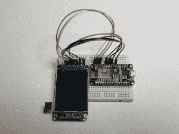
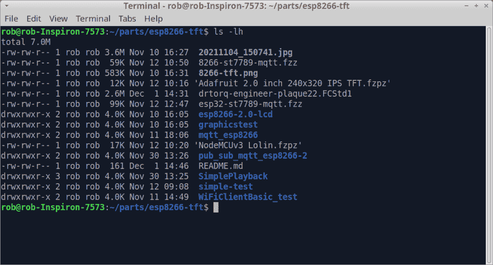
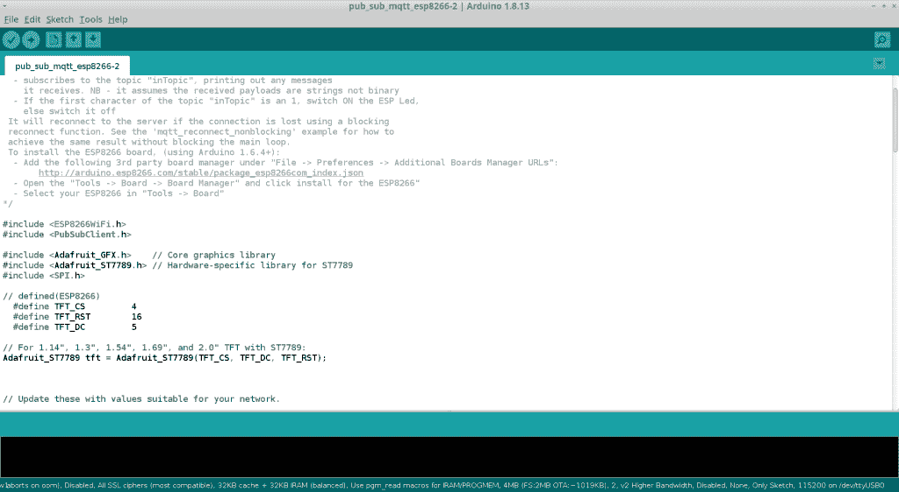
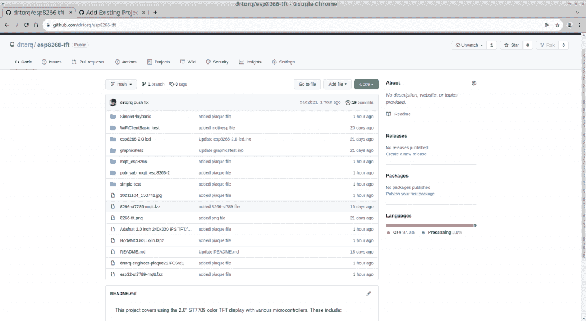

# 开发:用于小型物理计算项目的 Git

> 原文：<https://thenewstack.io/development-git-for-small-physical-computing-projects/>

本 [git how-to 系列](https://thenewstack.io/git-for-managing-small-projects/)的前几篇文章涵盖了安装、填充和与 git 库交互的基础知识。Linux 是 git 的天然环境，因为可以很容易地从命令行的常规文本终端输入命令。虽然您最初使用联网浏览器创建 GitHub 帐户，但是对于远程存储和共享，使用命令行推送和提取数据非常简单。无论是在本地还是在云中，访问内容都很容易。

[Git](https://git-scm.com/) 被设计用来组织原始的、基于文本的源代码，并且非常适合这个目的。它能有效地与其他内容一起工作吗？在 git 下处理混合文件类型的项目的逻辑是什么？有什么入门的基础推荐吗？

让我们以我的一个蒸汽朋克 Arduino 项目为例来探索这些想法。

## 我的物理计算项目的程序

esp8266-tft 项目板

物理计算项目需要各种用途的应用程序的组合，并产生各种文件类型。

我使用的所有程序都在 Linux 下运行，并且可以在网上免费获得。同样，Linux 有几十种版本，以适应各种类型的计算硬件和个人偏好。我喜欢 Xubuntu 64 位版本，并在一台使用了两年的戴尔笔记本电脑上运行，该笔记本电脑配有 16 GB 内存、500 GB 高速固态硬盘、英伟达显卡和英特尔 I7 处理器。多个应用程序轻松同时运行，甚至无需打开风扇。

[Arduino IDE](https://www.arduino.cc) (交互式开发环境)用于编码和上传固件到 Arduino 微控制器板上。类似地，[处理语言](https://processing.org/)用于构建与 Arduino 或 Raspberry Pi 硬件交互的基于小屏幕的 Linux 应用程序。Arduino 和 Processing 都功能丰富，易于使用，并且很好地支持原型项目。

这些库特别有用，涵盖了很多很酷的物理计算需求。通过板管理器，Arduino IDE 可以输出数十种不同“Arduino”类型硬件的固件，包括各种基于 ARM 的微控制器板、ESP8266 wifi 模块、ESP32 NodeMCU wifi 设备等。

小工具需要适当的包装，以便演示、展示和日常使用。3D 打印是一个很好的解决方案。一个漂亮的外壳给人一种“成品”的感觉。我的蒸汽朋克项目通常还包括齿轮、机械链接、支架、铭牌、适配器等等。将这些 3D 设计与项目文件的其余部分保存在一起是有意义的。

我花了一年的时间使用 FreeCad 进行 3D 模型设计。它的特点是参数化建模，并吐出进入 Prusa Slicer 切片程序的目标文件，准备在 [Prusa MK3S 打印机](https://www.prusa3d.com/category/original-prusa-i3-mk3s/)上打印。FreeCad CAD 模型(. FCStd1 扩展名)将很容易驻留在 git 项目目录中。我懒得把目标文件(。obj extension)在 git 的控制之下，因为它们变化如此频繁，实际上没有任何意义。

我也不包括 g 代码文件(。gcode 扩展)来处理 MK3S 上的打印。也许当我重新组织我的小工具生产操作，并有一个体面的标准零件库存时，这些文件可能会包括在内。随着设计的发展，FreeCad 文件会随着时间的推移而更新，因此将它们置于 git 的控制之下是合理的。我当前模型开发的 CAD 文件大小通常小于每个零件 3 MB。

FreeCad 和 Prusa MK3S 是设计和实际生产有趣的蒸汽朋克小工具和零件的完美组合。

我使用另一款免费应用软件 [Fritzing](https://fritzing.org/) ，来获取原理图和接线图。它易于使用并得到很好的支持。它输出漂亮、干净的图形，以。png 文件，所以它们的大小相当小。

我的示例 esp8622-mqtt-lcd 项目还包括一些硬件图形和截图文件。这些往往不会改变太多，可能只是驻留在项目目录中。你可能想也可能不想把它们推上 GitHub repo。

项目还可能包括任意数量的以下类型的信息。

*   构建说明
*   零件、外壳等的 CAD 模型。
*   文档、用法、要求、3D 打印机设置等。
*   概念图
*   用户界面图片
*   录像
*   问题
*   版本索引，交叉引用
*   零件清单、零件来源、物料清单
*   有用链接列表

本地 8266-tft 目录列表

## 关于 Arduino 和处理文本文件的更多细节

Arduino 代码是在 Arduino 微控制器上运行的固件的来源。

最近，我只是将每组项目文件转储到/home/rob/parts 下一个适当命名的子目录中。例如，我的 esp8266 nodemcu 微控制器带有一个 2.0 英寸彩色 LCD 屏幕小工具，用于显示 MQTT 消息，它位于/home/rob/parts/esp8266-tft。您可以使用任何有效的目录组合。在初始化特定的 git 实例时，一定要记得转到那个目录。同样，我在 GitHub 和 GitLab 上使用类似的“目录”/repo 命名。

Arduino 示例代码

Arduino 和处理代码非常相似，看起来很像 C 语言。源代码都是文本文件，通常很小。Arduino 文件被编译成二进制文件，作为固件上传到 Arduino 硬件。处理文件通常从处理 ide 中执行，尽管它们也可以被编译成独立的二进制包，在命令行和 IDE 之外执行。我通常不会在项目目录中保留 Arduino 和处理二进制文件。

这两种类型的文件也存储在“素描本”中 Arduino 文件使用. ino 扩展名，而处理文件使用. pde 扩展名。您可以拥有任意数量的 sketchbook 目录，然后从每个 IDE 中引用这些目录。要检索文件进行编辑、上传和执行，您只需在文件菜单下滚动，选择“sketchbook”并单击您的项目名称。两个 ide 都从“preferences.txt”文件中设置他们的“sketchbook”。

或者，您可以简单地放弃在 ide 中使用 sketchbooks，直接将文件保存到您的项目所使用的 git 目录中。该源代码文件，无论是 Arduino 还是 Processing，都可以在各自的 IDE 上使用“文件”下拉菜单下的“打开”或“最近”菜单项调用。

另一点是 Arduino 和处理文件必须存储在它们自己的目录中。git 像处理文本文件一样处理目录，所以在这方面没有问题。将这些子目录推送到 GitHub 也没有问题。

## 关于文件大小的一句话

您可能已经注意到，我提到了各种应用程序的一般输出文件大小。虽然如果你只是在你的 Linux 笔记本上使用 git 并没有太大的区别，但是把文件放在 GitHub 或 GitLab 这样的 git 服务上就有点棘手了。

github 8266-tft repo

例如，GitHub 有免费和付费账户。免费帐户允许 500 MB 的空间，在他们的服务器上为您的项目。一级付费帐户允许高达 2 GB 的空间。记住这一点，注意你在上面放了什么是很重要的，这样你就不会用完空间。

文本文件不会占用太多空间。图形、视频和 3D 模型会占用大量空间。

一个策略是转换你的。jpg 图形文件转换成。使用类似 Gimp 的 png 格式。幸运的是，我使用的 XFCE 桌面下的截图程序输出了。默认为 png 文件。

视频也是如此。在将大视频文件放入 g it 系统之前，将其转换为压缩格式。

另一种方法是简单地将你的大型图形、视频和 3D 模型文件放在某个网络服务器上，然后将它们的网络链接放入一个基于文本的列表(或 HTML)中，并保存在 git 环境中。您将不得不手动更新这些文件，尽管这可能是可以的，因为这些文件在项目的生命周期中可能不会改变太多。

## 包裹

在本文中，我向您展示了 git 可以处理不同类型的文件，而不仅仅是文本。您必须决定要用 git 跟踪哪些文件。

还要记住，在 GitHub 或 GitLab 这样的 git 服务网站上，你的项目空间是有限的，这取决于账户类型。

看看下面的链接，看看别人放在 GitHub 页面上的布局和文件类型。

*在[doc@drtorq.com](mailto:doc@drtorq.com)或 407-718-3274 联系 [Rob "drtorq" Reilly](/author/rob-reilly/) 咨询、演讲约定和委托项目。*

<svg xmlns:xlink="http://www.w3.org/1999/xlink" viewBox="0 0 68 31" version="1.1"><title>Group</title> <desc>Created with Sketch.</desc></svg>