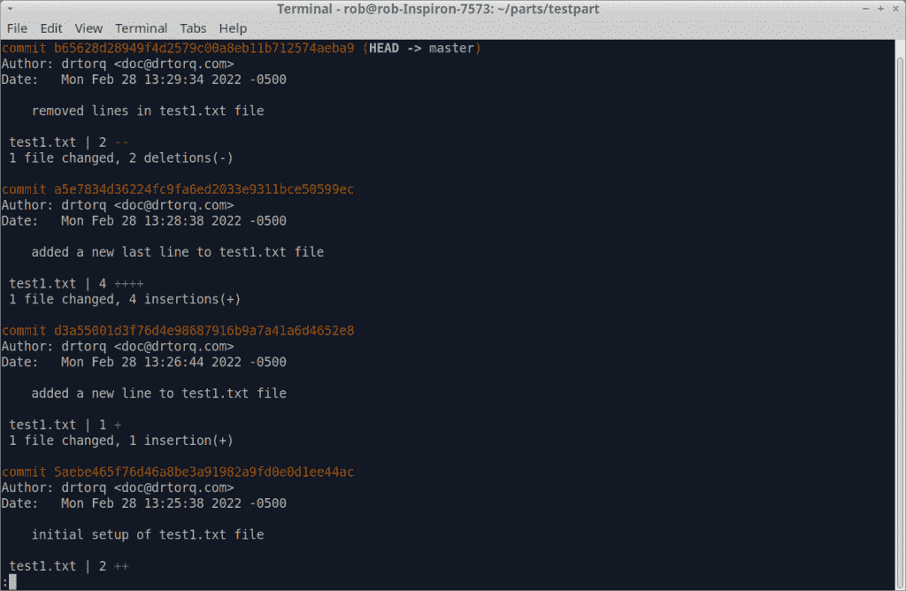

# 开发:Git 日志记录简介

> 原文：<https://thenewstack.io/development-introduction-to-git-logging/>

[git](https://git-scm.com/) 分布式版本控制软件是一个软件开发工具，帮助个人和团队管理和维护他们的源代码。它基于快照模型，将变更捆绑到提交和存储库中。您可以随时返回并探索旧的代码配置。正如您可能想象的那样，知道什么时候或谁做了错误修复、特性添加等方面的更改肯定是有帮助的。

Git 具有内置的能力，可以为您提供与每次提交相关联的“元数据”。这可能包括谁编写了一个变更，对其他提交的引用，为什么有些东西被更改，事情是如何被影响的等等。这个特性叫做日志记录，也是今天文章的主题。

## 一些基本的 Git 日志选项

假设您使用`git init`命令在超级用户 Linux 笔记本的/home/rob/parts/testpart 目录中建立了一个 git 存储库。

存储库包含一个名为 test1.txt 的文件，这个文件是添加并提交的。

这里有一个使用 cat 命令的文件内容的截图。就几行文字而已。

`rob% cat test1.txt`

test1.file 的 Cat

您可以使用 git log 命令查看文件创建和后续编辑过程中的“元数据”。

`rob% git log`

Git 日志常规结果

该图显示了到目前为止该文件发生的四次提交。在本例中，每次提交有六行，默认为时间顺序相反。

第一行是提交号(橙色文本)，带有分支。接下来是作者和日期，后面是一个空行。最后，我们看到提交注释和提交之间的分隔空行。

Git log 有许多有用的选项。

`git log --stat option`给出了通常的基本信息，以及每次提交之间的更改数量的汇总，但没有给出细节。您可以使用此选项快速查看添加(用绿色加号表示)或删除(用红色减号表示)的内容。改变的字符显示为绿色和红色的加号。请记住，对于多个 git 日志页面，通常的 vi 或更多风格的导航，通过屏幕底部的“:”提示适用。

例如，要移动到日志的下一页，只需在“:”提示符下点击空格键。

Git 日志–stat 选项

要查找某个字符串的实例，请在“:”提示符下，将“/”与该字符串一起使用。您将得到文件中显示的字符串的打印输出，带有白色背景。

git log -p 选项显示了编辑过程中所做的实际更改。这里是提交日志的一部分，其中删除了文本(红色)并添加了文本(绿色)。

使用-p 选项 Git 日志

搜索“/”命令行开关与–stat 和-p 选项一起使用。

您可能只想看到最后几个提交，而不是整个列表。使用带有提交次数的-n 选项。例如-n 2 将打印出最近的两次提交。确保您的终端足够大，可以看到您想要的号码，否则它会自动进入“:”寻呼模式。

`rob% git log -n 2`

## 让我们来谈谈 Git 提交消息

提交消息是 git 的另一个很棒的特性。它们帮助您向每个提交添加描述性文本，以便将来您或团队成员可以弄清楚对代码进行了什么、为什么、何时以及如何更改。最棒的是，它使用简单，并且无缝集成到 git 日志中。一个基本的 git 提交及其相关消息如下所示。

`%rob git commit -m "This is a possible git commit message"`

这些消息显示在 git 日志输出中。

Git 日志提交消息

编写好的 git 提交消息本身就是一个完整的主题，你当然可以比一个基本的消息走得更远。许多公司对它们的提交消息应用约定，所以如果您是组织中使用 git 的新手，您可能想要检查一下这些约定。

一个通用的约定被称为“50/72”格式。这里，您使用 50 个字符或更少的标题总结 git 提交，然后是一个空行，后面是 72 个字符或更少的提交(代码更改)的更详细描述。这种格式最大限度地减少了换行带来的问题，换行会使文本在外部 git 应用程序或小型设备(如手机屏幕)上难以阅读。我不使用我的 Samsung S8+来阅读 git 日志，尽管我想有些人可能会这样做。只要保持在这些线的长度之下，你就会很好。

你也不仅限于两行。在 git commit 中使用多个“-m”将它们分成段落，每段之间有一个空行。

有些人还使用更长的信息。使用诸如 vi 这样的编辑器可以做到这一点。使用不带消息的“git commit”会让您进入编辑器。用下面的方法设置它。

`rob% git config --global core.editor vi`

如果你想其他编辑如纳米等。，在您选择的编辑器程序中替换 git config 命令中的 vi。

你可以使用的另一个约定是在你的消息的开头使用一个关键字来表示所做的改变的类型。组织通常对这个单词列表进行标准化，可能包括像修复、重构、测试、文档或杂务这样的术语。很多人在提交类型后在摘要文本前加上分号和空格。这里有一个愚蠢的物理计算例子。

`rob% git commit -m "test: adj servo travel var - robot head rotation"`

一旦习惯了使用关键字，使用关键字可以让您轻松区分提交的目的。

git 提交消息本身就是一个完整的主题，围绕这个主题有很多观点。只要说它们非常有用就够了，特别是对于维护和故障排除，当一年后重新访问一个项目，并试图找出为什么要修改代码时。

## 包裹

Git log 是软件开发工具包中的一个重要命令。提交历史被整齐地排列，并且有许多选项来微调您想要看到的确切信息。始终如一地编写好的日志消息，会让您在开发项目时更加轻松。

*在[doc@drtorq.com](mailto:doc@drtorq.com)或 407-718-3274 联系 [Rob "drtorq" Reilly](/author/rob-reilly/) 咨询、演讲约定和委托项目。*

<svg xmlns:xlink="http://www.w3.org/1999/xlink" viewBox="0 0 68 31" version="1.1"><title>Group</title> <desc>Created with Sketch.</desc></svg>