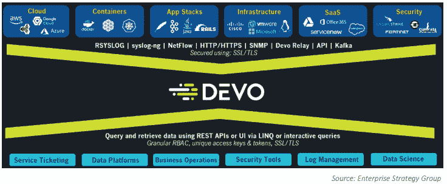
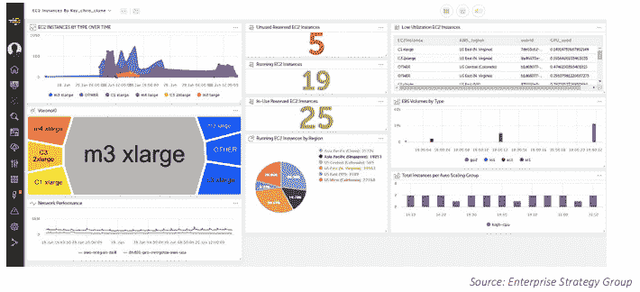
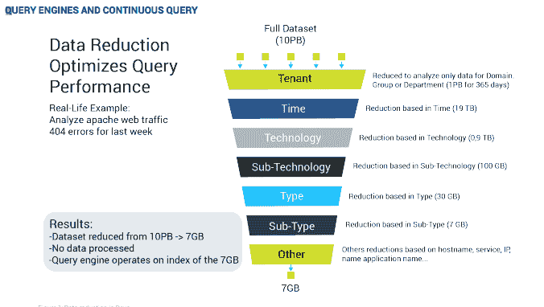
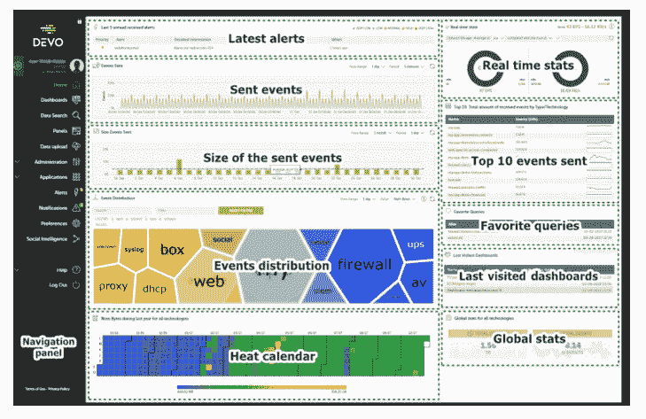

# Devo:更快地从数据中获得洞察力

> 原文：<https://thenewstack.io/devo-faster-time-to-insights-from-data/>

数据对组织具有巨大的价值，尤其是对安全和运营团队而言，但是随着数据量呈指数级增长，管理数据仍然是一项挑战。

数据分析平台 [Devo](https://www.devo.com/) 解决企业在管理各种来源的数据爆炸时面临的挑战，重点关注[可观察性](https://www.devo.com/resources/observability/)而不仅仅是数据收集。(CA Technologies 的 Peter Waterhouse 曾在[概述了新堆栈的不同之处](/monitoring-and-observability-whats-the-difference-and-why-does-it-matter/)。这也是蜂巢首席技术官 Charity Majors 的核心话题。)

Devo 首席营销官 [Dimitri Vlachos](https://www.linkedin.com/in/dvlachos/) 表示:“我们看到许多客户在处理他们收集和操作机器数据和日志的方式，这对他们来说在可扩展性、it 经济性方面已经成为一个真正的挑战，尤其是对安全和 it 运营团队来说。

敏捷的市场研究最近[预测](https://finance.yahoo.com/news/aiops-market-grow-32-cagr-054716595.html)到 2025 年，全球 AIOps 市场——使用人工智能改善 it 运营的工具——将达到 2370 亿美元，利用包括大数据平台、预测分析和机器学习在内的技术。

Adroit 报告称 Devo 是 AIOps 市场的顶级玩家之一。最近，该公司一直在宣传其技术是下一代安全信息和事件管理(SIEM)系统，尽管它适用于整个企业的其他数据密集型用例。

Devo Security Operations 为安全团队提供了一个中心枢纽，使分析师能够收集、存储和分析来自任何来源的任何数据类型。它还提供基于机器学习的行为分析、自动化和协作，以识别威胁并快速做出响应。

此外，其 ML workbench 允许运营团队将自己的模型投入大规模生产，并使用真实数据进行测试。

Telefonica 是世界上最大的电信公司之一，它使用 Devo 隔离用户体验问题，推出其 IPTV 服务，使其能够通过其整个交付网络从用户家中提取数据。

Vlachos 说，在另一个用例中，一家主要的美国制造商使用 Devo 来捕捉正在购买库存的机器人，就在它发布新的发货并在二级市场上出售库存的时候。

### 微索引

Devo 为任何业务部门提供流数据和历史数据分析。

[Pedro Castillo](https://twitter.com/pedrocastillodv?lang=en) ，现任 Devo 首席技术官的 Pedro Castillo 于 2011 年创建了这家总部位于马萨诸塞州剑桥的公司。该公司前身为 LogTrust，2018 年更名为 Devo。

“当我们的创始人想要解决这个挑战时，他们看了看开源软件，没有一个解决方案可以做到这一点，”Vlachos 说。

专有技术是从头开始构建的。

“我们研究了 ELK stacks(T7)和 Hadoop(Hadoop ),研究了其他人在开源领域所做的工作，它不需要满足我们所看到的企业未来的需求，”他说。

Devo 采用不同的方法来处理大数据。Devo 依赖于数据存储后的微索引，而不是在接收时索引数据，这会使系统越来越慢，因为索引越来越大，越来越难维护。这将索引所需的 CPU 和内存资源减少了 80 %,从而为查询腾出了空间。

据该公司称，并行运行许多微索引可以为大型数据集的实时查询提供高性能和可预测的快速响应速度。

数据立即以原始格式写入磁盘，然后压缩 90%。数据始终保持热度，而不是存储在分层基础架构中。带外标记化索引是从原始数据创建的，并异步写入磁盘。这些微索引与原始数据并排放置。

每天为每个源数据类型创建一个微索引，然后使其不可变，从而实现大规模并行化。

查询独立于数据节点中的接收。该公司坚持认为，这种方法能够使单个 64 核心数据节点每秒查询多达 4800 万个事件。系统通过添加数据节点进行水平扩展。

可视化交互模型允许用户搜索和分析数据，而无需了解任何专门的编程语言，也无需编写任何代码。更有经验的用户可以直接在 UI 中或通过 API 使用 LinQ 或 SQL 运行查询。

Devo Activeboards 使用户能够创建和共享数据可视化。

“能够使用活动板动态构建和修改仪表板简化了我的分析师时间，因为我的分析师不用跨电子表格或五种不同的工具来尝试自己构建时间表。他们可以接收所有信息，在一个控制面板中跨所有日志记录和所有不同信息源构建一个时间表。所以，这是一个巨大的时间节省。它还具有能够在一个视图中查看所有这些数据源的准确性。OpenText，[的安全服务经理 Jay Grant 在 it 中心站](https://www.itcentralstation.com/product_reviews/devo-review-69507-by-jaygrant)的一篇评论中写道:“日志分析需要 40 个小时，使用 Devo，我们大概可以在 5 到 8 个小时内完成。

服务位于平台的核心查询引擎和数据模型之上。它们包括关联引擎、聚合引擎、机器学习引擎、警报功能、数据增强(查找)功能、API 和 web 用户界面。

它以 SaaS 产品、内部解决方案或两者的混合形式提供。

Devo 还关联了多个指标，因此组织可以监控整个应用体系的整体运行状况，而不必监控单个组件。

借助可定制的策略，警报可以通过电子邮件、Slack、JIRA 或 PagerDuty 等方式发送。

### 新的 SIEM

Vlachos 说，Devo 最接近的竞争对手将是 Splunks 或 Elastics of the world 或传统安全信息和事件管理(SIEM)提供商。

“对我们来说，真正的区别是双重的。一个是我们可以轻松引入系统的数据的广度，第二个是:从历史上看，当你看这些解决方案时，它们要么已经在引入数据方面进行了优化，它们正在采用技术来真正索引数据，并以快速写入磁盘的方式存储数据。但是，当他们去查询这些数据时，就会出现这样的争论，‘嘿，我应该专注于收集这些数据吗？或者我真的要把全部精力放在查询这些数据上吗？所以这两者之间有一个非常自然的争论，”他说。

“因此，如果您想要查询并引入大量日志数据或机器数据，您必须围绕这些数据构建大量基础架构，在查询和收集之间存在大量争用，我们已经真正消除了这些问题。…因此，这实际上归结为以高速率引入数据的能力，即在接收数据的同时查询数据的能力。而且不需要随着数据的变化而改变。”

如果一个数据源改变了数据格式，你不需要做任何重新处理。他说，该系统可以处理格式的变化，使用户能够继续做他们正在做的事情。

[https://www.youtube.com/embed/KLYWfPwyVEA?feature=oembed](https://www.youtube.com/embed/KLYWfPwyVEA?feature=oembed)

视频

图片来自 Pixabay 的 Myriam Zilles。

<svg xmlns:xlink="http://www.w3.org/1999/xlink" viewBox="0 0 68 31" version="1.1"><title>Group</title> <desc>Created with Sketch.</desc></svg>