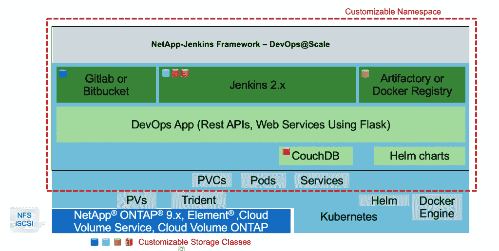
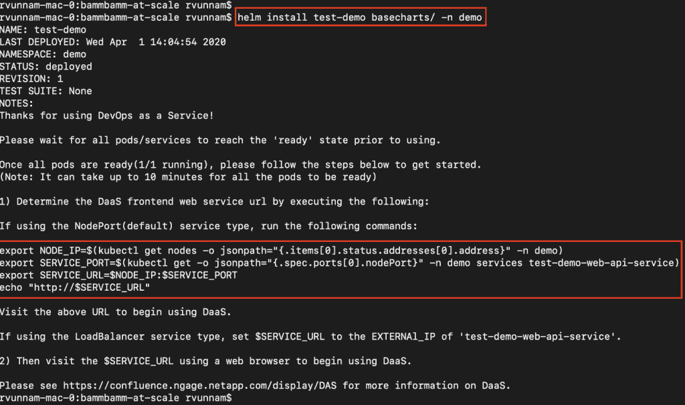
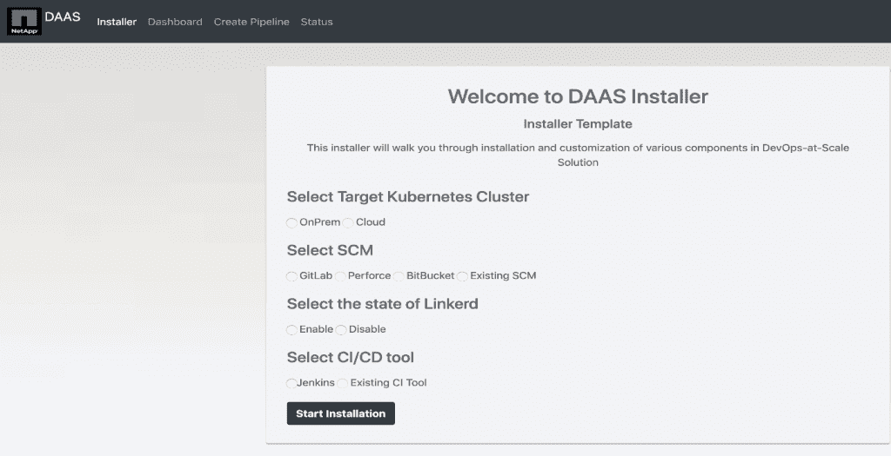
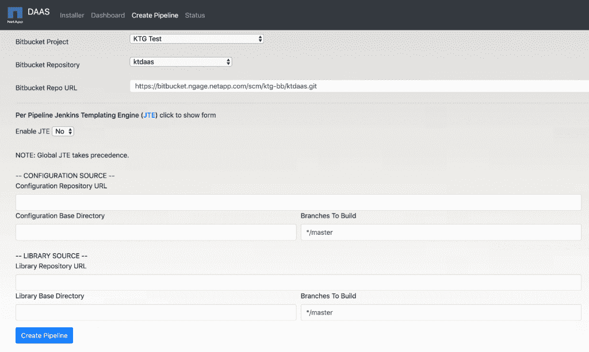

# 开发运维即服务:我们的内部解决方案

> 原文：<https://thenewstack.io/devops-as-a-service-our-internal-solution/>

[sus HMA Sattigeri](https://www.linkedin.com/in/sushmasattigeri/)

[sus HMA Sattigeri 是 NetApp 开发运维工具和服务团队的工程经理。她的团队为产品团队提供工具和服务，供他们在整个工作流程中使用，从而提高开发人员的工作效率和用户体验。](https://www.linkedin.com/in/sushmasattigeri/)

随着组织改变他们的开发模型，支持这些组织的工具也必须转变。在 NetApp，我们已经看到了开发格局的变化，从单片到微服务。为了帮助不断发展的团队实现快速、频繁、可靠的代码交付，并提高工程生产率，我们开始向 NetApp 内部团队提供开发运维即服务(DaaS)。

该解决方案提供服务的自动安装、配置和部署，例如 Jenkins、源代码管理和工作流所需的插件。DaaS 使团队能够显著减少从编写代码到交付的周期时间。

## DaaS 的特色和价值

基于 Kubernetes，我们的 DaaS 解决方案提供了整个软件开发工具生态系统的集中管理——如 Jenkins、源代码控制管理(SCM)、工件存储和监控。Helm 和 Docker 引擎用于运行容器和部署解决方案。Trident 管理我们的永久卷，因此可以使用任何存储— NetApp ONTAP、Element software、Cloud Volumes Service 或 Cloud Volumes ONTAP。使用 Flask 开发了一组内部服务，CouchDB 用于存储管道上的信息。Bitbucket、Perforce 或 GitHub 都可以作为 SCM 使用，解决方案可以在内部，也可以在云中。

DaaS 对我们的关键价值在于 Jenkins 的自动化部署。随着 Jenkins 映像的部署，*将自动执行以下操作，*无需任何用户干预:

*   定制 Jenkins 映像。
*   安装附加插件。
*   启用 Kubernetes 插件。
*   连接到 SCM 以检测新的代码提交。
*   一旦创建了管道，就开始新的工作。

## DaaS 建筑

### 使用 Helm 自动安装

这一步由 Kubernetes 管理员运行，使用 Helm 安装基础服务。一旦基础服务启动并运行，就可以使用 web 用户界面来部署解决方案。

### 在命名空间中创建基本舵图

### 部署解决方案的用户界面

这一步使解决方案所有者或管理员能够配置和部署一个容器化的 Jenkins 实例，并将其与所选的 SCM 集成，同时部署和配置所有必要的插件。过去需要管理员花费几个小时的工作现在完全自动化，只需点击一下鼠标，几分钟就可以完成。

使用 Helm charts(作为代码的基础设施)部署解决方案使得这个过程可编程和可重复，节省了开发人员的大量时间。有了 Helm 和源代码控制中的一切，可以保存对项目的额外修改，可以恢复更改，并且可以在升级之前安全地存储信息。

### 用于选择和安装所需服务的 Web UI

一旦安装了所需的服务，Jenkins 就会与 Helm charts 中的所有配置一起安装和部署。不需要人工干预。

### Jenkins 管道创建自动化

该功能自动创建多分支管道，从 SCM 中提取代码，并使用动态 Jenkins 代理来执行管道步骤。

每次创建新项目时，都需要为每个存储库创建新的管道。通过使用动态 Kubernetes pods 作为 Jenkins 代理，安装所有需要的插件、连接到 SCM 以及创建管道都可以自动完成。

### 管道的自动创建

SCM 服务帐户用于填充项目列表以及与所选项目相关联的存储库。SCM URL 是根据所选的项目和存储库自动填充的。

这一步大大减少了项目管理员所需的时间和人力。一旦创建了管道，就会自动处理以下事情:

*   每当在存储库中创建一个新的分支时，该分支就会被自动拉入，并触发该分支的管道构建。
*   每次在存储库中现有分支中提交代码时，都会自动为该分支触发管道构建。
*   删除管道时，Jenkins 文件夹及其所有配置都会自动删除。并且分配给管道的 Kubernetes 资源被释放。

### 用于管道管理的 Jenkins 模板引擎(JTE)

这个框架使项目能够拥有模板化的工作流，可以被多个团队同时重用——不管他们使用什么工具。项目可能会很复杂，他们的 Jenkins 文件可能会很长，有多个管道和许多行代码。JTE 将其简化并分解成易于理解和调试的可重用模板。

JTE 的主要特色:

*   可重用库。
*   可以在多个级别(配置级别、库级别和项目级别)对工作流施加治理规则。
*   特定于项目的自定义脚本。
*   将分支和部署策略定义为代码(高级功能)。
*   Jenkins 服务器上没有存储任何配置。

借助 JTE，我们可以抽象出 CI/CD 管道的构建方式，并且可以针对每个工作流定制和定制单个模板。

### 数据监控和指标

Linkerd 和 Splunk 用于监控解决方案。Linkerd 是 Kubernetes 的服务网，与 Splunk 结合使用，用于运营和开发指标。

*   **可操作的。**监控基础设施故障:
    *   成功率、部署延迟和 pod 等基本指标。
    *   通过 HTTP、TCP 和 gRPC 呼叫进行实时呼叫。
    *   在应用层调试服务。
*   **发育性的。**监控管道、容器和自动化系统的故障。

Grafana 用于这些指标的可视化。它为现成的服务提供了可操作的仪表盘，例如部署、服务和命名空间详细信息、运行状况监控、集群监控、网络 I/O 以及 CPU 和内存使用情况。可以看到高级指标并深入了解细节，即使对于 pod 也是如此。

## 摘要

总之，我们的 DevOps 即服务是一个完整的端到端的基于 Kubernetes 的 CI/CD 解决方案，它提供了对整个软件开发工具生态系统(Jenkins、SCM 和 Artifactory)的集中管理。它使轻松的项目启动成为可能；自动化服务的安装、配置和部署，并为开发团队节省大量时间和人力。

通过利用 JTE 等功能，该解决方案促进了 Jenkins 的简化和模板化。Linkerd、Splunk 和 Grafana 的组合监控基础设施和自动化，以便我们的开发人员可以专注于开发。

最重要的是，我们的 DaaS 提供了可以跨开发团队重用的最佳实践；以及 Jenkins、SCM、Artifactory、安全合规、指标和监控等工具的自动化和集成。

<svg xmlns:xlink="http://www.w3.org/1999/xlink" viewBox="0 0 68 31" version="1.1"><title>Group</title> <desc>Created with Sketch.</desc></svg>