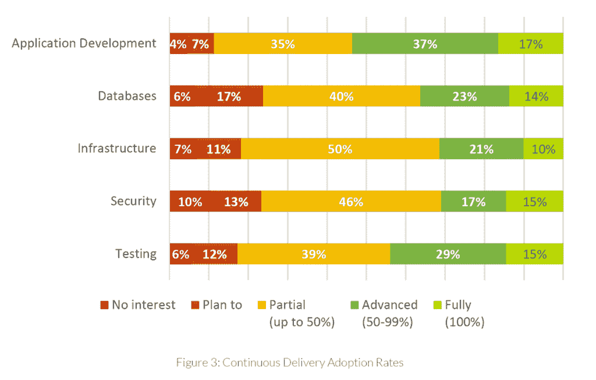
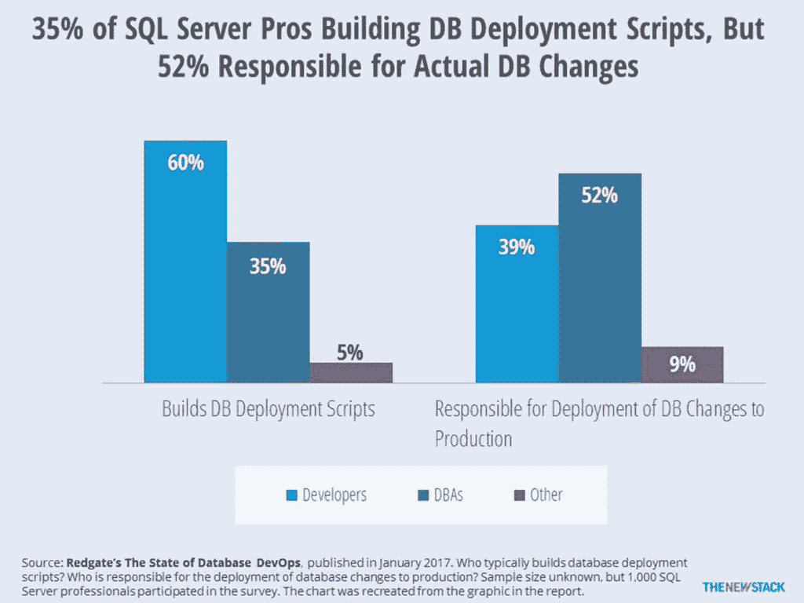

# 本周数字:数据库的开发运维

> 原文：<https://thenewstack.io/devops-databases-one-hurdle/>

大多数调查显示，大多数企业至少已经开始了他们的 [DevOps](/category/devops/) 采用之旅。采用 DevOps 的细节取决于如何定义和衡量它。仅看连续交付(CD)和自动化，2017 年 10 月来自 [DBMaestro](https://www.dbmaestro.com/) 的[调查](https://www3.dbmaestro.com/devops-for-database-survey-2018-results)224 名 IT 专业人员发现，89%的人至少部分采用了自动化 CD 进行应用程序开发，而 77%的人对数据库采用了自动化 CD。对于数据库来说，这是一个不错的表现，但是就范围和成熟度而言，数据库的持续交付更加落后。

 需要改进的一个方面是，只有三分之一的受访者表示他们使用自动化工具来构建或提交脚本以更改数据库。到目前为止，这还没有对部署频率产生重大影响，因为 43%的调查受访者每周部署一次以上的变更。完全自动化不是 DevOps 的先决条件。

展望未来，部署变更的频率可能不会改变，但是相反，DBA 可以专注于更多的测试和安全优先级，而不是手动执行脚本。

正如我们今年早些时候报道的，Redgate 对 SQL Server 用户的一项调查显示，创建和管理生产应用程序的人之间存在脱节。尽管 60%的开发人员编写脚本来部署数据库，但只有 39%的开发人员真正负责生产中的数据库变更。DBA 过去一直不愿意考虑自动化，但是他们已经到了一个临界点。[正如 Datical 首席技术官 Robert Reeves 向我们解释的那样](https://thenewstack.io/op-ed-devops-needs-embrace-database-2/)，虽然应用发布自动化有助于开发人员，但数据库管理员还没有看到好处。就像测试和安全一样，数据库需要集成到 CD/CI 管道中，以实现真正的自动化。

通过 Pixabay 的特征图像。

<svg xmlns:xlink="http://www.w3.org/1999/xlink" viewBox="0 0 68 31" version="1.1"><title>Group</title> <desc>Created with Sketch.</desc></svg>