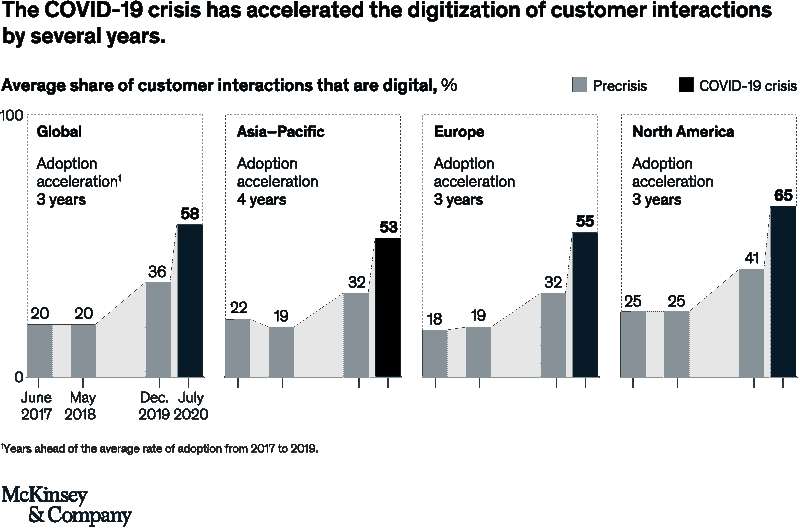

# DevOps、DevApps 和基础设施的死亡

> 原文：<https://thenewstack.io/devops-devapps-and-the-death-of-infrastructure/>

[Mark Hinkle](https://www.linkedin.com/in/markrhinkle/)

[Mark 在新兴技术和开源领域有着悠久的历史。在共同创立 TriggerMesh 之前，他是 Node.js 基金会的执行董事，也是 Citrix、Cloud.com 和 Zenoss 的高管，在那里他领导了他们的开源工作。](https://www.linkedin.com/in/markrhinkle/)

1897 年，美国伟大的幽默作家塞缪尔·克莱门斯(又名马克·吐温)生病了，谣言四起。最终，谣言变成了相信他已经去世。《纽约日报》的英国记者弗兰克·马歇尔问吐温这是否属实。吐温有一个著名的回答:

我完全明白关于我生病的消息是怎么传开的，我甚至听到可靠消息说我已经死了。我的一个表兄詹姆斯·罗斯·克莱门斯两三个星期前在伦敦患了重病，但现在好了。我生病的报道源于他的病。

关于我死亡的报道是夸大其词。

 *我声称基础设施已死，这可能是故意厚颜无耻，但这并不过分夸张。就像克莱门斯从视野中消失让谣言传播一样，我们现在可以说基础设施也是如此。随着我们继续向基于服务的 IT 经济发展，我们用自我管理的服务器来换取服务，并将基础架构的管理委托给云提供商。

随着无服务器的发展，基础设施并没有消亡；相反，它变得越来越抽象，越来越看不见了。事实上，正在使用的基础设施比以往任何时候都多，但是这些服务器、路由器和存储设备的管理被委托给了一个更小的熟练管理员小组——在改进的工具和自动化的帮助下。

## **DevOps，基础设施即代码**

DevOps 运动一直关注运营和开发的融合，基础设施实践越来越多地反映了软件开发人员的实践。从业者经常用首字母缩写词 CAMS(文化、自动化、测量和共享)来描述 DevOps，这个词是由 DevOps 的杰出人物之一和 [DevOps 手册](https://itrevolution.com/book/the-devops-handbook/)、[约翰·威利斯](https://twitter.com/botchagalupe)的合著者创造的。自动化部分是 DevOps 运动中更具体的部分之一。CFengine、Puppet、Chef 和 Red Hat 的 Ansible 等技术可以自动配置基础设施，尽管这只是自动化的一种。

另一个常见的实践是通过持续集成和部署(CI/CD)来自动化软件的部署。由 CI 触发的自动化构建和测试步骤确保合并到存储库中的代码变更是可靠的，然后作为 CD 过程的一部分无缝地交付。

最近，[亚马逊的云形成](https://aws.amazon.com/cloudformation/)和[哈希公司的 Terraform](https://www.terraform.io/) 帮助企业通过声明式 API 自动配置云服务，这些服务可以加速部署和维护基础设施。综上所述，这些自动化功能改变了全球 IT 文化，现在在较小的维护窗口期间，系统更新每月进行一次，或者在更积极的情况下每周进行一次，这已经是司空见惯的事情。如今，许多组织每天甚至每小时都在推送[更新](https://blog.newrelic.com/technology/data-culture-survey-results-faster-deployment/)。

随着时间的推移，谷歌、AWS 或微软的云服务以远低于企业内部的成本提供了冗余系统。云供应商的主要风险不是停机，而是供应商锁定，缺乏对利用某些服务的后果的理解，或者服务相对于其他云供应商的劣势。

多云云的使用正在增加，但不是为了冗余。曾几何时，多云意味着在多个云上运行相同的工作负载。正如著名的“云好麻烦制造者”科里·奎因[评论](https://www.lastweekinaws.com/blog/multi-cloud-is-the-worst-practice/)的那样，这是最糟糕的做法。相反，企业正在挑选满足其需求的最佳解决方案，例如针对代码存储库的 Gitlab、针对 CRM 的 Salesforce、针对监控的 Datadog 以及针对基础架构托管的 Google、Microsoft 和 Amazon。这种组合才是真正有意义的多云。一旦组织开始消费解决个体问题的多种服务，*这就不再是基础设施的问题，而是集成的问题*。

## **开发应用程序，代码集成**

DevOps 运动的教父 Patrick Debois 经常谈到我们如何转向一个更加面向服务或服务化的内部网(参见他关于服务化与无服务化的[演讲](https://www.slideshare.net/ServerlessConf/patrick-debois-from-serverless-to-servicefull))。 [DevApps](https://thenewstack.io/from-devops-to-devapps/) 是我在 [DevOps 部署方法](https://thenewstack.io/deployment-strategies/)上一直称之为 riff 的东西。

这是一种新兴的设计模式，其中云原生应用程序是定制服务(如 Twilio、Salesforce 和许多其他服务)与定制软件的组合，定制软件作为功能部署在零规模 web 服务上，如 Amazon Lambda。服务由 Terraform 管理，就像过去的服务由厨师或木偶管理一样。

一旦组织处理了广为接受的自动化部署实践，下一个前沿就是创建可通过自动化方式组合的应用程序。我们在这里讨论的是在基础设施即代码之上分层集成即代码。由于有各种各样的云服务可供使用，应用程序开发人员不需要担心后者——只需要担心前者。

在 [TriggerMesh](https://www.triggermesh.com/) 上，我们看到越来越多的组织希望创建配置有动态自动化工作流的应用程序。我们看到了一种发展，开发人员现在可以通过声明式 API，简单地定义他们的云原生应用程序的组件以及它们之间的工作流，从而创建端到端的应用程序，而无需配置基础架构。例如，最近的一个工作流使用 TriggerMesh 和机器人流程自动化(RPA)技术来挖掘 Salesforce 的数据，将这些数据转储到 Google Cloud 上，然后通过 Twilio Sendgrid 发送发票。这涉及到由四个不同的提供商管理的非常不同的服务的链接。由此产生的工作流有可能基于成本和功能在每个类别中实施同类最佳的解决方案，并提供单一的自动化云原生解决方案。

## **一个例子:Jamstack**

随着 web 的蓬勃发展，LAMP 栈是在 Linux 上部署应用程序的一种常见方式——使用 Apache web server、MySQL 和 3p(Python、Perl 或 PHP)之一。今天，我们开始看到一种新的“堆栈”的出现， [Jamstack](https://jamstack.org/) 。Jamstack 与其说是一个定义良好的堆栈，不如说是一个旨在使 web 更快、更安全、更容易扩展的架构。它建立在许多工具(Gatsby、Hugo、Jekyll、Eleventy、NextJS 和[更多](https://jamstack.org/generators/))和工作流的基础上，极大地提高了生产率。

像 Netlify CDN 这样蓬勃发展的云服务生态系统已经成为 Jamstack 网站的重要推动者。利用通过 API 提供产品和服务的领域专家的能力允许团队用更少的资源构建越来越强大的网络应用程序。开发人员可以为任务消费和集成其他服务，包括认证和身份、支付、内容管理、数据服务、搜索等等。

Jamstack 站点可能在构建时使用这些服务，也可能在运行时通过 JavaScript 直接从浏览器使用这些服务。这些服务的完全分离允许更大的可移植性和灵活性，以及更快的价值实现。

## **数字或新冠肺炎变换**

正如麦肯锡公司在他们的报告《新冠肺炎如何推动公司越过技术临界点——并永远改变了商业》中指出的那样，新冠肺炎·疫情加速了公司提高与客户数字化互动能力的需求。

出于这些原因，公司不仅必须加快步伐，还必须采用能让他们加快步伐的流程和工具，以加速他们的数字化转型计划。这包括采用可缩短价值实现时间的云服务，以及添加其他功能，如代码集成和 CI/CD。最终，公司需要将精力集中在为公司提供优势的差异化服务上。转向更具服务性的方法来开发和维护数字体验，是实现更好、更敏捷的在线展示的途径。

<svg xmlns:xlink="http://www.w3.org/1999/xlink" viewBox="0 0 68 31" version="1.1"><title>Group</title> <desc>Created with Sketch.</desc></svg>*