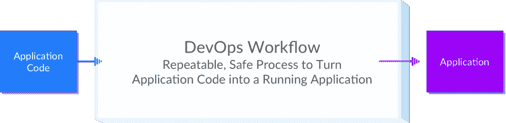

# DevOps Landscape 2015:管理层竞赛

> 原文：<https://thenewstack.io/devops-landscape-2015-the-race-to-the-management-layer/>

凯文·菲什纳是

[HashiCorp](https://hashicorp.com/)

，DevOps 市场的领导者。作者注:作为 DevOps 生态系统中的一员，我们当然会有偏见。此摘要是我们对当前 DevOps 环境的看法，以我们的经验和客户的经验为依据。它并不详尽。

在过去的几个月里，DevOps 工具和最佳实践方面的活动如此之多，以至于很难理解该行业的当前和未来状态。该总结是解释 HashiCorp 对当前 DevOps 前景和未来路线图的想法的结果。

## DevOps 的目标是通过一个可重复的、安全的过程将应用程序代码转换成一个可运行的应用程序

作为一个术语,“DevOps”有许多含义，但是为了本概述的目的,“DevOps”将由其目标来定义。在整个组织中，DevOps 的目标是通过一个可重复的、安全的过程将应用程序代码转化为一个可运行的应用程序。

## 通往完整 DevOps 管理层的道路:配置管理与不可变基础设施

有两种范例可以为交付应用程序提供完整的管理层:

*   **范例 1:运行时配置**。从这个角度来看，从应用程序代码到运行应用程序的工作流就是提供一个服务器；用依赖项和应用程序代码配置服务器；并通过预定的连续配置管理运行来监控应用程序和服务器的运行状况。

*   **范例 2:不可变的基础设施**。在这种观点下，从应用代码到运行应用代码的工作流程是将应用打包成可部署的工件，如 Docker 容器、AMI、jar 等；然后按照那个工件的样子配置服务器；最后，监控应用程序和服务器的运行状况。值得注意的是，不可变的基础设施和配置管理并不相互排斥。配置管理工具通常用于配置构建时工件。

不可变基础设施和配置管理范例之间的关键区别在于配置发生的时间点。在不可变的基础设施视图中，配置发生在构建时，部署之前。在配置管理视图中，配置发生在部署之后的运行时。为了在不可变的基础设施世界中进行服务变更，需要构建一个新的工件，销毁旧的服务，并使用新的工件创建一个新的服务。服务一旦被部署就永远不会改变，这就是为什么这种范式被称为“不可变的”基础设施。为了在配置管理环境中进行服务更改，相同的服务器将使用新的服务代码进行更新。同样，这些范例并不相互排斥，因为配置管理工具经常被用来帮助构建构建时工件。

可以说有一个新生的第三范式**，它将服务器视为一个通用资源池，异构工作负载在其上调度。这在技术上符合不可变的基础设施范式，但也足够独特，可以独立定义。随着 Mesos、Kubernetes、Docker Swarm 和各种其他调度器的流行，这种模式正在积极发展。**

## 管理层是 DevOps 中的收入机会

DevOps 中有三个基本层—基础架构、工具和管理层:

【T2

*   **基础架构层**由向物理硬件提供虚拟化功能的技术组成，以使计算、网络和存储易于访问。示例技术包括公共云领域的亚马逊 EC2 和谷歌计算引擎，以及私有云领域的 VMware 和 OpenStack。
*   **工具层**由使基础设施层的访问和配置更容易的技术组成。这些工具仍然需要底层基础设施的功能知识。这里的例子有 HashiCorp、Mesos、Docker、Puppet、Chef、Jenkins 和其他许多人的开源工具。有趣的是，工具层的大部分是由开源软件组成的。
*   **管理层**位于顶层，其目标是将工具层和基础设施层抽象成一个通用的工作流，将应用程序代码转化为运行的应用程序。一个示例最终目标是将您的应用程序打包——可能是 Docker 容器、rkt 容器、jar 或二进制文件——并使其能够在任何云或物理基础架构上运行。理想情况下，不需要了解基础设施本身，所有的逻辑都保存在应用程序级别。

基础设施层正面临着竞争和商品化的浪潮，我们现在看到该领域的公司正试图向工具和管理领域发展。亚马逊网络服务(AWS)已经发布了 EC2 容器服务(ECS)和 AWS CodeDeploy 等工具，这些工具允许用户简单地打包他们的应用程序，而忽略基础架构配置和供应过程。谷歌云平台也类似地发布了谷歌应用引擎和谷歌容器服务，以及赞助 Kubernetes 等开源项目。VMware 已经进入工具和管理领域，大力支持 Pivotal 的 Cloud Foundry。这些工具使用户更容易部署应用程序，并允许基础设施提供商将用户锁定在他们的平台上。

工具层更难赚钱，因为工具本身解决了更大的 DevOps 目标的一部分。很难在企业层面对打包应用程序或提供基础设施的工具收费。企业购买工具，通过节省员工时间或材料来降低成本。这些工具仍然需要大量的员工努力，并且很难与材料节约联系起来，因此更难货币化。当然有可能通过支持和服务将这一层货币化；然而，这些更难扩展。

管理层提供了最重要的盈利机会，因为它提供了将应用程序代码转化为运行应用程序的完整解决方案。员工投资在实施阶段很重要，但在维护阶段相对较少。如果管理层能够节省大量成本，例如减少服务器数量，将会有巨大的收入机会。

DevOps 公司竞相向管理层进军；但是，要获得完整的 DevOps 管理产品，有几个工具是必不可少的。

## 三种类型的 DevOps 公司:基础设施提供商、配置管理公司和不可变基础设施公司

鉴于管理层具有最大的收入潜力，该领域的积极参与者都在争夺这一机会。这场战斗有趣的一面是，DevOps 中不同类型的公司正从独特的有利位置接近它。这些组织可以被分类为基础设施提供者、配置管理公司或者倾向于不可变基础设施的公司。亚马逊网络服务、谷歌云平台、OpenStack 和 VMware 是基础设施提供商领域的主要参与者。Ansible，Chef，Puppet，Salt 是配置管理的佼佼者。HashiCorp、CoreOS、Docker 和 Mesosphere 是新生的不可变基础设施领域的领导者。

所有这些公司都必须拥有基础设施供应和应用程序打包或配置的解决方案，以便有可能在管理层的战斗中获胜。从历史上看，VMware 是拥有整个工具体系以赢得数据中心虚拟化市场的绝佳范例。如果你看一下这些公司目前的产品开发，你会发现每个公司都在围绕这些基本要素开发工具。Chef 通过 Chef Provisioning 来配置基础架构，通过 Chef configuration management 来配置应用程序。HashiCorp 拥有 Terraform 来提供基础设施和打包程序，以打包应用程序和构建机器映像。Docker 有 Docker Machine 来提供基础设施，Docker 用来打包应用程序。

然后，这些工具被组合到一个仪表板或通用工作流中，以提供一个管理层。例如，Mesosphere 将 Mesos、Marathon 和 Chronos 捆绑在一起，创建了 Mesosphere 数据中心操作系统。HashiCorp 联合 Packer、Terraform 和 Consul 创建 Atlas。CoreOS 最近发布了将 etc、rkt 和法兰绒捆绑到管理层的构造。下面的信息图显示了这些类别中主要参与者的工具组合，以及这些工具是如何开始发展成管理层的。

## 对未来 12 个月的预测

该摘要将基础架构配置和应用打包或配置确定为构建 DevOps 管理层的基本工具。这个结论导致了一些预测:

*   不可变基础设施领域的所有公司都将拥有提供基础设施、打包应用程序、调度应用程序和监控应用程序的工具。
*   配置管理公司将获得大部分企业预算。一成不变的基础设施公司需要 12 个月以上的时间才能在企业方面取得重大进展。
*   AWS 将增长 50%以上，并占据更大比例的总体基础设施预算。AWS 工具生态系统比竞争对手成熟得多，越来越多的公司正在远离内部数据中心。

## 如何选择 DevOps 管理层

这个总结的目的是揭示拥挤和不透明的 DevOps 景观。然而，下一个明显的问题是，“我如何选择一个 DevOps 管理层？”这个问题有许多可移动的部分，我们最好通过回答几个问题来简化一些选择:

### 是否有两个或更多的人在你的团队的基础设施上工作(包括兼职贡献者)？

*   如果没有，两个最好的选择要么是亚马逊网络服务，要么是 Heroku。如果没有人有 ops 经验，Heroku 是最好的选择。如果有人有运营经验，AWS 是最全功能的选择。

*   如果是，您的团队需要一种方法来管理基础架构协作的复杂性。继续下一个问题。

### 您想进行构建时配置还是运行时配置？

*   如果您想进行运行时配置，请使用配置管理工具，如 Ansible、Puppet、Chef 或 Salt。如果您想要基于代理的配置管理，请使用 Puppet 或 Chef。如果您想要基于 ssh 的配置管理，请使用 Ansible 或 Salt。
*   如果您想进行构建时配置，这意味着构建映像和不可变的基础设施，请使用 HashiCorp 的 Atlas、Mesosphere、CoreOS 的 constructive 或 Docker Hub。继续下一个问题，在这些选项中进行选择。

### 您是否希望自动化基础架构配置流程？

*   如果是的话，HashiCorp 的 Atlas 是唯一的选择。Atlas 使用 Terraform 以代码形式规划基础设施，并自动执行供应流程。Docker 有 Docker 机器来供应 Docker 主机；但是，它目前是一个命令行工具，只管理主机，而不是一个完整的基础架构。

*   如果没有，可以考虑 HashiCorp、Mesosphere、Docker 和 CoreOS 的任何选项。但是，如果没有自动化和可靠地供应基础设施的方法，就很难部署应用程序。

这个基本决策树并不详尽，但应该有助于选择 DevOps 管理工具的初始决策过程。

<svg xmlns:xlink="http://www.w3.org/1999/xlink" viewBox="0 0 68 31" version="1.1"><title>Group</title> <desc>Created with Sketch.</desc></svg>