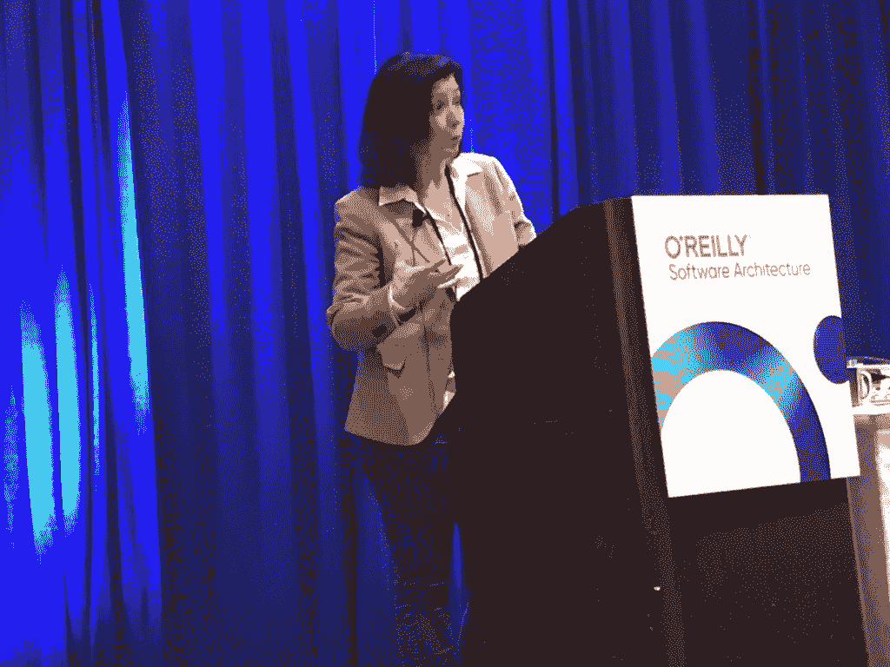

# DevOps 成熟度和 O'Reilly 软件架构会议

> 原文：<https://thenewstack.io/devops-maturity-and-the-oreilly-software-architecture-conference/>

[DevOps 成熟度与奥莱利软件架构大会](https://thenewstack.simplecast.com/episodes/devops-maturity-and-the-oreilly-software-architecture-conference)

在本周的 [New Stack Context](https://thenewstack.io/podcasts/context) 播客中，我们采访了 [CircleCI](https://circleci.com/) 的首席技术官 [Rob Zuber](https://www.linkedin.com/in/robzuber/) ，探讨对于一个组织来说，达到 DevOps 成熟度意味着什么。

“好消息是，我们在各种 DevOps 组织中看到的增长是复合的:团队投入的技能和流程越多，他们就越有能力处理他们在发展过程中面临的规模和日益增加的复杂性问题，”Zuber 在他对新堆栈的贡献系列的第一部分中写道。DevOps 帮助团队获得更高的生产力，然后帮助他们优雅地处理源自生产力的增长。这就是我们所说的 DevOps 成熟。"

在稍后的节目中，我们还将讨论本周在纽约举行的 O'Reilly 软件架构会议的新闻。

TNS 编辑部主任利比·克拉克主持了这场秀，TNS 创始人亚历克斯·威廉姆斯和 TNS 执行主编约阿布·杰克逊提供了协助。

## 链接

*   [devo PS 成熟度对您的组织真正意味着什么](https://thenewstack.io/what-devops-maturity-really-means-for-your-organization/) : DevOps 可以帮助团队更快速、更敏捷地移动。使用 DevOps 实践使得部署变更更加安全，因此帮助开发团队更好地响应他们的市场。但是我们没有谈论很多的是，采用 DevOps 是一个旅程，而不是目的地。
*   [消除 DevOps 成熟道路上的障碍](https://thenewstack.io/eliminate-roadblocks-on-the-path-to-devops-maturity/):本文概述了阻碍成熟的常见障碍，并提供了一些绕过这些障碍的方法。有时，管理层还不相信开发运维会给组织带来的价值。除此之外，他们可能会陷入“我们一直都是这样做的”的思维方式。通常，阻碍来自团队内部——开发人员通常不愿意承担开发运维带来的更多运营责任。
*   [Golang 在 2019 年将迎来什么:模块、泛型、更好的错误处理](https://thenewstack.io/whats-coming-to-golang-in-2019-modules-generics-better-error-handling/):事件驱动的人工智能(AI)可能会导致更快、更智能的决策，但除了充分利用无服务器和其他新兴技术的混合架构结构之外，还需要对组织流程和团队构成进行重新定位。
*   [当霍尔特-温特斯比机器学习更好的时候](https://thenewstack.io/when-holt-winters-is-better-than-machine-learning/):机器学习(ML)得到了很多宣传，但它的经典前辈仍然非常强大。在这篇由 TNS 赞助商 InfluxData 提供的帖子中，开发者倡导者阿奈斯·多蒂斯-乔治乌带我们了解了使用霍尔特-温特斯预测模型的过程，该模型对季节性事件的时间序列数据非常有用。
*   [CodeReady Workspaces 交付 Kubernetes-Native IDE](https://thenewstack.io/codeready-workspaces-delivers-kubernetes-native-ide/) :本周，红帽向 general availability 发布了 CodeReady Workspaces，这是一个基于云的集成开发环境(IDE)，可直接与红帽企业 Linux 和 OpenShift(红帽基于 Docker 和 Kubernetes 构建的 PaaS)配合使用。

## 本周的照片

在 O'Reilly 软件大会上，亚马逊的 Arun Gupta 向 Java 开发者介绍了 Kubernetes。

Audible.com 的 Tyler Lund 在 O'Reilly 软件架构会议上解释了 Audible 是如何成为混沌测试的早期采用者的。

Diana Montalion，Mentrix Group 的创始人，在纽约的 O'Reilly 软件架构会议上发言:系统架构师并不是所有方面的专家。那是不可能的。相反，系统架构师是集成方面的专家，是系统集成者

CircleCI、InfluxData 和 Red Hat 是新堆栈的赞助商。

通过 [CircleCI](https://circleci.com/) 的特征图像。

<svg xmlns:xlink="http://www.w3.org/1999/xlink" viewBox="0 0 68 31" version="1.1"><title>Group</title> <desc>Created with Sketch.</desc></svg>