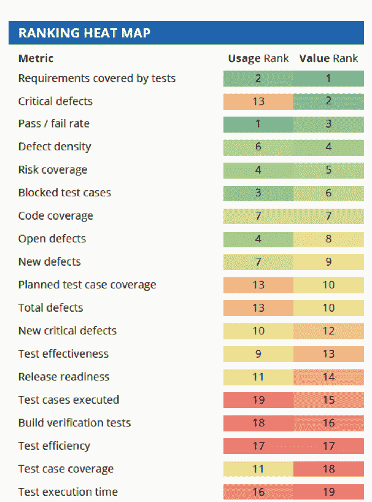
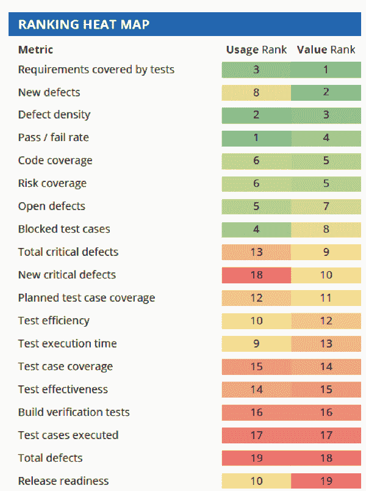

# 重要的开发运维指标

> 原文：<https://thenewstack.io/devops-metrics-that-matter/>

Tricentis 赞助了这篇文章。

 [韦恩·阿里奥拉

来自 Tricentis 的 Wayne 是持续测试、基于风险的测试、服务虚拟化和 API 测试等软件测试领域公认的思想领袖。Wayne 创造并销售了支持动态软件开发、测试和交付环境的产品。他推动了许多创新技术的设计，并获得了多项发明专利。他为软件测试领域贡献了 15 年，在软件行业工作了 20 多年。在 LinkedIn 或 Twitter 上与他联系。](https://www.linkedin.com/in/wayneariola/) 

应用交付的所有其他方面都经过了仔细审查，并针对开发运维进行了优化。为什么不重新检查质量指标呢？

自动化测试的“经典”度量，测试用例覆盖率和通过/失败率在 DevOps 的上下文中是否重要，在 devo PS 中，目标是立即洞察给定的发布候选是否具有可接受的风险水平？还有哪些指标可以帮助我们确保稳定的更新流真正适合生产？

为了向 DevOps 社区提供关于哪些质量指标对 DevOps 的成功最重要的客观观点，Tricentis 委托 Forrester Research 研究该主题。调查结果发表在 55 页的报告[“Forrester Research on devo PS Quality Metrics that materials:75 个常见指标——由行业专家排名](https://www.tricentis.com/resources/forrester-research-on-devops-quality-metrics/)”中该报告提供了详细的排名、热图、象限图和分析。

在本文中，我们描述了四个主要度量类别的热图和分析:构建、功能验证、集成/API 测试和端到端测试。

## 构建测试

当度量构建时，单元测试做得好很重要。计算单元测试是浪费时间，但是理解变化的影响很重要。跟踪按风险划分优先级的“单元”测试是关键。随着代码库的发展，开发人员和测试人员需要关于变更影响的即时反馈。如果按照风险级别划分优先级，这种反馈更具可操作性。

这些公司中有 63%认为风险优先的单元测试数量是他们最想要的度量之一。但是很少有人能真正做到——尽管 34%的高级 DevOps 公司跟踪单元测试运行的数量，但是只有 27%的公司根据风险进行优先排序。不太先进的 DevOps 公司甚至更少使用它——今天只有 15%的公司可以跟踪这一指标。在构建中跟踪的其他重要指标集中在确保代码质量上，例如成功代码构建的数量(61%)、单元测试通过/失败的比率(60%)以及识别的缺陷总数(59%)。

## 功能验证

当功能测试开始时，用户故事/需求覆盖成为焦点。测试人员在这个阶段的最高目标是通过确保用户故事中表达的功能按预期工作来最小化风险。将这个覆盖概念扩展到业务风险覆盖是领先的 DevOps 公司为推进发布自动化而执行的一个额外的度量。

运行功能测试并对照覆盖的需求进行检查(69%)、错误的密度(62%)或发现的功能缺陷的数量(66%)以及测试通过与失败的比率(64%)是成功的团队在功能测试期间识别为管理风险和跟踪质量的重要指标。

## 集成测试

为了处理现代分布式架构，度量集成测试和 API 测试无处不在。随着应用架构变得更加分离，分解为服务和微服务，

API 测试变得更加重要。用户界面之外发生了如此多的事情，如果不解决 API 层的问题，就不可能保持高质量并降低风险。先进的 DevOps 公司优先考虑集成测试的许多相同的度量，就像他们为功能测试阶段所做的一样；这一次，焦点特别集中在 API 上。

这些指标包括针对功能需求运行的测试(75%)、发现的新 API 缺陷总数(64%)和 API 缺陷密度(63%)、API 测试通过率与失败率(62%)以及 API 代码覆盖率(62%)。监控 API 风险覆盖率也是一个重要的指标，62%的高级 DevOps 公司将其作为该类别的首要指标。

## 端到端回归测试

端到端回归测试也获得了一等公民的角色。在这一类别中，领先的组织在流程或事务级别自动化端到端测试。自动化这些类型的测试并不容易，因为速度很重要，所以需要先进的测试自动化工具。测试技术的选择很重要，因为实现，更重要的是，保持高水平的自动化是至关重要的。因此，自动化的测试越多越好，因此 70%的领先 DevOps 团队将自动化端到端测试用例的百分比作为首要指标。

领先公司在这一类别中认为重要的许多其他指标是定量的，并测量功能与需求的覆盖率(70%)、执行的测试用例数量(65%)以及测试期间识别的缺陷总数(66%)。

有关象限映射、指标详细信息和其他分析，请参见完整的 55 页报告“Forrester Research on devo PS Quality Metrics that matrics the materials:75 Common Metrics—由行业专家排名”该报告可在 Tricentis 网站上免费获得。

图片由来自 Pixabay 的 Frank Winkler 提供。

<svg xmlns:xlink="http://www.w3.org/1999/xlink" viewBox="0 0 68 31" version="1.1"><title>Group</title> <desc>Created with Sketch.</desc></svg>