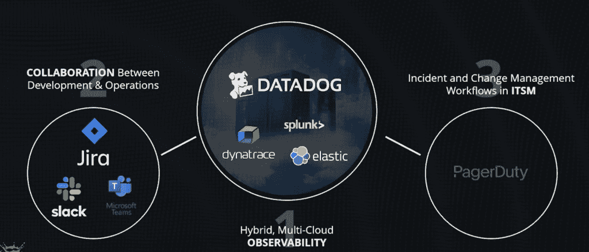
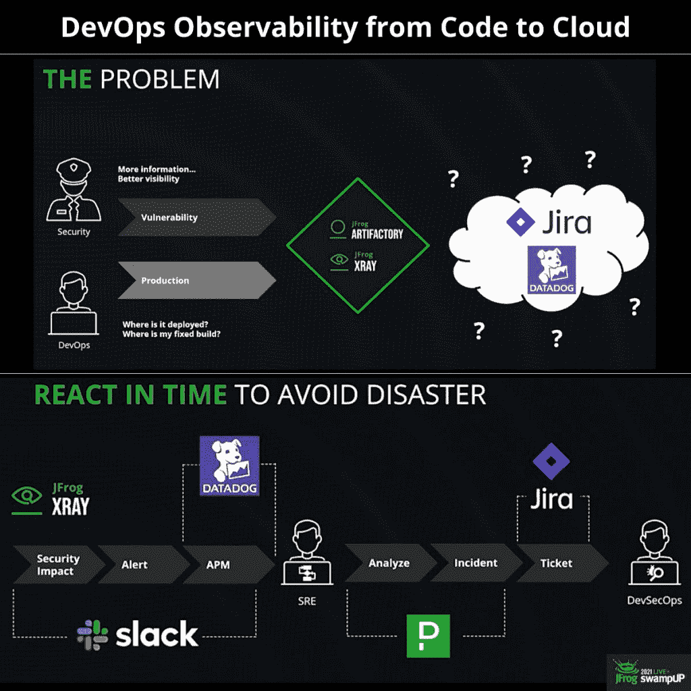

# 从代码到云的开发可观察性

> 原文：<https://thenewstack.io/devops-observability-from-code-to-cloud/>

 [帕万·贝拉加蒂

帕万·贝拉加蒂是印度增长黑客领域的先驱之一，他也是 DevOps 的影响者和谷歌认证的数字营销人员。他已经就 DevOps 主题写了 100 多篇文章。他通常写 DevOps、市场营销和增长黑客。他是世界上一些顶级网站的客座撰稿人。](https://www.linkedin.com/in/pavan-belagatti-growthmarketer/) 

现代软件交付实践已经随着时间的推移而发展。我们有 GitOps、AIOps、DataOps 等等。，企业采用并试验哪一种最适合他们的需求。如今，这不仅仅是敏捷或快速的问题；公司更关注基础设施的稳定性。

虽然 [DevOps](https://jfrog.com/devops-tools/what-is-devops/) 和云原生实践的进步正在全面展开，但严格监控和观察与基础架构性能相关的指标、日志、分析和数据集以优化系统可靠性非常重要。

输入可观察性。

在瀑布软件开发的时代，事情是相当孤立的；没有人知道在软件开发生命周期中其他人在做什么。当开发人员致力于构建新的特性时，测试团队和操作人员分别测试这些特性，因此存在沟通和协作上的差距。监控方面远远超出了开发团队的控制。构建这些特性时只考虑了成功，而忽略了混乱的工程和基础设施依赖，因为开发人员不太了解这些。

“可观察性”不仅仅是另一个时髦的词，它通过为组织提供可靠的指标来帮助组织，这些指标可以帮助他们查明基础设施和系统问题，以便他们可以在最有效的阶段开始解决这些问题。监控不太重要，没有人知道这些系统之间和内部发生了什么。这使得公司对自己的基础设施缺乏了解。因此，监控和可观察性已经成为了当今云领域的焦点。

可观察性可分为三个基本支柱:

*   **日志**捕获系统的大量不可变事件以及时间，用于了解系统的不规则行为，以了解哪里出错了。日志的格式应该是结构化的，比如 JSON。
*   **指标**构成监控的基础；它们只是一种测量方法，用于了解系统、方法使用的内存量，以及服务每秒处理的请求数。
*   **跟踪**是请求的那些微小细节，让您知道是什么导致了系统错误，并呈现系统性能中的瓶颈。

## 监控与可观察性

监控是可观察性的一个子集。

而监控允许您使用网络流量、资源利用率等指标来跟踪应用程序的整体健康状况。可观察性是固有的系统属性，它提供了对系统内正在发生的事情的可见性和感知。通过观察，你将能够分析和可视化收集的数据。它有助于改进应用程序生命周期管理。可观察性将使团队能够看到发生了什么，并共享解决方案来修复它。

与可观察性相比，监控更加有限，可观察性可以揭示事情发生的原因，并提供详细的、可操作的见解。可观察性包括监控并扩展其范围。它接收监控数据，将其转换为丰富的可视化信息。相比之下，监控不会为您提供增强的数据和解决方案来修复问题。可观察性旨在获得深度和粒度的洞察力、上下文和调试能力。相比较而言，监控不是为了深层的根本原因和分析。

什么时候可观测性是必要的？以下是一些场景:

*   当您的应用程序很关键并且执行大量工作时，您不能错过任何作为输出生成的数据。任何一个做生意赚钱的公司，都经不起让客户不爽；因此，在单一窗口中观察应用程序中发生的事情变得至关重要。
*   当您的应用程序具有动态流量行为时，会出现流量峰值。事情发生得非常快，所以你需要适当的可观察性，以使事情顺利进行而不停机。
*   当你有成百上千个微服务在相互通信时，有时很难发现什么地方出了问题。这里还需要适当的可观察性，以确保用户请求得到很好的处理，而不影响工作流。
*   当您通过自动化的 CI/CD 工具链将快速更新投入生产时，可观察性是绝对必需的，我们需要知道最近的更新是完全好的，还是因为任何问题而需要回滚到前一阶段。

## 从代码到云的开发可观察性

DevOps 在过去几年中进行了自我转型，从我们过去所见的孤立工具完全转变为高度集成的单一控制台平台。

图片由 Datadog 提供。

像 JIRA、Slack 和微软团队这样的协作系统连接到您的观察工具，如 Datadog、Dynatrace、Splunk 和 Elastic。最后还接入了类似[page duty](https://www.pagerduty.com/?utm_content=inline-mention)这样的 IT 服务管理工具。将这些高级工具捆绑在一个平台上，如 [JFrog 平台](https://jfrog.com/?utm_content=inline-mention)，为寻求可观察性工作流的企业带来高价值[。](https://jfrog.com/user-conference/devops-observability-from-code-to-cloud/)

安全人员还需要更好地了解企业的系统，以寻找漏洞。在 Artifactory 和亚马逊网络服务 Xray 中有很多这样的信息，但是我们如何在其他合作伙伴系统中利用这些信息，比如 JIRA 和 Datadog？

这一切都始于 JFrog Xray 的安全影响，我们可以向 Datadog 生成松弛和健壮安全日志的警报，供您的站点可靠性工程师进行分析。同样由 x 射线生成的 PagerDuty 事件可以用来快速创建 JIRA 问题。

## 结论

并非每个应用程序都需要可观测性，但是对于关键应用程序来说，测量性能、稳定性和分析变得至关重要。因此，在 DevOps 行业中，可观察性已成为一项必要条件。很高兴看到围绕这一点有这么多的倡议和组织站出来确保软件开发之旅尽可能顺利地进行。可观察性有助于我们在单一窗口中了解一切，以便我们可以对不顺利和影响应用程序性能的事情立即采取行动。

<svg xmlns:xlink="http://www.w3.org/1999/xlink" viewBox="0 0 68 31" version="1.1"><title>Group</title> <desc>Created with Sketch.</desc></svg>