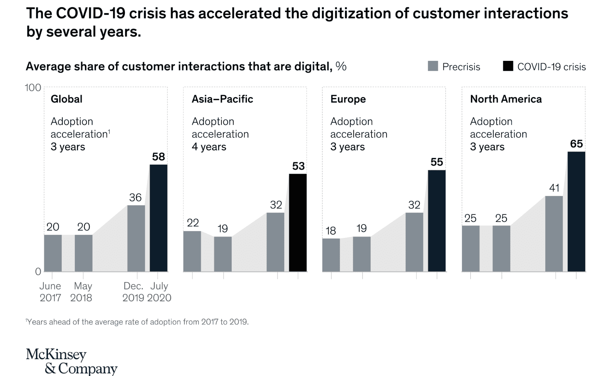
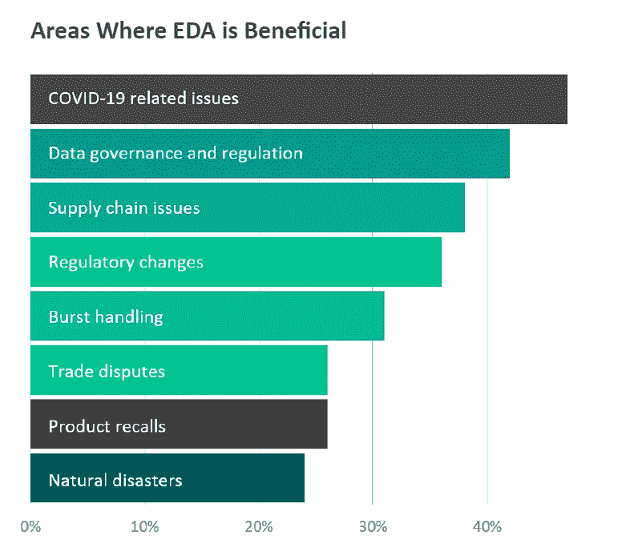

# 发展、流行病和 2022 年的云计算未来

> 原文：<https://thenewstack.io/devops-pandemics-and-2022s-cloud-y-future/>

当我去年写这篇文章“DevOps，DevApps，和基础设施的死亡”时，我看到了许多事情的到来，这些事情往往受到疫情的影响。2020 年，麦肯锡公司[发现](https://www.mckinsey.com/business-functions/strategy-and-corporate-finance/our-insights/how-covid-19-has-pushed-companies-over-the-technology-tipping-point-and-transformed-business-forever)由于疫情，数字化转型在全球加速。当我们带着对持续数字化转型的新考虑结束 2021 年时，对于希望在社交距离遥远的世界中保持相关性的公司来说，这不再是一种趋势，而是一种业务要求。

## 【2021 年 DevOps 和云计算趋势

 [马克·辛克尔

Mark 在新兴技术和开源领域有着悠久的历史。在共同创立 TriggerMesh 之前，他是 Node.js 基金会的执行董事，也是 Citrix、Cloud.com 和 Zenoss 的高管，在那里他领导了开源项目。](https://www.linkedin.com/in/markrhinkle/) 

我把我在许多计算趋势前沿的职业生涯归功于我预见未来的本领。在 Linux 桌面出现的那一年(是的，从 1999 年到现在)，我在一家 Linux 桌面公司的第一家全国性 ISP 工作。

在 DevOps 进入企业软件词典之前，我和 DevOps 之父 Patrick Debois(T8)一起在比利时经历了一场暴风雪。我曾是第一批云计算公司中的一名高管，现在我很幸运地在一家云原生公司 TriggerMesh 工作。

以下是我认为将在 2022 年推动企业软件和云计算的一些事情。

### **从可组合基础设施到可组合应用**

可组合的基础设施允许通过 API 控制计算、存储和网络资源的抽象。因此，可组合基础设施使数据中心资源像云服务一样随时可用，因此它们可以支持私有云和混合云解决方案。今天，我们已经有了在这个基础设施上构建大规模可伸缩业务的构件，为更强大的可组合性进化打开了大门。

随着基础设施抽象的增长，我们开始看到由云服务组成的应用程序创建云原生服务。很快，我们将不再编译软件，而是将微服务链接到云原生应用中，我称之为“开发应用”

例如，我们已经看到 HashiCorp 的 Terraform 部署云基础设施的增长，这是基础设施作为代码的最新发展。下一个逻辑步骤是我们在 TriggerMesh 称为代码的[集成。用于管理基础架构部署的相同 DevOps 实践应该用于集成。为了推动这一新时代，TriggerMesh 开源了我们的](https://www.triggermesh.com/product-overview)[云原生集成平台](https://www.triggermesh.com/open-source)，以帮助企业构建可组合的云原生应用。这种可组合性有助于服务部署和交互的自动化，以及人工智能和机器学习的加入，以在未来几年创建更多创新的应用程序。

### **DevSecOps**

在过去，安全性通常是事后的想法，是在项目结束时添加的，而不是在开始时的设计点。如今，开发周期持续数天或数周或最多数月。为了有效地遵守 DevOps 实践，您需要在不牺牲安全性的情况下快速开发新特性并频繁部署它们。这通常是一个好的实践，但是根据 Sonatype 的" [2021 年软件供应链状态"](https://www.sonatype.com/resources/state-of-the-software-supply-chain-2021)报告:

*“2021 年，全球目睹了旨在利用上游开源生态系统弱点的软件供应链攻击增长了 650%。相比之下，在 2020 年版的报告中，同样的统计数据是 430%。”*

当 [Log4j 漏洞](https://thenewstack.io/log4j-is-one-big-i-told-you-so-for-open-source-communities/)在 12 月出现时，开发人员社区又接到了一个关于安全性的粗鲁的警钟。安全从不休假，安全也不应该休假。为了应对越来越多的威胁，我们将看到提供供应链安全的技术的增加，包括像 [Chainguard](https://techcrunch.com/2021/12/08/chainguard-seed-software-supply-chain-security/) 这样的初创公司，由谷歌前雇员创建，以确保在软件部署到生产之前构建系统是安全的。

### **事件驱动架构(EDA)**

在过去的几年里，围绕无服务器已经有了大量的宣传。然而，我相信炒作不仅仅是因为无服务器的成功故事，而是因为事件驱动架构的总体类别，无服务器是其中的一部分。无服务器是 EDA。一个事件触发一个无服务器函数，该函数可以根据需要伸缩，例如，当 EventBridge 使用来自 AWS Kinesis 的事件时，就会触发一个 Lambda 函数。虽然无服务器的采用是好的，但基础技术的采用，如事件流技术 Apache Kafka 和 Apache Pulsar 等新技术的采用正在增长，并为更有趣的 EDA 示例提供了基础。

由 Solace 赞助的科尔曼·巴夏礼的一份报告发现，72%的全球组织利用了事件驱动架构。这些组织见证了采用 EDA 带来的许多事件，并看到了实时数据和自动化的好处。

事件驱动的架构将提高组织更快地实时访问数据的能力，并通过自动化和数据同步对数据采取行动。

### **私有云(本地)**

在云计算的早期，有很多关于公共云和私有云的讨论。如今，随着 Kubernetes 的采用快速增长，2020 年生产使用将增加到 83%,这个词是关于云的，但没有限定条件。不仅 Kubernetes 的采用率在增长，而且 Kubernetes 的内部部署增长速度也比托管云产品快得多。

私有云的使用也在增加。这就是为什么我认为趋势不仅仅是在云计算领域，而是在云原生领域。

## **先开源**

20 年前，许多企业对开源软件持谨慎态度。今天，我们将开源视为云基础设施的标准。Linux、KVM 和 Kubernetes 为许多云服务提供了基础。来自 HashiCorp、Elastic、Confluent、Kong 和许多其他项目的工具为管理云基础设施提供了基础。这种趋势只会越来越强。我怀疑来自 [CNCF 沙盒](https://www.cncf.io/sandbox-projects/)的项目将继续成熟，并与许多其他项目一起成为生产生态系统的一部分。

根据 [Red Hat 的“企业开源状况](https://www.redhat.com/en/enterprise-open-source-report/2021)”报告，79%的企业预计在未来两年内使用新兴技术的企业开源软件将会增加。此外，87%的人认为企业开源软件比专有软件更安全。

今天，情况发生了变化，甚至最保守的行业在采购基础设施软件时也采取开源优先的立场。以下是 2022 年云计算和 DevOps 相关的一些开源项目。

1.  [Apache Pulsar](https://pulsar.apache.org/)—Apache Pulsar 是雅虎创建的云原生分布式消息和流媒体平台，现在是顶级的 Apache 软件基金会项目。它的声誉是一种轻量级但可扩展的方式来提供事件流。
2.  [Appwrite](https://github.com/appwrite/appwrite) — Appwrite 是一款安全的端到端后端服务器，面向 web、移动和 Flutter 开发人员，打包成一组 Docker 容器，便于部署。
3.  [Terraform](https://www.terraform.io/) — Terraform 是一款开源的基础设施即代码软件工具，提供一致的 CLI 工作流来管理数百个云服务。Terraform 将云 API 编码成声明性的配置文件。
4.  [Jamstack](https://jamstack.org/) — Jamstack 旨在让网络更快、更安全、更易于扩展。它建立在开发人员喜欢的工具和工作流程之上，并带来最大的生产力。
5.  [Argo](https://github.com/argoproj/argo-cd) — Argo CD 是一个用于 Kubernetes 的声明式 GitOps 连续交付工具。
6.  [Knative](https://knative.dev/docs/) — Knative 是一个基于 Kubernetes 的平台，用于部署和管理现代无服务器工作负载。谷歌最近向 CNCF 沙盒提交的 Knative 应该会对这个项目有所帮助。
7.  [TriggerMesh 云集成平台](https://github.com/triggermesh/triggermesh) —这是一个开源的事件驱动集成平台，由 Kubernetes 和 Knative 提供支持。TriggerMesh 允许您通过基于内容的过滤、拆分和使用函数的处理来声明性地定义源和目标之间的事件流。
8.  Kong 是一个非常流行的 API 网关。Kong 专为混合云和多云而打造，针对微服务和分布式架构进行了优化。

这些只是高质量开源应用的几个例子，它们可以提高云运营商、DevOps 和云原生开发者的生产力和效率。

## **一片云-y 2022**

2022 年的天气预报是多云。经受住了疫情考验的公司已经利用云技术来提高生产力。其他人这样做是为了帮助他们的企业实现现代化，并在一个社会距离越来越远的世界中生存下来。为此，Gartner [预测](https://www.gartner.com/en/newsroom/press-releases/2021-08-02-gartner-says-four-trends-are-shaping-the-future-of-public-cloud)2022 年全球云服务支出将超过 4820 亿美元，高于 2020 年的 3130 亿美元。

此外，自五年前《DevOps 手册》出版以来，谷歌趋势显示，2021 年 [DevOps 搜索](https://trends.google.com/trends/explore?date=all&geo=US&q=devops)创下历史新高，而且这一数字很可能会持续到 2022 年。结合 GitHub 的 [Octoverse 报告](https://octoverse.github.com/#lets-look-back-at-the-code-and-communities-built-on-git-hub-this-year)中显示的大规模开源增长，包括 GitHub 上的 1600 万新用户，使总数达到 7300 万，并创建了 6100 万个新存储库。因此，2022 年我们可能会过得非常轻松、开放源代码、多云。

<svg xmlns:xlink="http://www.w3.org/1999/xlink" viewBox="0 0 68 31" version="1.1"><title>Group</title> <desc>Created with Sketch.</desc></svg>