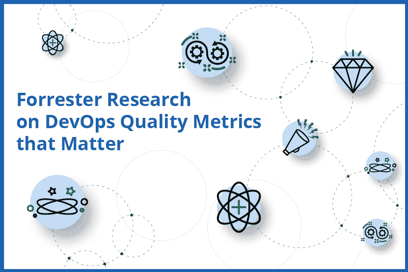
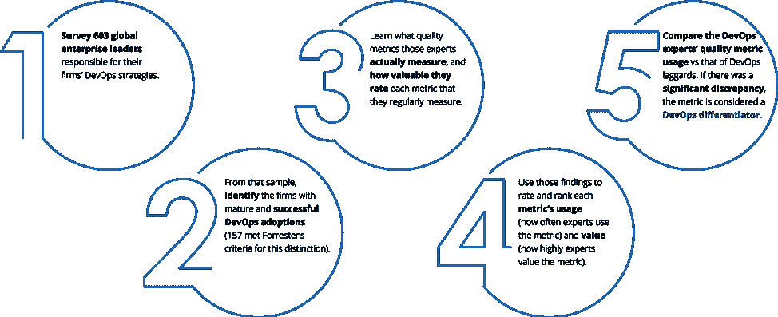
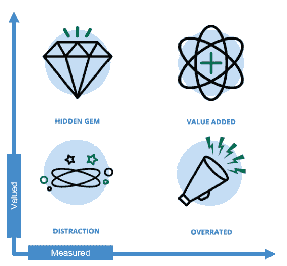
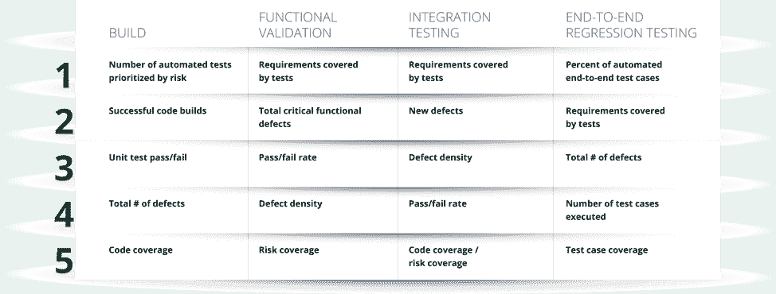
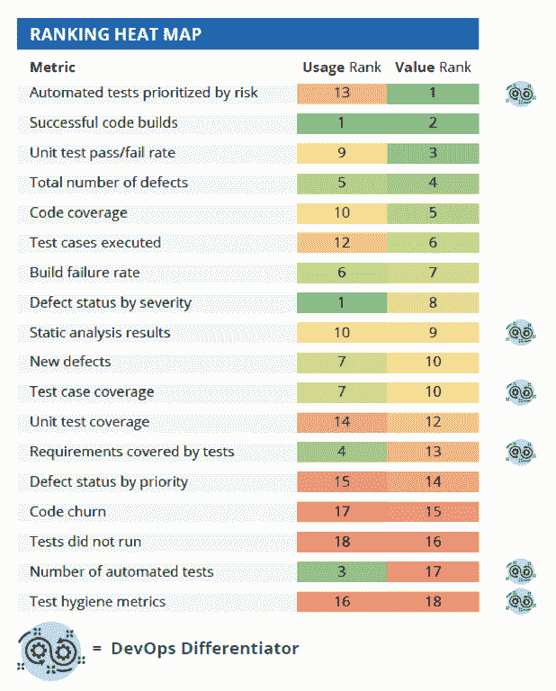
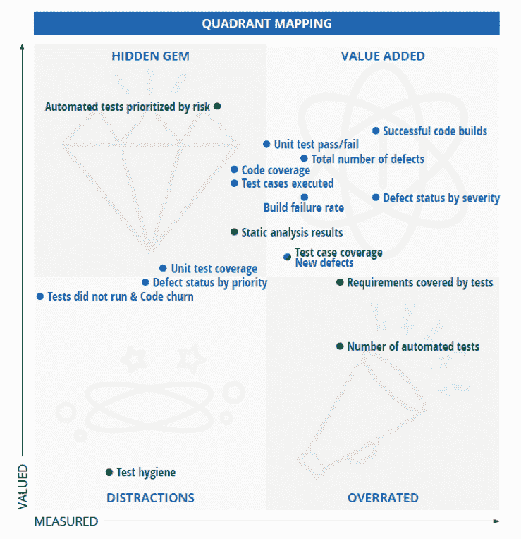

# DevOps 质量指标排名:从高估的干扰到隐藏的宝石

> 原文：<https://thenewstack.io/devops-quality-metrics-ranked-from-overrated-distractions-to-hidden-gems/>

Tricentis 赞助了这篇文章。

 [韦恩·阿里奥拉

来自 Tricentis 的 Wayne 是持续测试、基于风险的测试、服务虚拟化和 API 测试等软件测试领域公认的思想领袖。Wayne 创造并销售了支持动态软件开发、测试和交付环境的产品。他推动了许多创新技术的设计，并获得了多项发明专利。他为软件测试领域贡献了 15 年，在软件行业工作了 20 多年。在 LinkedIn 或 Twitter 上与他联系。](https://www.linkedin.com/in/wayneariola/) 

DevOps 极大地改变了我们开发和部署软件的方式。有了持续的一切，了解每个新版本最终会增强还是削弱整体用户体验是至关重要的。然而，今天大多数“行/不行”的决策仍然依赖于为不同时代设计的质量标准。

应用交付的所有其他方面都经过了仔细审查，并针对开发运维进行了优化。为什么不重新检查质量指标呢？

在 DevOps 的上下文中，像自动化测试的数量、测试用例覆盖率和通过/失败率这样的“经典”度量标准是否重要，在 devo PS 的上下文中，目标是立即洞察给定的发布候选是否具有可接受的风险水平？还有哪些指标可以帮助我们确保稳定的更新流真正适合生产？

为了向 DevOps 社区提供关于哪些质量指标对 DevOps 的成功最重要的客观观点，Tricentis 委托 Forrester 研究该主题。结果发表在一本新的电子书中，[“Forrester Research on devo PS Quality Metrics that materials:75 个常见指标——由行业专家排名。”](https://www.tricentis.com/resources/forrester-research-on-devops-quality-metrics)

## 我们如何确定哪些指标真正重要

下面来看看这个过程:

1.  调查 603 位负责公司发展策略的全球企业领导者；
2.  从该样本中，确定成熟且成功采用 DevOps 的公司(157 家符合 Forrester 的标准)；
3.  了解这些专家实际测量的质量指标，以及他们对定期测量的每个指标的评价；
4.  使用这些发现对每个指标的使用(专家使用指标的频率)和价值(专家对指标的重视程度)进行评级和排名；
5.  比较 DevOps 专家和 DevOps 落后者的质量指标使用情况。如果存在显著差异，该指标将被视为“DevOps 区分因素”

75 项 DevOps 质量指标分为四类:

*   建造；
*   功能验证；
*   集成测试；
*   端到端回归测试。

对于每一类质量指标，我们都提出了一个热图来显示使用情况和价值排名。我们还将每个指标的数据绘制成一个象限，分为四个部分:

*   **隐藏的宝石:**devo PS 专家不经常使用的度量标准，但是被度量它们的组织一致评定为有价值的；
*   **增值**:devo PS 专家经常使用的指标，并且被测量它们的组织一致评为有价值；
*   **分散注意力:**开发运维专家不经常使用的度量标准，度量它们的组织也不认为它们有价值；
*   **高估:**devo PS 专家经常使用的指标，但测量它们的组织并不认为它们有价值。

## 20 个最重要的指标

在全球范围内，以下 20 项指标被实际测量它们的 DevOps 专家评为最有价值的指标。

该研究还确定了亚太地区[和欧洲](https://www.tricentis.com/resources/forrester-research-on-devops-quality-metrics-apac/)的前 20 项指标，并指出了一些关键的地区差异。

## 构建指标

“构建”类别中的质量指标排名如下:

“DevOps 竞争优势”是 DevOps 专家/领导者比 DevOps“落后者”更多衡量的指标

Forrester 提供了以下关于构建指标的注释:

当度量构建时，单元测试做得好很重要。计算单元测试是浪费时间，但是理解变更的影响很重要。跟踪按风险划分优先级的“单元”测试是关键。随着代码库的发展，开发人员和测试人员需要关于变更影响的即时反馈。如果按照风险级别划分优先级，这种反馈更具可操作性。

*“这些公司中有 63%认为风险优先的单元测试数量是他们最想要的度量之一。但是很少有人能真正做到——尽管 34%的高级 DevOps 公司跟踪单元测试运行的数量，但是只有 27%的公司根据风险进行优先排序。不太先进的 DevOps 公司甚至更少使用它——今天只有 15%的公司可以跟踪该指标。在构建中跟踪的其他重要指标侧重于确保代码质量，如成功代码构建的数量(61%)、单元测试通过/失败比率(60%)以及识别的缺陷总数(59%)。*

根据从 DevOps 专家那里收集到的原始数据，我们可以快速了解一下构建指标是如何相互定位的。DevOps 的优势以绿色突出显示。

其他三个类别(功能验证、集成[API]测试和端到端回归测试)的热图和象限排名，所有 75 个指标的定义，以及一些有趣的列表(最被高估的，顶级隐藏的宝石……)都可以在完整的 DevOps 质量指标电子书中找到。

[【下载 55 页 DevOps 质量指标电子书】](https://www.tricentis.com/resources/forrester-research-on-devops-quality-metrics/)

## 3 个关键要点

作为完整电子书的预告片(或摘要):

1.  对业务风险的理解是 DevOps 成功的关键因素。一旦组织重新定义了他们考虑风险的方式，他们也改变了他们的质量度量，以帮助他们更好地理解他们发布周期中的风险水平；
2.  DevOps 专家更关注上下文度量(例如，需求覆盖，风险覆盖)，而其他人关注“计数”度量(例如，测试的数量)；
3.  DevOps 专家更有可能测量端到端事务的用户体验，而其他人则依赖于特定于应用程序或特定于团队的指标。

最终，这强调了一个事实，即 DevOps 的成功需要更多的自动化和全新的工具集。需要进行更广泛的转型，以调整业务风险并满怀信心地发布。不容易。然而，在使团队能够更快地交付更好的软件方面，这种努力确实得到了回报。

通过 Pixabay 的特征图像。

<svg xmlns:xlink="http://www.w3.org/1999/xlink" viewBox="0 0 68 31" version="1.1"><title>Group</title> <desc>Created with Sketch.</desc></svg>