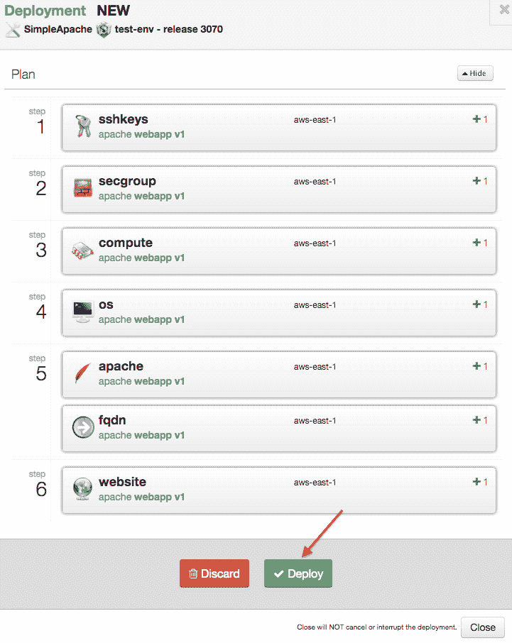

# 借助最新发布的 OneOps 云平台，开发沃尔玛之道

> 原文：<https://thenewstack.io/devops-walmart-way-newly-released-oneops-cloud-platform/>

本周，沃尔玛实验室发布了开源的 OneOps，该公司的软件用于在多家云提供商之间部署应用程序。

沃尔玛实验室平台和系统高级总监布莱恩·约翰逊表示，OneOps 可用于为开发人员建立一个简化的工作流程，以部署他们的应用程序，并帮助组织避免局限于单一的云提供商。

OneOps 最初用于管理 Walmart.com 电子商务网站，现在正在扩展到沃尔玛的个体商店以及其他项目。目前，大约有 3，000 名沃尔玛工程师部署在 OneOps 上，每月进行超过 30，000 次更改。

沃尔玛经营其数字资产的原则是，开发者应该负责维护他们自己的生产应用程序。“我们内部的口号是‘你部署它，你拥有它’，”约翰逊说。

毫无疑问，这是一个大问题。好消息是，除了选择组件和基本配置设置之外，开发人员不必担心配置支持堆栈。OneOps 负责调配和运营。

“OneOps 是支撑我们 DevOps 文化的产品。OneOps 通过授权团队建设和更改基础设施，使 DevOps 能够在沃尔玛的环境中工作，”Johnson 说。

该软件基于模型驱动的架构。对于开发者来说，OneOps 提供了各种流水线:他们指定基础设施需求，比如使用什么应用服务器。他们还可以就环境做出决策，指定特定的云服务以及要添加多少冗余。

该软件提供了一个接口，可以轻松部署到多个云供应商以及软件产品。“我们可以以一种非常流畅和动态的方式添加更多的云和软件，”约翰逊说。可以通过插件添加新的应用程序和提供程序。

对于 OneOps 流程的低级自动化，沃尔玛使用 Chef，尽管该平台也可以在 Puppet 或 Ansible 上轻松运行。约翰逊说，该平台必须采取一种不可知论的方法，因为不可能为沃尔玛及其合作伙伴运营的许多不同的开发环境指定一种“通用方法”。

根据沃尔玛实验室的说法，这种架构提供了许多好处。

该系统为持续的生命周期管理提供了基础，提供了从开发到生产的单一管道。它还可以帮助云提供商创造公平的竞争环境，提供一种方法来轻松地将应用程序从一个云提供商切换到另一个云提供商。

沃尔玛有点担心云锁定，因为该公司不想过于依赖单一的云提供商。“灵活性对于沃尔玛的规模来说至关重要，”约翰逊说。

沃尔玛在 2013 年[收购](http://techcrunch.com/2013/05/14/walmartlabs-acquires-cloud-computing-startup-oneops-delicious-founders-tasty-labs/) OneOps 时收购了 OneOps 软件。当时，该公司正在开发工具来加快部署过程，但工作进展不够快。

“我们知道在几个季度内我们会碰壁。这种风险是如此之大，以至于我们去寻找能够加速我们内部路线图的技术，”约翰逊说。“我们以 OneOps 为基础，并立即开始利用它构建我们的开发和生产前环境。”

自从获得代码后，美国零售巨头[沃尔玛](http://www.walmart.com/)的研究部门[沃尔玛实验室](http://www.walmartlabs.com/)，已经开始为该软件添加更多功能，如策略引擎和成本跟踪。

使用 OneOps 在 AWS 上部署带有依赖项的应用程序

该公司已经在使用 OpenStack 来运行其私有云操作，尽管开源云软件过于集中于基础设施，不便于开发人员使用。“开发者关心 Cassandra、Couchbase、MySQL、Tomcast、Java、Postgres、PHP。这是他们所关心的，他们关心的是他们的应用程序是建立在这个基础之上的，”Johnson 说。OneOps 背后的想法是允许他们挑选自己喜欢的组件。

管理员还可以为单个任务设置配置文件，例如开发或测试。“他们点击一个按钮，他们就有了那个环境，”约翰逊说。

OneOps 可以从 GitHub 下载。

<svg xmlns:xlink="http://www.w3.org/1999/xlink" viewBox="0 0 68 31" version="1.1"><title>Group</title> <desc>Created with Sketch.</desc></svg>