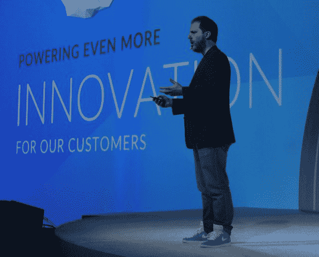
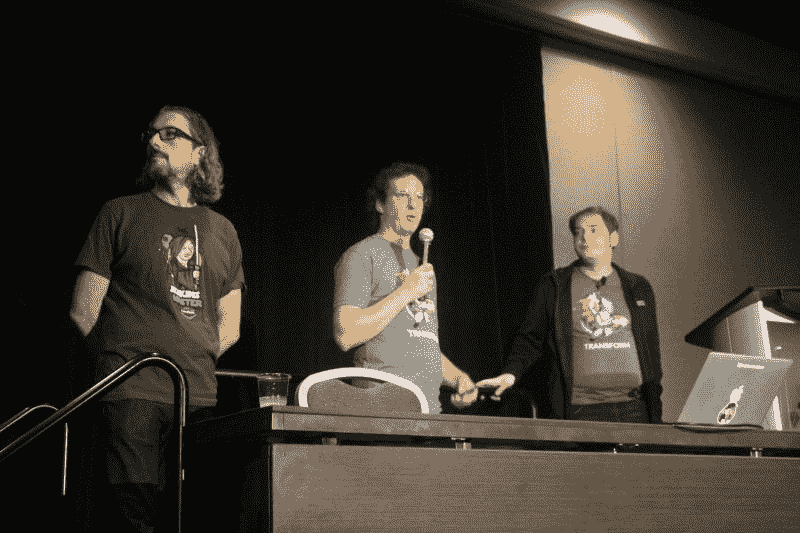
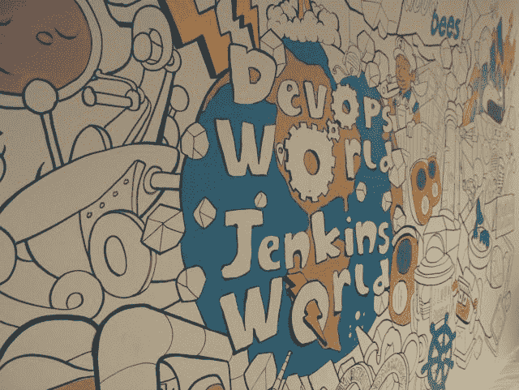

# DevOps World 2018:“詹金斯斯坦”和一个云原生詹金斯

> 原文：<https://thenewstack.io/devops-world-2018-jenkinstein-and-a-cloud-native-jenkins/>

"如果詹金斯不再是一片雪花呢？"它的创造者[川口光介](http://kohsuke.org/)问道，他可以说是他的自动化平台的设计师。

“也就是说，你了解詹金斯配置的每一部分是如何组合在一起的，”他继续说道，“因为有一份记录，记录了谁在何时出于何种目的进行了何种配置更改。所以每次你做改变的时候，你知道你并没有破坏底层平台的某些部分，你也没有这些你不理解的东西。"

正如 CloudBees 首席技术官在[devo PS World | Jenkins World 2018](https://www.cloudbees.com/devops-world)(过去也称为 Jenkins World)的第一天主题演讲中告诉与会者的那样，在某些组织中，云原生自动化平台有一席之地。但“云原生”并不是所有公司都不可避免地要经历的某种类型的“旅程”，只是为了让他们能够使用云原生供应商彩虹尽头的平台。当然，没有一个单一的平台适合所有人的开箱即用(如果可以的话，很有可能 Jenkins 根本就没有存在的必要)。结构性和文化性的调整将是必要的。

但是，正如集装箱化的成功非常清楚地表明的那样，当核心部分——必须保持完整的部分——与需要适应的部分分离时，适应性就会变得简单得多。对于詹金斯来说，一开始可能并非如此。然而，现在肯定需要如此。

这是川口发出的如此微妙的信息，以至于有些人可能很容易把它误认为是要求詹金斯分手的呼吁。

## 无需配置的自动化

[Jenkins Evergreen](https://github.com/jenkins-infra/evergreen)是我们今年年初开始的一项努力，”川口说，“因为持续交付越来越成为主流，越来越成为开发人员生活的一部分。这意味着，简单性、易用性、易管理性的标准正在迅速提高…对于 Jenkins Evergreen，我们试图做的是提供预组装的 Jenkins 发行版，可以说包括电池。”

Evergreen 发行版致力于让 Jenkins 自我更新。您可能会认为，一个在市场上被定位为持续交付引擎的工具为自己提供本质上相同的服务是最容易的。

这里的问题是架构上的:插件可以把平台变成一个独特的不同的野兽，一个物种本身。你可以设计出某种配置平台(可能会有一个小管家作为它的标志)，来指定这个庞然大物如何被拆开和重新组装，这是一个自我更新的平台必须要做的。但是自动化是关于设计可重复的过程，如果你不能在该平台的所有已部署实例上重复更新该平台的过程，那就真的没有任何意义。

Kawaguchi 建议，理想情况下，一个 Jenkins Evergreen 用户不应该知道更新是如何发布的，甚至是何时发布的，除非她自己去查看。更重要的是，现在组织已经决定如何部署 Docker 容器并使用 Kubernetes 编排它们，利用这个组件化的系统来控制更广泛的核心自动化功能变得更加可行——一个更清晰地将核心从适应中分离出来的系统。

> “Jenkins 有 1，400 个插件，这很好，但你不应该安装 1，400 个插件”——cloud bees 首席执行官 Sacha Labourey

Kubernetes 可能会催生一类新的以工作负载为中心的用户，他们对自己的自动化平台有着更简单、更具体的期望。一个这样的平台可以适应这些期望，为这个班级提供 Kawaguchi 所描述的一种引导式的、配备护栏的成功之路，而无需花费太多时间进行配置。川口这次选择的类比是将预订商业航班的行为与学习驾驶飞机进行比较。

“对于许多用户来说，Jenkins 升级自己的想法可能会感到有点可怕，”CTO 说，“对于那些已经使用 Jenkins 一段时间的人来说也是如此。但我确实相信，这是更快交付更好的 Jenkins 的更好方式…当我们推出新的变革，我们注意到有不好的事情正在发生，那么我们可能在你们大多数人注意到之前就能察觉到。然后我们可以采取纠正措施，您的实例可以继续运行。”

## 詹金斯那家伙

CloudBees 首席执行官[Sacha laboury](https://twitter.com/SachaLabourey)在随后的主题演讲中说，在组织内部，所有的软件部署都依赖于一个狭窄的部署渠道，这已经变得很典型。担任该频道看门人的人被费力地描述为“詹金斯家伙…这位超级巨星致力于让詹金斯在他的团队中变得伟大。”

因为这个人是组织内部署的权威，多个团队开始依赖他来满足他们的调度目标。然而，这导致了一个 IT 运营之外的人很少花时间考虑的技术问题:Jenkins Master(不要与“Jenkins Guy”混淆，而是管理具有多个代理的分布式方案的服务器)变得臃肿，就像旧的电话簿或 Windows XP 系统注册表一样。

因为该组织的 Jenkins 部署不仅依赖于这个人，而且在某种程度上与他选择的插件有关，所以结果就是首席执行官所说的“Frankenstein Jenkins”，以及周二会议上其他开发人员和工程师称为“Jenkinstein”的东西。

“詹金斯有 1400 个插件，这很好，但你不应该安装 1400 个插件，”这位首席执行官说，穿着他的商标，光滑的蓝绿色运动鞋。“这是一个大禁忌，但我们在任何地方都可以看到……这个詹金斯变得臃肿，行动迟缓。当它崩溃时，它永远都不会启动。数百名开发者被激怒了。没有人想修理它，因为如果你碰了它，你就拥有它，对吗？”

Kawaguchi 为 Jenkins 展示了一些概念的快照，其中启动配置文件有效地产生了容器，将其置于操作中，并为该容器的期望配置建立了最佳拟合。

对于这样一个版本来说，要发展成为“云原生 Jenkins”部署—一个可以推进[所谓的“云原生 devo PS”](https://thenewstack.io/7-promises-and-potential-pitfalls-in-adopting-a-cloud-native-approach-to-devops/)的目标的部署—它实际上需要进一步推进几个步骤。

“如果当您开始运行 Jenkins 时，您真的不需要预先进行任何计算、存储或任何东西的调配，那会怎么样？”CTO 问道。随着不同的团队增加自动化工作负载，它可以简单地向外扩展？

## 短暂的詹金斯

在周二的另一场会议上，为 [Jenkins Cloud Native SIG](https://jenkins.io/blog/2018/07/30/introducing-cloud-native-sig/) 做出贡献的三名 CloudBees 工程师令人惊讶地明确了对于任何思考“云原生开发应用程序”的正确定义的人来说应该显而易见的事情:“现代云原生应用程序的组件是微服务，这意味着它们本质上是短暂的。维持和维持它们的存在将违背它们设计的整个要点。DevOps 并不真正关注这些微生物的生命周期。它们都是一个更大的目标，一个更大的应用程序的一部分，这是 DevOps 过程的实际产品。

“我们想要实现的，”CloudBees 首席软件工程师 [Carlos Sanchez](https://github.com/carlossg) 在周二向与会者解释道，“对于完全不了解 Jenkins 的人来说，今天似乎是来自 Kubernetes、新技术、新堆栈的东西，比如无限可伸缩性。这在今天是可能的，如果你正确地设计你的东西。多租户，多个 Jenkins 构建同时发生，不会被另一个插件中断，杀死您的主人并破坏每个人的构建。”

Sanchez 和 CloudBees 的同事 Jesse Glick 和 T2 Oleg nena shev 谈到了一个他们称为“短暂的 Jenkins”的愿景，这个愿景本身不是短期的，而是由短暂的组件组成，比如他们将服务的基于微服务的应用程序。从历史上看，詹金斯代理人一直依赖于一个单一的主人。在有数百个实例的分布式系统中，传统的部署很快就会变得难以为继。但在这种模式下，从某种意义上来说，主服务器将被虚拟化。代理将继续感知单个主设备，而在抽象的另一边，亚马逊 S3 存储将被自动配置和扩展，以存储共同形成主设备映像的映像。

【从左至右:卡洛斯·桑切斯，首席软件工程师；开发人员杰西·格里克；Oleg Nenashev，CloudBees 首席软件工程师]

“本质上，问题是目前，Jenkins 默认情况下会在这个名为‘Jenkins Home’的巨大目录中存储几乎所有与其相关的内容，”Glick 解释道。“这包括各种配置、各种运行时状态、所有构建记录，包括他们生成的文件的元数据、所有这些构建的日志、测试结果、文件的指纹——一长串东西……如果您不幸将这些放在网络共享上，那么在传输这些内容时肯定会遇到一些性能问题。因此，它存在许多可扩展性问题。”

## 建筑第一

事实证明，实现一些人所说的“云原生 DevOps”确实需要软件的另一次架构转变，也许在我们开始考虑组织及其人员的文化转变之前。我们问 Kohsuke Kawaguchi，有没有一个组织的概念，由于其结构，比任何其他类型都更适合于自动化的云原生实现。

“如果我认为这是一个更广泛的自动化推动，就像一个世纪的[*对人类的好处*，”首席技术官回答说，“这个层面的背景将是，云原生允许软件开发所做的只是在较低层次上更复杂的自动化，可以用来大大推进可扩展性等事情。但是为了利用这一点，它规定了某种软件架构来真正提供底层功能。因此，如果你有一个运行了 20 年的应用程序运行在 AWS 上，那就没有真正利用底层平台的功能。”

川口告诉新的堆栈，年轻的公司可能更容易设计更适合云原生自动化的流程。首先，最初雇佣来设计这些流程的工程师很有可能仍然在那里工作。但是老的组织面临着一个进化的挑战:不要成为这些新组织的复制品，而是要设计出保持其过程相关性的过程。

川口的完整采访可以在下一期的 **The New Stack: Makers** 播客中听到。

【T2

<svg xmlns:xlink="http://www.w3.org/1999/xlink" viewBox="0 0 68 31" version="1.1"><title>Group</title> <desc>Created with Sketch.</desc></svg>