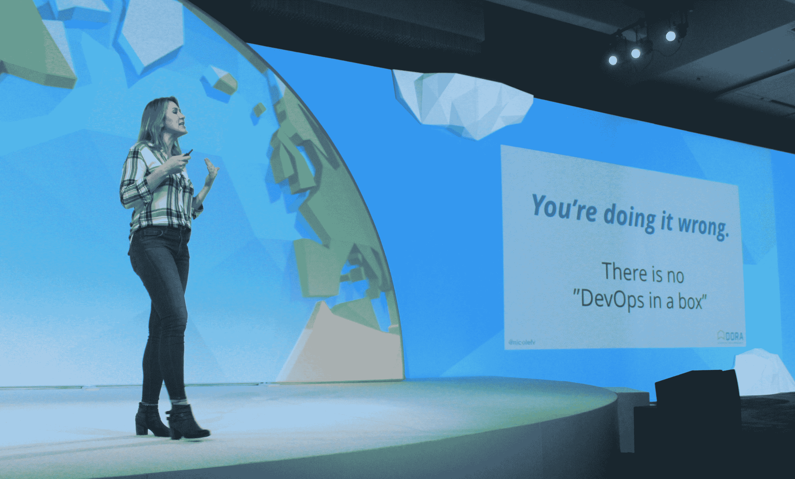
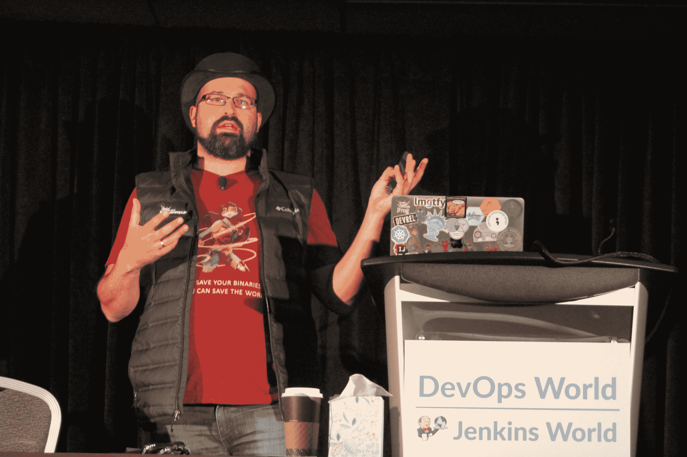

# DevOps World 2018:无 DevOps 套装

> 原文：<https://thenewstack.io/devops-world-2018-no-devops-in-a-box/>

“还记得尼古拉斯·卡尔吗？他实际上是有道理的，”Nicole Forsgren 上个月在三藩市举行的 cloud bees[devo PS World 2018](https://www.cloudbees.com/devops-world/san-francisco)的主题演讲中说道。她指的是畅销书《哈佛商业评论》(Harvard Business Review)的前自由撰稿人，他在 2003 年发表了一篇名为《没关系》的文章。在那里，尼古拉斯·卡尔指出，信息技术的新颖性已经逐渐消失，它最终将在全球经济中找到永久的位置，与制冷、移动和所有其他以前令人兴奋的商品服务并列。

 “早在 80 年代和 90 年代，尼古拉斯·卡尔写文章的时候，”福斯格伦博士继续说道，“我们所做的就是购买技术，插上电源，然后离开。或者我们买了东西，装了，就走了。这有点令人惊讶，因为这很容易。我们处于“轻松模式”，我们把它从清单上划掉，领了丰厚的奖金，然后离开了。

“挑战在于，如果我可以买一台服务器，插上电源，然后离开，那么我的任何竞争对手也可以。所以它不会让我领先。我不会因此而赢。如果其他任何人能像我一样轻松地做同样的事情，如果其他任何人能写一张支票，这不会让我领先。”

## 加速器

我们之前已经向你介绍过新堆栈中的 Forsgren 博士；她是 [DevOps 研究和评估](https://devops-research.com/) (DORA)的首席执行官，也是[年度 DevOps 研究状态](https://devops-research.com/2018/08/announcing-accelerate-state-of-devops-2018/)的首席研究员，该研究的最新版本几周前刚刚出版。她的新书《加速:构建和扩展高性能技术运营》也于近期出版，这里的签名售书仪式就像一场大型音乐会或 iPhone 发布会的队列。绝对公平地说，她在舞台上有一种令人放松的、迷人的、当然也是居高临下的风度。

在那篇文章发表后的几年间，卡尔不得不求助于其他方法来吸引人们的注意力。目前，他的个人博客上有一篇 5800 字的文章，列举了其他人对他作品的各种引用，其中大多数人似乎不同意他的前提，或者可能只是不同意他的标题。毕竟，我们确实生活在这样一个时代，当被公开争论时，会给人一种被认可的感觉。

因此，对于卡尔来说，福斯格伦用不到 100 个字的篇幅证实了他的大部分假设可能是个坏消息——当然比《脸书邮报》的平均篇幅还要短。然而，她善意的话语只是最终刺痛的舞台。

 “如果这是你对技术的看法，那你就错了，”她断言道，接着是一个停顿，声音至少和陈述本身一样响亮。

“没有盒子里的 DevOps。是的，这是我现在正拖着半个行业，因为他们正试图出售 DevOps-in-a-box。没用的。"

“信息技术”一词来源于一场运动，这场运动旨在分离和识别“无差别”的工作类别和元素，即那些贡献了最低限度的消费者感知价值(如果有的话)的类别和元素，并从该工作中尽可能多地去除人力支出。DevOps 只是这一运动的最新变化。一些人认为这种去除意味着将人才委派给一项确实产生价值的任务；其他人认为这是公司裁员的必要组成部分。不管是哪种情况，它都会让这两个组织单独以及全球经济作为一个整体，面对可能是数百万高技能、有经验的工人，而这个行业正在从他们那里转移。

## 改革者

这些人中有几个正在向英雄寻求帮助。这些英雄中有一个看起来像是鲍勃·凯恩画的，这很合适。

“你需要给出一个 s__t，”软件开发管道服务 JFrog 的开发者关系主管 Baruch Sadogursky 宣称。Sadogursky 穿着一件红色 t 恤，一件降落伞织物背心，一顶黑色大礼帽，留着从足球场对面可以看到的突出的黑胡子，他发明了自己独特的成功方法来吸引和保持观众的注意力。

“人们需要关心变得更好，”他在自己的一次会议上继续说道。“我想说，老派企业的例子数不胜数，但这些人根本不在乎变得更好。他们做他们该做的，没人在乎。这些最终都会转化为金钱……雇佣提供测试的人是要花钱的。这意味着，您需要向企业证明这一投资的合理性，向他们提供这些见解，即更好的发布会带来更好的质量、更好的客户满意度，并在市场上击败您的竞争对手。”

他的观点是，自动化一个组织的软件和服务交付过程不是一个自动的过程——简而言之，自动化不是自动的。它需要与以前负责自动化基础架构和“保持正常运转”的 It 运营专业人员相同级别的人力和监督。正如他告诉听众的那样，JFrog 本身也不得不经历类似的程序调整。

“愿意做事的另一个方面，”Sadogursky 继续说，“是工作保障，特别是质量和做人工 QA 的工程师[*质量保证*]。因为很明显，他们是第一批出局的。如果我自动化了我的 QA，我自动化了我的发布工程师，我的发布工程师和我的 QA 工程师就可以回家了。”

他说，十年前，当关于如何进行 QA 过程的选择较少时，JFrog 有一个庞大的发布工程师团队。它的发布周期在当时被认为很快——三个月，仅仅四分之一年。从那时起，该公司转向了 Sadogursky 称之为*液体软件*的模式。事实上，在与合著者弗雷德·西蒙和约夫·兰德曼合著的一本书中，他正致力于让这个短语成为官方创造。

JFrog 成功实现了这一转变，同时从最初的员工队伍中裁掉了 0 名工程师。“不仅我们没有发射任何东西；我们实际上试图招聘，但找不到足够的人，”他说。

“因为虽然有些人肯定会回家，因为他们无法做其他任何事情，但这是少数。大多数人将在新的组织中找到自己的位置，使用新技术，改进流程，实际上，我们发布的速度越快，我们做的工作就越多，我们需要的人手就越多。”

## 催化剂

Sadogursky 引用了他所谓的“Nicole 的报告”(在这个行业中，每个人都知道“Nicole”是谁)中的数据，揭示了在她的研究中，表现最高的组织的软件发布周期比表现差的组织快 2500 倍以上。他认为，这些数据足以证明，管理得当的过渡应该不会造成太多伤亡。“这种担心真的没有道理，”他慢慢地说道。

“DevOps 就是开发和运营，”佛斯格伦在周三她的签售会前告诉一个挤满人的会议。“我们不能在牺牲另一个团队的同时实现总体目标。全球衡量，关注结果，而不是产出。”

她可能最难让听众理解的一点是，她在工作中高度重视的指标不应该代表使用这些指标的组织的结果。换句话说，度量本身不应该成为任何组织成功的晴雨表，而是那些度量的结果被积极地使用。指标是指标，正如她在多个场合所说，一个组织选择的衡量标准将直接转化为它的价值观，甚至是它的道德观。但是指标不是目标，就像速度本身不是终点线一样。

“考虑那些容易获得或者可以自动化的指标，”她建议她的听众。“这里有人有售票系统吗？可以自动出票。我知道在一些组织中，票证被打开，尤其是被最终客户打开，这是最糟糕的，但它会自动关闭。票关了，一切正常！但是，如果这是您唯一的最终指标—解决票据的速度(“杀死它！”)—或者如果必须在特定天数内关闭，我也可以自动完成。我可以关闭它，然后重新打开。但是*的目标*是什么？不是所有能数的都算数。”

Baruch Sadogursky 和 Nicole Forsgren 在这个经常令人恐惧和不确定的行业中代表了灵感和希望的两种声音。我认为，如果我们希望度过下一个十年，我们可能需要这些人的 2500 倍。

[https://www.youtube.com/embed/6-QG12yOZmc?feature=oembed](https://www.youtube.com/embed/6-QG12yOZmc?feature=oembed)

视频

CloudBees 是新堆栈的赞助商。该公司帮助支付了记者参加 DevOps 2018 的差旅费。

斯科特·m·富尔顿三世摄影。

<svg xmlns:xlink="http://www.w3.org/1999/xlink" viewBox="0 0 68 31" version="1.1"><title>Group</title> <desc>Created with Sketch.</desc></svg>