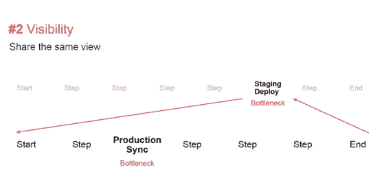
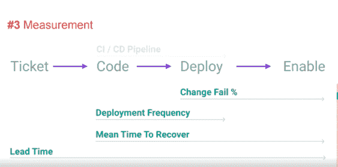
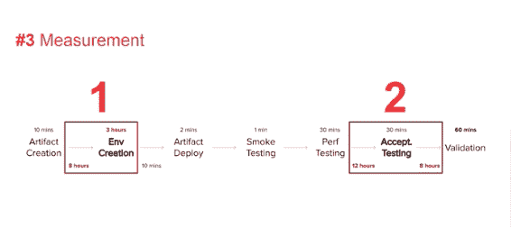
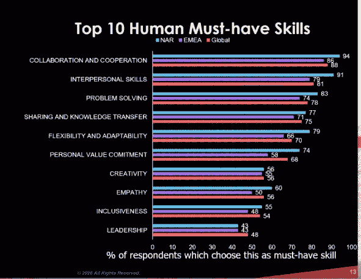
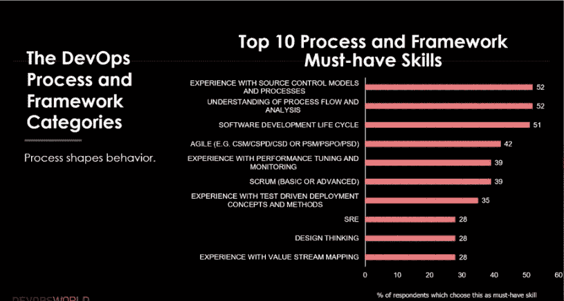
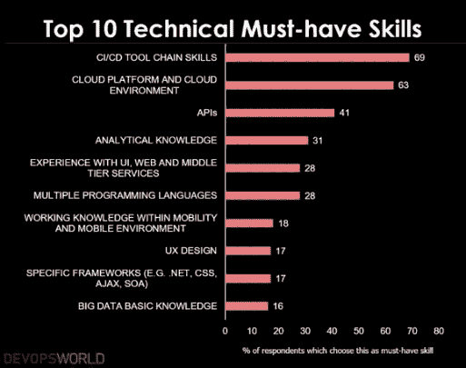

# DevOps 世界:DevOps 从无情的自动化转向价值流

> 原文：<https://thenewstack.io/devops-world-devops-shifts-from-relentless-automation-to-value-streams/>

DevOps 是自动化的代名词吗？或者，我们是否过于关注自动化，而忽略了实际的价值交付？

cloud bees 2020 年 DevOps World】的核心主题是[加速弹性。](https://thenewstack.io/cloudbees-devops-world-2020-points-the-way-to-accelerated-resiliency/)这个想法可以分为三个部分:一切自动化，一切互联，一切弹性。然而，立即有一些谈话站出来反对自动化一切，至少作为第一求助。

两个关于开发运维在自动化之前交付价值的有趣演讲分别由[可见价值流咨询](http://visible.is)负责人 Steve Pereira 和[开发运维研究所](https://twitter.com/JayneGroll)[首席执行官 Jayne Groll](https://devopsinstitute.com/) 就混合产品团队发表。两次会谈都超越了持续交付和集成管道，转向理解价值流向。

像往常一样，所有文化和敏捷视角的价值都是由人来发现的。

## DevOps 价值流图简介

Pereira 以两个关键问题开始了他的演讲，这两个问题在 DevOps 环境中具有挑战性，并且必须作为一个团队来讨论:

1.  我们的目标是什么？
2.  我们进展如何？

前者类似于指南针和你的团队前进的方向，而后者更像是环境的地图。

虽然 DevOps 自成立以来已经走过了十几年的漫长道路，特别是在自动化、扩展和协作方面。然而，佩雷拉仍然指出了持久的甚至是不断增加的痛点:

*   复杂性
*   摩擦
*   浪费

> “你百分之五十的功能从来没有被使用过。因此，如果没有人使用我们的功能，我们所有的自动化、我们所有的规模和我们所有的交付能力都可能被浪费掉。这意味着我们必须交付两倍的速度或两倍的数量，才能达到我们对客户的期望。”—史蒂夫·佩雷拉，可见

他认为，为了推动更好的结果，我们必须始终从客户的角度来设计开发团队，不管我们的客户是内部的还是外部的。自动化程度的提高必然会增加复杂性。

佩雷拉呼吁在 DevOps 的基础上进行价值流思考，以获得不同的视角，呼应 20 世纪 60 年代的丰田汽车制造。

佩雷拉澄清说:“不是让构建软件的过程自动化，而是让我们通过自动化重复、浪费、不必要和没有价值的事情，尽可能多地集中创造性时间。”

也许问题的一部分是 DevOps 的影响已经超过了它的名称，这有可能造成它自己的筒仓。如今，DevOps 不仅仅包括软件开发和操作，比如安全、测试甚至客户支持。对一些人来说，DevOps 关注个人，而对其他人来说，关注团队，而对其他人来说，它必须跨越组织，包括人力资源、法规遵从性等。除此之外，在那些认为 DevOps 主要是关于协作的人和那些认为它完全是自动化的人之间似乎有一场拔河比赛。

佩雷拉说，我们谈论 DevOps flow 真的很有价值，他认为最好从[价值流范式](https://www.visual-paradigm.com/features/value-stream-mapping-tool/)的角度来看，这是一个让每个人都说同一种语言的可视化翻译器。

他说，许多人被困在 CI/CD 管道(编码和部署)中，机会来自于关注之前(标签)和之后(实现)。)他加入了一条溪流的视觉概念，这条溪流充满了从鹅卵石到棍子到青蛙到鱼的障碍物，并且不可避免地与其他溪流相连。这绝不仅仅是管道连接管道的问题，这种复杂性包括团队、行为、文化和可能阻碍流动和速度的人工活动。你可能忽略了相关事物的速度，比如营销、文档和批准。

> “在我们的客户获得价值的大背景下，我们真的可以说我们表现良好吗？”—史蒂夫·佩雷拉，可见

问问你自己:有哪些小的改变可以“微优化”上游和下游，而不仅仅是 CI/CD 管道？我们如何将所有其他活动整合为价值流的一部分？

接下来，Pereira 说，你需要缩小范围来查看完整的流，然后放大更深的范围来找到不同瓶颈的原因和成本。

“在每一个案例中普遍一致的是，在绘制地图时，我们可以确定大问题在哪里。这让我们有了这些简单的行动，”他说。

他说，只要停下来立即做几件事就能带来巨大的变化，通常可以减少 20%的浪费。

## 测量 DevOps 值

你如何衡量你的流量和它的价值？佩雷拉说，从事情需要多长时间开始。

他说一个很好的起点是[谷歌的四个关键 DevOps 指标](https://thenewstack.io/googles-formula-for-elite-devops-performance/)，将它们放在你的价值流之上，如上所示:

*   变革的准备时间
*   部署频率
*   恢复服务的时间
*   变更失败率

正如你在下面看到的，佩雷拉从步骤和时间开始，然后是更多的细节。第一步和第二步花费的时间明显比其他任何事情都长——几个小时比几分钟。两个最大的瓶颈与自动化无关。

Pereira 说，这个例子来自一个真实的客户，“它为我们节省了数百万美元，我们将把这些钱用于自动化部署。你沿着这条路走下去，设置好这一切，就底线而言，就移动指针而言，它不会真的有所不同。”

价值流图成为协调和协作的工具，所有业务级别都有相同的愿景。

> “一旦我们有了数据，一旦我们有了可视化，我们就可以进行这些对话。我们可以充满信心地前进，保持一致，步调一致。”—史蒂夫·佩雷拉，可见

最后，价值流管理帮助组织确定下一步自动化的优先顺序。在此之后，他的客户全国建筑协会在一年内将发布周期从三年改为三个月。

但如果不只是自动化一切，我们不能忘记有多少人仍然参与 DevOps 的生命周期。

## 从 T 到 E:建立混合产品团队

去年 3 月，DevOps Institute 发布了 [2020 DevOps 技能提升报告](https://devopsinstitute.com/thought-leadership/upskilling-3/)，该报告讨论了 DevOps 团队最需要的技能。现在，绝大多数团队在压力大的时候分散工作，这似乎只会放大结果。格罗尔说，这项调查特别指出了“开发人类”的人才缺口

考虑到这一点，她建议创建跨价值流的混合产品团队，并由跨组织和多技能的个人组成。这些自主的、自我调节的团队的成功是通过理解和交付客户价值来衡量的。

> “DevOps 向我们展示了，我们不仅需要在技术上左移，我们还需要在人类转型的方法上左移。”DevOps 研究所 Jayne Groll

对以人为中心的技能的需求包括团队合作、指导、同伴互动和角色扮演。

格罗尔认为，向仆人型领导的文化转变是强制性的，这种转变只能引导变革，而不能引导变革。这些自我调节的团队被分配了工作，但是由他们决定如何以及何时交付工作。

> 已经证明，文化是 DevOps 中区分组织成功与否的一个因素。”—杰恩·格罗尔，DevOps 研究所

工艺技能也非常需要。

毕竟，正如 Groll 所说，“智能自动化是基于智能流程的。”

她戏剧性地偏离了敏捷行业的框架和认证，她说源代码控制、测试和批判性思维对增加价值流很重要，但是这个过程并不忠于单一的知识体系，比如 [Scrum、SAFe or LeSS](https://thenewstack.io/search-best-agile-framework-safe-less-another/) 。

敏捷持续了 20 年，而 DevOps 只有 11 年。Groll 说他们都非常关注前期制作，而软件交付的未来是基于后期制作的。也就是说，[站点可靠性工程](https://thenewstack.io/the-evolution-of-the-site-reliability-engineer-sre/) (SRE)的采用在过去的一两年里增长迅速，这反过来不仅开放了开发和运营，也开放了[开发安全运营](https://thenewstack.io/cloudbees-ci-cd-widens-access-and-control-for-secops/)的安全部分，让每个人都可以参与进来。

最后，混合产品团队的所有成员都应该具备一些受欢迎的技术技能。他们证明，虽然价值流是必不可少的，但 CI/CD 渠道仍然占主导地位。事实上，虽然云在过去的几项调查中占据主导地位，但 CI/CD 今年却跃居榜首。

最后，DevOps Institute 将今年的建议重点放在了以价值为中心的产品团队的混合方面。他们正从呼吁 T 型的深入专业化发展到 E 型的广泛人类技能，对流程的敏锐把握，以及更多自动化的计划。

最后，重要的是要记住，复杂的人类才是真正交付价值的优秀软件。

立即响应企业发展技能 2021 报告的[调查。](https://www.surveymonkey.com/r/humansofdevops)

<svg xmlns:xlink="http://www.w3.org/1999/xlink" viewBox="0 0 68 31" version="1.1"><title>Group</title> <desc>Created with Sketch.</desc></svg>