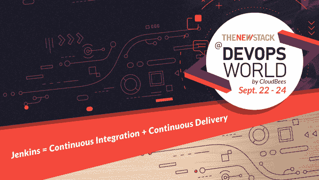

# DevOps World:丰富的内容、参与和创意触手可及

> 原文：<https://thenewstack.io/devops-world-great-content-engagement-and-ideation-is-within-reach/>

[CloudBees](https://www.cloudbees.com/) 赞助了这篇文章。

 [乔治亚娜·帕特鲁

乔治亚娜是 CloudBees 公司的 EMEA 营销传播经理。](https://www.linkedin.com/in/georgiana-patru-07458054/) 

由 CloudBees 开发的 [DevOps World](https://www.cloudbees.com/devops-world) 今年将走向虚拟化。随着会议日期的临近，9 月 22 日至 24 日，我们对 CloudBees 首席执行官兼联合创始人[萨查·劳里](https://www.linkedin.com/in/sachalabourey/?originalSubdomain=ch)进行了问答，以了解他对会议和他的公司的看法。今天就注册[免费](https://www.cloudbees.com/devops-world/register?utm_source=NewStack&utm_medium=email&utm_campaign=dw2020)！

**与会者对今年的活动有什么期待？**

虽然我们不能在同一个屋檐下相聚，但我们仍然对 DevOps World 有史以来第一次虚拟活动的所有计划感到非常兴奋。

该计划包含了人们期望从 DevOps World 获得的所有精彩内容，以及今年新增的内容和有趣的虚拟参与方式。我们有一组非常有趣的主题演讲人，他们将挑战观众，以及 125 场以 DevOps 为重点的会议-从高层次的主题到技术技能发展。此外，我们将举行虚拟会议，人们可以在那里交流思想。与会者可以获得 DevOps World 的所有好处，但今年他们不必旅行。他们可以在自己的家里和工作场所免费访问所有内容并安全地参加会议。

**你对第一次参加的人有什么建议？**

 [萨查劳动

Sacha 是 CloudBees 的首席执行官和联合创始人。](https://www.linkedin.com/in/sachalabourey/) 

在 DevOps World 上，人们最大的乐趣之一就是与他们的同行和聚集在现场的专家交流。在我们面对面的活动中，对话随处可见。今年，我们不会在同一个屋檐下，但我们有很多互动的机会。

他们可以利用聊天功能，不仅可以与演讲者进行问答，还可以与其他与会者进行随机会面。我们为导师和学员等特定群体设立了网络休息室。我们将在世博会的展位上提供实时视频聊天功能。如果这还不够，我们正在建立一个“快速约会”类型的功能，参与者可以打开他们的相机，随机与另一位参与者配对，进行 30 秒的聊天。

人们喜欢围绕他们试图解决的问题交流信息和最佳实践。这真的是双向的。如果这是你第一次参加 devo PS World——甚至是第九次或第十次——请确保与其他人交流。进来吧，水很好。

**CloudBees 最近一直在谈论软件交付管理和软件交付自动化。从高层次来说，这是怎么回事？**

随着组织部署更多的[软件开发自动化](https://www.cloudbees.com/software-delivery-automation)，他们获得了更高的速度，并将更多的代码投入生产。这有助于他们完成更多的工作，但也造成了相当大的混乱。在不同的组织职能中，人们通常不知道组织的其他部分发生了什么。谁在做什么？特性什么时候出现？什么样的用户故事鼓励了这种能力的发展？正在开发的软件的市场前景如何？没有产生任何见解。组织不知道应该改进什么，也不知道新特性是否安全。

软件交付管理——我们称之为 SDM——是理解所有这些混乱的关键。我们将在 DevOps World 上展示 SDM 的整个概念，在会议期间涵盖重要的方面，并发布一些公告，这些公告将阐明采用整体软件交付方法的价值。如果社会要继续投资数十亿进行数字化转型，你就要创造投资回报率。SDM 为真正的投资回报率扫清了道路。

在疫情期间，你的工作怎么样？你采用了什么样的最佳实践来最大化你自己的生产力？

首先，这是无法回避的:这个疫情对社会造成了毁灭性的影响。它影响了很多人的生活，造成了很多痛苦。我同情世界各地那些受到可怕影响的人。

我们所有人面临的挑战是坚持下去，充分利用我们自己的个人情况。对我个人来说，就像其他人一样，这一次也包含了一些积极的因素。我回家的次数多了，旅行的次数少了，见家人的次数多了。我有两只猫。其中一个，Tricotine，是我们的孩子。她喜欢玩，我和她关系一直很好。另一个，内斯特——我们经历过起起落落。但在疫情期间，他变得更习惯我在身边，现在他不会离开我了。

今年活动的主题是“向我们展示你的世界”这对你意味着什么？

这意味着我们越来越多地将私人生活与职业生活混为一谈。如果你的专业工作淹没了你的家庭生活，这可能是一个负面的影响，但它也能以好的方式创造新的世界。疫情教会我们的是，你不必向他人关闭你的生活。当你在家工作时，会有噪音——孩子们来来往往，人们在你周围过着真实的生活。我们通过视频交流，我们越来越习惯让人们看到我们的世界是什么样子。你需要表现得专业，但现在人们愿意展示的东西有了更多的灵活性。它让人更放松，更自然。它在人与人之间建立了更强的纽带。

在会议期间，我们将把它作为一个主题。我们会带你去看我们的世界。给我们看看你的。你在家是怎么工作的？你是如何应对的？你是如何解决问题的？你的世界是什么样的？今年的焦点将不再是人们通常在会议中期待的东西——主办公司或行业如何令人震惊——而是更多地关注互动和适应我们都在应对的环境！在这些时候，我们认为更好的方法是更多地谈论我们的世界是如何演变的，我们如何适应这种情况，分享技巧并给予支持。

*参加 DevOps World 2020，[今天就免费注册](https://www.cloudbees.com/devops-world/register?utm_source=NewStack&utm_medium=email&utm_campaign=dw2020)！*

通过 Pixabay 的特征图像。

目前，新堆栈不允许直接在该网站上发表评论。我们邀请所有希望讨论某个故事的读者通过 [Twitter](https://twitter.com/thenewstack) 或[脸书](https://www.facebook.com/thenewstack/)访问我们。我们也欢迎您通过电子邮件发送新闻提示和反馈: [feedback@thenewstack.io](mailto:feedback@thenewstack.io) 。

<svg xmlns:xlink="http://www.w3.org/1999/xlink" viewBox="0 0 68 31" version="1.1"><title>Group</title> <desc>Created with Sketch.</desc></svg>