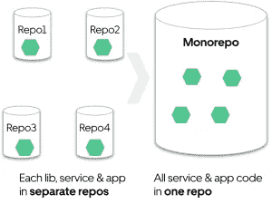
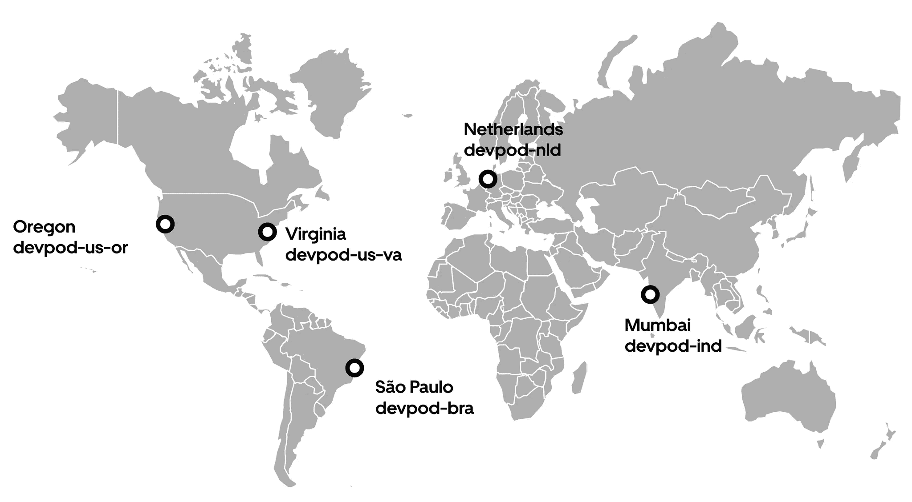
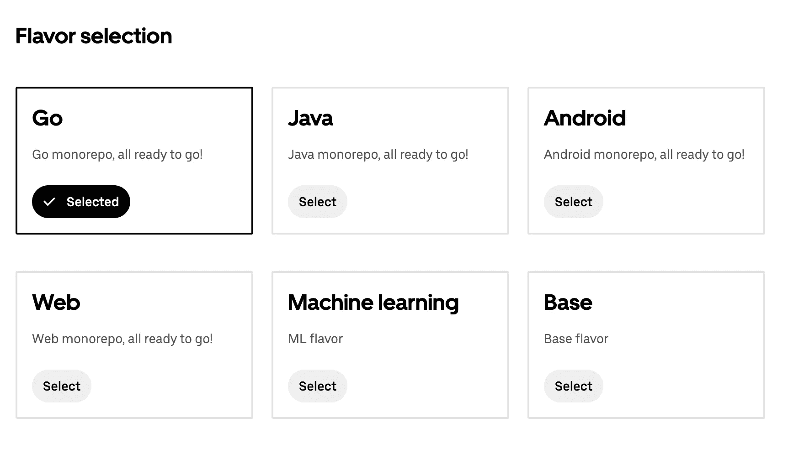
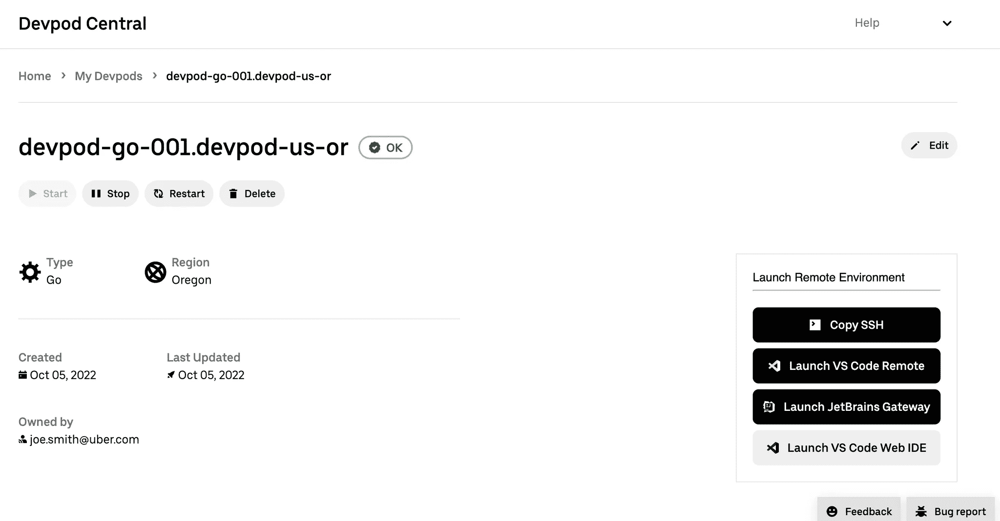
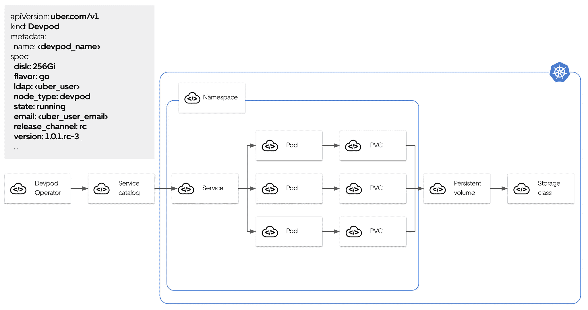
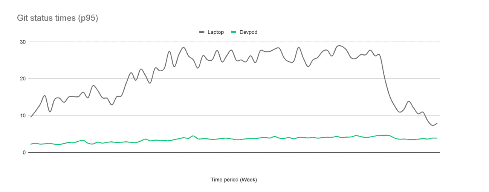

# DevPod:优步基于 MonoRepo 的远程开发平台

> 原文：<https://thenewstack.io/devpod-ubers-monorepo-based-remote-development-platform/>

到 2017 年，优步的代码库令人难以置信地支离破碎，问题会渗透到库版本、构建工具、依赖管理和协作中，代码共享也受到了深刻影响。因此，该公司将开发人员转移到远程开发环境，基于在 Kubernetes 集群上运行的 monorepos。

优步的构建策略团队建议迁移到 monorepo 架构来托管优步的代码。他们的计划包括超过 10 种编程语言、超过 4，000 种服务、超过 500 种 web 应用、超过 9 种构建工具和超过 6 种配置工具，这些工具当时分布在数千个存储库中，采用基于主干的开发，每个第三方库只有一个版本。

优步最近的博客文章详细介绍了该公司定制的内部远程开发环境 Devpods，它运行在 [Kubernetes 集群](https://thenewstack.io/what-does-it-take-to-manage-hundreds-of-kubernetes-clusters/)上。这些安全的环境不需要任何设置，它们运行在云中，而不是在笔记本电脑上。截至 2022 年 11 月，uild 时间有所改善，超过 60%的工程师正在使用 Devpods。

新的 monorepo 是一个单一的集中式构建平台(构建于 Google 的 Bazel 之上)，它带来了更好的依赖性管理、一致的通用生产库版本、对一组标准工具和流程的更简单支持，以及改进的可见性、协作和代码共享。

但这也给日常的代码编辑-构建-运行开发循环带来了挑战——开发时间越来越长，在某些情况下克隆需要几个小时。

远程开发挑战加上 [monorepo 挑战](https://thenewstack.io/engflow-bazel-and-more-for-faster-builds/)导致了对创新的需求。

## **平台工程**

Devpod 的想法是允许开发人员在云中构建，使用更快的机器，所有工具都保存在安全、受控的环境中。

Devpod 是专门为优步开发者的需求定制的，优步认为这是“最好的开发者体验”

Devpods 作为一个容器在 Kubernetes 集群上运行，拥有必要的工具和计算资源，能够在优步的大规模 monorepo 上进行无缝开发。Devpod 改进的性能和几乎为零的设置提高了生产率。通过运行每个依赖项的最新稳定版本，安全性得到了提高。

Devpods 是持久的，这意味着工程师在不同设备上工作或在单一环境中与其他工程师合作时，不会丢失他们的设置、文件或代码更改。他们使用云资源-笔记本电脑资源上多达 48 个内核和 96GB 的 RAM，从而实现更快的 Git、构建和响应速度。Devpods 带有最新版本的 IDE，配置了缓存的 IDE 索引。Git 配置得到了优化，使用了 Linux 文件系统而不是笔记本电脑文件系统，这提供了更好的性能环境。

由于 Devpods 运行在云计算环境中，因此冻结/过热的情况更少，电池寿命更长，开发人员可以在环境之间自由切换。

其他优势包括:

*   **零设置和维护** : Devpod 拥有在任何主要 monorepos 中立即开始工作所需的所有工具和配置。工具准备好了。环境是按需提供的，ide 是集合配置的，存储库是预先克隆的。
*   **安全:** Devpods 会在一夜之间自动更新最新的工具和安全升级。由于 Kubernetes pods 运行在云中，并且没有笔记本电脑电池的限制，所以在下班时间扫描磁盘上的恶意工件或活动是“微不足道的”。易受攻击的应用程序也可以在非工作时间打补丁。
*   **优先考虑低延迟:** Devpods 在全球范围内部署，目标是减少开发人员的延迟，避免 UI 操作的“迟缓”感。

## 用户体验

为开发人员提供了一种“风格”，即一个 Docker 图像，其中预置了工具以及针对特定工程师组的默认设置和配置。支持以下口味:

根据优步工程师的说法，将工具和配置放入 docker 映像“非常合理”。他们在生产映像基础之上构建了 Devpod 映像基础，以重用其关键的生产软件配置。优步使用 Debian 处理生产工作负载。一致的基础允许当前的基础设施继续构建和分发内部包。

创建这个基于 web 的界面是为了提供更好的 Devpods 初次体验，并改进故障排除。未来的目标是扩展 Devpod Central，并提供资源使用和消耗的可见性。

Devpods 中提供了以下 IDE:VS Code remote、VS Code over web、JetBrains IDE via ssh 使用 JetBrains Gateway Vim 和 Emacs via terminal。

## **Kubernetes 作为一个平台**

从笔记本电脑转移到云是一个很好的开始，Kubernetes 提供了额外的必要构件。在强大的硬件上托管容器的能力、连接容器的网络以及在重启之间存储工程工作的持久卷也是必要的一步。

优步使用了[定制资源定义](https://thenewstack.io/kubernetes-crds-what-they-are-and-why-they-are-useful/) (CRD)，这是一种通过提供存储在控制板内的数据结构来扩展 Kubernetes 的方式，并且消除了对用于 Devpod 元数据的内部数据库的需要。它还允许使用 [kubectl](https://thenewstack.io/introduction-to-kubernetes-imperative-commands/) 创建和访问 Devpods。

Kubernetes 的 CRD 也有能力编写对资源变化作出反应的定制软件，称为操作者模式。优步将定制资源和小型定制控制器结合起来，将高级 Devpod 描述翻译成标准 Kubernetes 原语，标准 Kubernetes 控制器可以处理这些原语。

为了在不使用 Devpod 时降低成本，定制控制器后来被扩展为对 VolumeSnapshotContents 和 PersistentColumeClaim 做出反应。

## **迄今为止的进展**

Devpods 在降低本地 Git 命令性能方面是有效的。下图显示 git 状态时间一直低于 4 秒。

对于更长、更复杂的构建，Devpods 平均比笔记本电脑提高 2.5 倍，对于平均构建，比笔记本电脑提高 1.8 倍。

截至 2022 年 11 月，超过 60%的优步软件工程师已经采用了 Devpods。

Devpods 在优步有光明的未来。现在的目标是让 Devpods 对优步的工程师来说完全无缝。探索的一些领域是减少设置 Devpods 所需的时间、短暂的 Devpods 以及笔记本电脑和 Devpods 之间的无缝文件传输。

<svg xmlns:xlink="http://www.w3.org/1999/xlink" viewBox="0 0 68 31" version="1.1"><title>Group</title> <desc>Created with Sketch.</desc></svg>