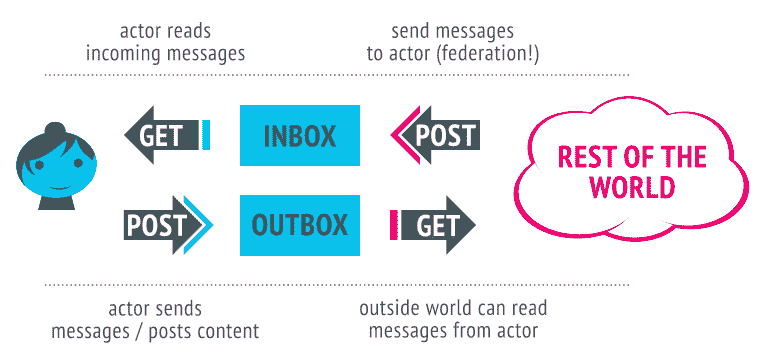

# 开发人员对乳齿象开放协议 ActivityPub 感到兴奋

> 原文：<https://thenewstack.io/devs-are-excited-by-activitypub-open-protocol-for-mastodon/>

“这正在发生，”Evan Prodromou 在博客上写道，他在[的开创性工作](https://thenewstack.io/challenges-of-creating-a-decentralized-open-source-twitter/)启发了 Mastodon 运行的 ActivityPub 协议。“自从我们发布 ActivityPub 以来，我从未对联合社交网络如此兴奋，”他写道。“转变已经开始。”

当然，他指的是成千上万的用户从现在由埃隆·马斯克控制的集中式社交媒体应用 Twitter 迁移到乳齿象和其他由 Pub 驱动的分散式应用上。虽然这种迁移仍处于早期的[阶段](https://thenewstack.io/twitter-turmoil-we-need-an-open-protocol-for-public-discourse/)，但开发者对所谓的[Fe diversity](https://thenewstack.io/the-fediverse-points-to-our-social-media-future-post-musk/)的兴趣在过去几周飙升——如果有一个关于网络的历史事实值得注意，那就是开发者通常处于范式转变的前沿。

在乳齿象上的一篇帖子中，W3C ActivityPub 规范的联合编辑 Christine Lemmer-Webber 写道，“很多人对 activity pub 做出了贡献”，但她将 Prodromou 列在了关键贡献者列表的第一位。她说，Prodromou“设计了核心协议”，基于他“与 ActivityPub 的前身 OStatus 合作的经验。”

有迹象表明，ActivityPub 可能会成为继 Musk Twitter 之后的一个重要的新互联网协议，所以让我们深入了解细节，看看 Mastodon 是如何使用它的。

## ActivityPub 如何开始

[ActivityPub](https://www.w3.org/TR/activitypub/) 是[始于 2016](https://zenhack.net/2016/05/29/sandstorm-and-the-social-web.html) 的去中心化社交网络协议，由万维网联盟(W3C)支持。这是 Fe diversity 的主要协议，Fe diversity 是一组不断发展的[去中心化应用和网站](https://thenewstack.io/why-developers-should-experiment-with-the-fediverse/)，它们开始挑战像 Twitter 这样的中心化服务的霸权。

ActivityPub 包含[两层](https://activitypub.rocks/):客户端到服务器协议“用于创建、更新和删除内容”和服务器到服务器联合协议“用于发送通知和订阅内容”

ActivityPub 如何工作(来源:W3C)

ActivityPub 的另一个重要概念是，用户由一个或多个“参与者”来代表，这些参与者代表他们在不同服务器上的帐户。因此，如果你在三个不同的服务器上有两个 Mastodon 账户和一个 BookWyrm 账户(一个分散的 Goodreads 替代方案),那么你就有三个参与者。

在 2021 年 4 月关于 ActivityPub 的演讲中，Lemmer-Webber 解释说，这是一个团队将各种现有协议整合在一起的努力。“在我们开始标准化工作的时候，有各种不同的协议，”她说，“有很多不同的应用程序使用这些协议，但很少有应用程序能够相互交流。”

活动粒子前体

## 活动布丁和乳齿象

我第一次注册乳齿象时，它运行在 OStatus 上，而不是 ActivityPub 上。我在 2017 年 4 月注册，并在 2017 年 6 月的一篇帖子中写下了我在[的早期乳齿象经历。我注意到与 Twitter 相比，它相对不活跃，但它也有潜力成为“Reddit 和 Twitter 的有效融合”，拥有前者的社区功能和后者的微博功能。](https://web.archive.org/web/20170624064533/http://altplatform.org/2017/06/07/mastodon/)

当时，在 2017 年年中，乳齿象拥有 70 多万个账户(尽管不知道有多少活跃账户)和 1500 个实例。Mastodon.social 是 2017 年最大的英语实例，用户不到 6.7 万人(有两个日语实例，分别拥有 16.3 万和 13.2 万用户)。虽然现在很难量化用户的数量，但乳齿象的首席开发者尤金·罗奇科[在 11 月 7 日](https://mastodon.social/@Gargron/109300967725833789)表示，它“今天在网络上有 1，028，362 个月活跃用户”，“自 10 月 27 日以来有 1，124 个新的乳齿象服务器”截至今天，mastodon.social 称其拥有 183，000 名活跃用户。

那么乳齿象是什么时候转到 ActivityPub 的呢？那是 2017 年 9 月，Rochko [宣布](https://hackernoon.com/mastodon-and-the-w3c-f75f376f422)乳齿象 v1.6，“第一个完全实现 ActivityPub 协议的乳齿象版本。”几个月后，2018 年 1 月，ActivityPub 成为 W3C 推荐标准。

## 那么这是一个转折点吗？

许多早期采用者(包括我自己)在 2017/18 年的时间框架内试验了乳齿象和其他 Fe differential 应用程序，但那时还没有达到临界点。部分原因是因为一个新的闪亮的分散物体出现了，并迷惑了许多科技行业的人:区块链。去年，一家有影响力的风险投资公司将加密热潮更名为“web 3 ”( T1 ),似乎取代了 fediverse 成为网络的新面孔。

尽管 Web3 曾经风光一时，对 fediverse 的关注也逐渐减少，但真正的信徒们仍在继续开发 ActivityPub 协议和相关应用。今年，我们看到 Web3 后退了一大步，多亏了埃隆·马斯克，fediverse 再次成为一个有吸引力的提议。正如埃文·普罗德罗穆所说，这种情况又发生了。

虽然 Mastodon 的活跃用户数与 Twitter 相比仍然相形见绌，但我注意到最近几周开发人员社区中有许多人加入了 fediverse。[西蒙·威廉森](https://mastodon.social/@simon@simonwillison.net),[后端网络开发框架 Django](https://thenewstack.io/djangos-place-in-a-web-development-world-ruled-by-react/) 的联合创始人就是一个例子。他于 11 月 2 日加入乳齿象，目前拥有 6300 名粉丝(他在 Twitter 上有 43200 名粉丝——但如果马斯克在收购前是正确的，那么肯定有一堆机器人在那里！).因此，仅仅几周之后，他的观众中就有大约 15%的人迁移到了乳齿象。另一个开发者，莫莉·怀特(运营着“Web3 很棒”网站)拥有 22，000 名乳齿象粉丝，相比之下，推特上有 88，800 名——25%！再说一次，开发者是事物发展的前沿。

乳齿象的开发者莫莉·怀特

对 fediverse 的这种新兴趣也意味着对 ActivityPub 规模的第一次真正考验。Twitter 在早期有众所周知的规模问题，所以我预计乳齿象也会出现这种情况——事实上 Aral Balkan 已经[提出了一些关于像](https://ar.al/2022/11/09/is-the-fediverse-about-to-get-fryed-or-why-every-toot-is-also-a-potential-denial-of-service-attack/)[史蒂芬·弗莱](https://mastodon.social/@stephenfry@mastodonapp.uk)(他已经有 56，000 名乳齿象粉丝)这样的超级受欢迎用户所需的 Sidekiq 工作数量的担忧。

但是，人们可以很容易地为乳齿象创建新的“实例”(又名服务器)的事实表明，这是可以克服的——毕竟，这是去中心化的主要好处。如果你不相信我，就拿布雷恩·库克的话来说吧，他是 2006 年 Twitter 的创始人之一。“我真的一点也不担心乳齿象鳞片问题，”他说，并补充说，“这些问题是可以解决的，我毫不怀疑很快就会得到解决。”

## Twitter 试图创建一个新的开放协议

最后，值得注意的是，ActivityPub 从一开始就被设计为可互操作和可扩展的，因此任何人都可以在其上进行构建。这带来了一个有趣的问题:为什么 Twitter 时任首席执行官杰克·多西决定在 2019 年底以一个名为 BlueSky 的非营利组织的名义为类似 Twitter 的应用程序创建一个全新的协议，而不是简单地扩展 ActivityPub？一句话:控制。正如乳齿象 Twitter 账户背后的人[机智地指出](https://twitter.com/joinmastodon/status/1204791506143457281)，“这是一个协议的建立，Twitter 开始控制，就像谷歌控制 Android 一样。”

当时，Twitter 忽视现有的开放标准并不一定会敲响警钟——毕竟，[@杰克说](https://twitter.com/TechEmails/status/1575588277700026368)他是开放协议的倡导者。但是现在，埃隆·马斯克掌管了 Twitter，并且似乎解雇了 Twitter 的所有开发平台团队，这些警钟正在以震耳欲聋的音量响起。

当然，解决方案是让开发人员支持 ActivityPub，并使其成为公共对话的默认开放协议。我鼓励开发人员[查看规范](https://www.w3.org/TR/activitypub/)并跳上乳齿象，看看有什么大惊小怪的([我希望在那里见到你](https://mastodon.social/@ricmac))。

<svg xmlns:xlink="http://www.w3.org/1999/xlink" viewBox="0 0 68 31" version="1.1"><title>Group</title> <desc>Created with Sketch.</desc></svg>