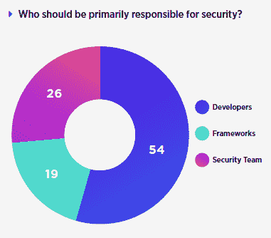

# 开发人员关心安全性，但 Infosec 团队更关心安全性

> 原文：<https://thenewstack.io/devs-care-security-infosec-team/>

假设开发者在安全方面很懒是不公平的。事实上，最近 [DZone 对 540 名开发人员进行的关于应用程序安全性的调查](https://dzone.com/guides/proactive-security-apps-environments-and-messaging)表明，54%的人认为他们，即开发人员，应该对安全性负责。如果你是安全专家，你可能会抱怨。

[开发者关心安全](http://lawrencehecht.info/agreement-between-sec-and-dev/)，只是不像他们的信息安全同行那样关心。安全性只是许多考虑因素中的一个，而 infosec 团队一直专注于测试和法规遵从性。事实上，根据同样的 DZone 调查，60%的人说发布时间表已经超越了他们组织的安全顾虑。

SANS Institute 的 *2017 年应用安全状态:平衡速度和风险* 通过对 214 名 IT 专业人员的调查提供了更多观点，其中三分之二的人从事以安全为重点的工作。当被问及在生产系统中实施应用程序安全性的最大挑战时，最大的回答是“弥合软件开发、安全性和法规遵从性之间的差距”，第二大挑战是“安全性、开发和业务部门之间的孤岛”

似乎每个人都知道测试应该被整合到整个软件开发生命周期中。让每个人优先考虑这是一个不同的故事。这种持续差距的最大原因之一是，虽然测试更可能是一种安全责任，但补救却落在了开发的肩上。

根据 SANS 研究所的报告，开发人员最有可能负责采取纠正措施，而内部和外部安全测试人员则专注于识别问题。人们普遍认为，跨工作角色的沟通可以使目标一致。改善公司安全状况的另一种方法是建立跨职能团队，如 [DevOps](/category/devops/) 或 DevSecOps。

组织和 c 级承诺能成为 app 安全的灵丹妙药吗？如果您知道其他数据源显示 Infosec、DevOps 和 AppDev 之间存在联系或缺乏联系，请告诉我们。

通过 Pixabay 的特征图像。

<svg xmlns:xlink="http://www.w3.org/1999/xlink" viewBox="0 0 68 31" version="1.1"><title>Group</title> <desc>Created with Sketch.</desc></svg>