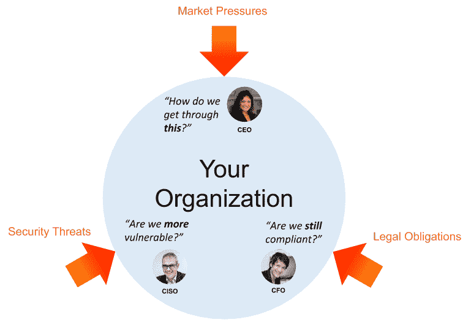
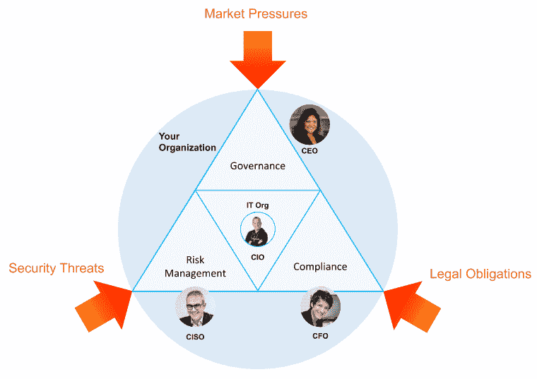

# DevSecOps 可以解决治理、风险、法规遵从性(GRC)方面的挑战

> 原文：<https://thenewstack.io/devsecops-can-address-the-challenges-of-governance-risk-compliance-grc/>

很容易将 DevOps 视为仅与 It 相关的东西。但是 DevOps 可能是支持更广泛组织的 GRC(治理、风险、法规遵从性)需求的一个关键方面。这为 IT 改进提供了背景，并使 IT 在更广泛的组织讨论中占有一席之地。

## 完美风暴:平衡创新与治理、风险和合规性

 [安德鲁·戴维斯

安德鲁·戴维斯是一名 Salesforce DevOps 专家，他热衷于帮助团队实现创新、建立信任和提高绩效。他目前是 Salesforce 的领先 DevOps 平台科帕多的产品营销高级总监。在加入科帕多之前，他在 Appirio 担任开发人员和架构师，在那里他了解了发布管理的酸甜苦辣，并领导创建了 Appirio DX，这是一套支持 Salesforce CI/CD 的工具。他和妻子以及一只可爱的小狗住在圣地亚哥。](https://andrewdavis.io/) 

随着新冠肺炎疫情延伸到 2020 年及以后，企业面临着一系列新的挑战:

*   支持远程工作人员
*   解决客户的安全问题
*   消除供应链瓶颈
*   和确保数据安全

当今企业面临的挑战不止于此。颠覆和竞争在很大程度上推动了数字化转型。“出生于数字时代”的公司正在迅速超越大多数传统上主导市场的公司。预计在未来十年，超过一半的标准普尔 500 将被取代，公司在 S&P 的平均时间已从 20 世纪 60 年代的 30 多年下降到今天的 12 年左右。

再加上最近法规遵从性要求的增加(如 GDPR 和 CCPA ),显然创新的压力从未如此之大。但两者都没有风险。虽然速度和灵活性至关重要，但企业必须在市场压力与安全和法律标准之间取得平衡。

随着市场不断加速转型和数据隐私需求的增长，企业必须找到一种方法来同时扩展创新和合规性。

## GRC 框架

GRC 一词是在 2002 年世界通信公司和安然公司丑闻之后创造出来的，是为了满足在遵守法律和保证业务安全的同时提高运营效率的需要。GRC 框架是[“在有效管理风险和满足合规性要求的同时，使 IT 与业务目标保持一致的结构化方法。”](https://www.compuquip.com/blog/governance-risk-and-compliance-program#:~:text=GRC%20is%20an%20acronym%20for,and%20compliance%20with%20industry%20regulations.)

GRC 框架有三个方面:

*   治理归结为实现组织定义的目标的能力。
*   风险管理是关于解决可能阻止你实现那些目标或活动的不确定性和潜在的不利因素。
*   合规性为诚信行事和满足该流程中不同的相关法规提供了指导。

GRC 框架对于不同的企业来说看起来不同，但在其核心，每个框架为企业提供了跨组织的结构优势和行为一致性，以管理和克服这些竞争压力。

## 将 GRC 透镜应用于 DevOps 和 DevSecOps

开发运维源于 IT 部门，以满足类似的性能和创新目标。虽然安全性和合规性一直是 DevOps 的一部分，但术语 DevSecOps 通常用于确保明确强调安全性。将 DevSecOps 视为更广泛的 GRC 框架的一部分，可以清楚地了解 DevSecOps 如何满足组织更快创新、保持完全可见性和控制力以及有效管理风险的需求。

GRC 和 DevSecOps 使用不同的工具，需要不同的技能，遵循不同的流程，并且被不同的团队所强调。但是他们的目标是一致的，这对两个团队都很重要，这样他们就可以有效地合作。开发运维专家通常专注于流程自动化或改进 IT 内部的交接。对于 It 团队来说，在服务于公司 GRC 计划的大背景下欣赏他们的工作非常重要。

相比之下，专注于 GRC 的顾问和领导者需要将 DevSecOps 理解为一种补充方法，他们应该鼓励而不是抑制它。IT 行业的发展速度比公司的大多数部门都要快，因此法规遵从性管理人员应该听从 IT 团队的意见，采用最有效的方法来满足需求。他们的主要角色应该是强调 GRC 的目标和要求，并邀请 IT 部门提供创造性的解决方案。对 IT 团队必须如何操作的过度规定将会破坏治理的目标，因为在可以简化的过程上存在官僚主义。

## 采用全面、综合的方法

虽然框架通常被视为过程和工作流，但是采用它们比文档更深入。要通过 GRC 镜头真正拥抱数字化转型，企业必须转变心态:“在一个具有前瞻性思维的组织中，GRC 被视为所有必要能力的良好协调和集成的集合，以支持组织各个层面的原则性绩效。GRC 不会给业务带来负担，而是支持和改善业务。”

开放合规与道德小组的 [GRC 红皮书](https://go.oceg.org/grc-capability-model-red-book)使用能力模型来帮助确保组织采取全面的 GRC 方法。但最重要的是要明白，GRC 应该被视为可以支持业务的东西，而不是给业务增加负担。

有一种错误的观点认为，法规遵从性是简化和实现组织效率的障碍。但是，除了满足法律和道德需求之外，遵从还会带来许多短期和长期的好处，尤其是在可追溯性方面。

为了更好地理解 GRC，让我们定义并理解治理、风险和法规遵从性之间的相互依赖关系。

虽然这些概念是相互关联和相互依赖的，但它们不一定一起执行。大多数组织遵循一个更加孤立的模型。在过去的二十年里，公司一直试图在他们所做的一切事情中采取一种更具协作性和整合性的方法来处理这三件事情。应用 GRC 框架可确保公司从管理层的角度考虑这些问题，从而确保平衡满足所有这些需求所需的时间和资源。目标是设计同时高效、合规和安全的流程。

## 结论

首席执行官的基本职责是在规避风险的同时确保公司业绩。在这个过程中，公司必须在各个层面诚信行事。治理、风险管理和法规遵从性(GRC)解决了这三重挑战。IT 组织对所有这三项活动以及更广泛的业务成功越来越重要。DevSecOps 是一种技术和文化方法，帮助 IT 团队尽可能有效地满足业务 GRC 标准。

DevSecOps 的强大之处在于，它不仅能满足组织的需求，还能增强个人贡献者的能力并让他们参与进来，激励他们以最有效的方式实现高水平的目标。这一领域的实践仍在发展，但基本原则是明确的:尽可能高效地交付价值，监控系统和流程，并征求用户和员工的反馈，以不断学习和改进。当安全和法规遵从性管理人员从一开始就参与设计一个高效、安全和法规遵从性的工作流，在不增加 it 负担的情况下满足业务需求时，他们可以带来最大的好处。

<svg xmlns:xlink="http://www.w3.org/1999/xlink" viewBox="0 0 68 31" version="1.1"><title>Group</title> <desc>Created with Sketch.</desc></svg>