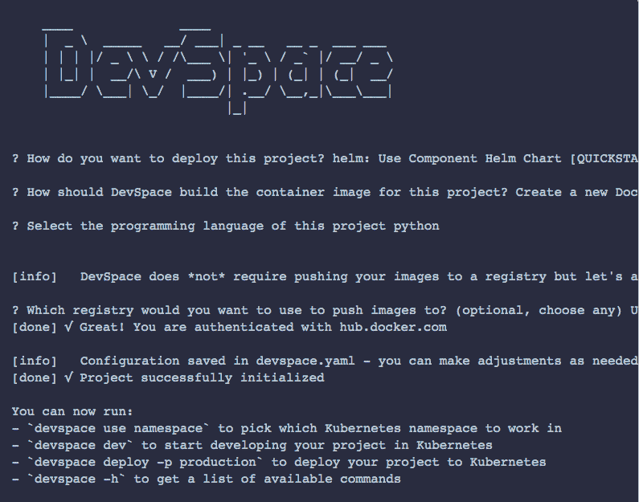

# DevSpace 旨在降低 Kubernetes 的学习曲线

> 原文：<https://thenewstack.io/devspace-designed-to-lower-the-kubernetes-learning-curve/>

简单地说，DevSpace 使开发人员在 Kubernetes 环境中更有效率。它可以作为一个 [Docker Compose](https://docs.docker.com/compose/) 的替代品，而且还多得多。

开源软件 [DevSpace](https://devspace.sh/) 吸引了人们的兴趣，它是一种工具，旨在让开发者更容易为 Kubernetes 创建应用程序，而不必先了解与环境相关的复杂性。它的创建者将其描述为一个 CLI 工具，可以帮助加速 Kubernetes 上部署的应用程序的开发工作流。DevSpace 的创建者将该工具比作“类固醇上的 kubectl”，他们说，它允许开发人员在一个存储库中创建为 YAML 文件配置的代码，这些代码被分发给 DevOps 团队，并与所有工作的 Kubernetes 环境兼容。

“DevSpace 的各种功能让开发者不必担心 Kubernetes 环境，”Kubernetes 自助服务和多租户平台提供商 loft.sh 的开发者倡导者 [Levent Ogut](https://www.linkedin.com/in/leventogut/?originalSubdomain=tr) 在[博客文章](https://loft.sh/blog/python-flask-development-on-kubernetes-with-devspace/?utm_medium=reader&utm_source=rss&utm_campaign=blog_python-flask-development-on-kubernetes-with-devspace?utm_source=thenewstack&utm_medium=twitter&utm_campaign=platform)中写道。"相反，它使开发者能够像在本地机器上一样进行开发."

已传达的 DevSpace 功能包括:

*   通过 Helm，kubectl 进行部署。
*   执行时在内存中修改 Dockerfile。
*   开发工具，如文件同步、日志聚合。
*   自定义挂钩(基于事件执行的操作)。
*   自定义命令(将复杂或冗长的命令构建到单个子命令中)。
*   自定义配置文件(使用添加、修补、删除和合并操作来更改 devspace.yaml 和 Dockerfile 文件中的任何内容。
*   Ogut 写道，这些配置文件能够为特定的部署类型使用不同的配置，如试运行、生产或测试。

企业管理协会(EMA)的分析师 Torsten Volk(T10)告诉新的堆栈，任何可以降低寻求在 Kubernetes 环境中工作的开发人员和软件工程师的学习曲线的东西都是受欢迎的。

然而，Volk 说，虽然 DevSpace 为 Kubernetes 提供了一个非常简化的开发人员体验，但开发人员仍然需要理解开发 Kubernetes 应用程序的基本概念，以确保可伸缩性、合规性、安全性、性能等。“但只要 DevOps 团队足够熟练，能够勤奋地实现实施最佳实践 Kubernetes 管理所需的声明式配置和自动化护栏，DevSpaces 就能显著提高开发人员的生产率，”Volk 说。

DevSpace 可能被视为 GitOps 的 CI/CD 工具的替代品，如 Flux 或 ArgoCD，它们允许开发人员只需配置 YAML 文件，然后将这些文件上传到 Git 存储库进行部署。事实上，使用 DevSpace，代码作为 CI/CD 过程的一部分被加载到 Git 上。尽管如此，DevSpace 的创建者并没有把这个工具吹捧为 CI/CD 工具。

Ogut 写道，DevSpace 不同于 CI/CD 平台，它的重点在于使开发者能够轻松地创建与生产相匹配的应用环境。“在云原生开发中，这可能会很棘手，因为它有众多的依赖性、错综复杂的网络和存储挑战，”他写道。“简而言之，让开发人员能够在一个实时的 Kubernetes 环境中创建代码，该环境与生产环境基于相同的声明性配置参数集，这是一个非常有趣的价值主张。”

<svg xmlns:xlink="http://www.w3.org/1999/xlink" viewBox="0 0 68 31" version="1.1"><title>Group</title> <desc>Created with Sketch.</desc></svg>