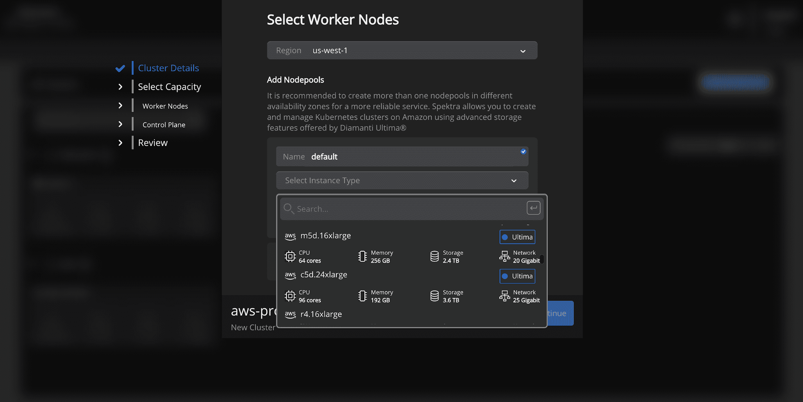

# Diamanti 扩展了 Kubernetes 有状态存储的范围和对 AWS 的支持

> 原文：<https://thenewstack.io/diamanti-extends-kubernetes-stateful-storage-reach-and-support-for-aws/>

[Honeycomb](https://www.honeycomb.io/) 正在赞助新 Stack 对 Kubecon+CloudNativeCon 北美 2020 的报道。

裸机容器平台提供商 [Diamanti](https://diamanti.com/) 已经扩展了其 Spektra 平台，通过其“单一窗口”控制台支持亚马逊网络服务(AWS)的 Kubernetes 环境管理，该公司上周在 KubeCon+CloudNativeCon 上宣布。随着 Diamanti Spektra 3.1 的发布，Diamanti 还为该平台添加了新功能，重点是改进有状态数据管理，并进一步简化多租户多云和内部环境的 Kubernetes 环境管理

Diamanti Spektra 3.1 提供的新功能包括一组数据平面服务。此外，该公司推出了新的客户门户网站 Diamanti Central。

Diamanti 对 AWS 的新支持“特别重要”，因为它允许 AWS 客户“以容错的方式”在[亚马逊弹性计算云(Amazon EC2)](https://aws.amazon.com/ec2/instance-types/) 实例上使用更高性能的本地非易失性内存 express (NVMe)驱动器，Diamanti 的创始工程师 Sambasiva Bandarupalli 告诉新堆栈。

Bandarupalli 说:“历史上，需要容错的客户不得不使用 EBS 存储服务。“现在，Diamanti 的客户可以利用更高性能的 EC2 实例，”与本地 NVMe 存储，他说。

Bandarupalli 表示，使用 Diamanti 控制台的 AWS 客户现在有:

*   “完整的”灾难恢复和数据保护功能，如快照、同步和异步复制。
*   整体性能更高。
*   提高容错能力。
*   每秒输入/输出操作的成本更低(IOPS)。

此外，Diamanti 支持 AWS 上 EBS 卷之上的存储功能，用于跨区域高可用性的容器粒度卷，Bandarupalli 表示这为客户提供了额外的“成本节约”。

Bandarupalli 表示:“使用 Spektra 3.1 AWS，用户可以通过单一平台查看和管理 AWS 集群，他们可以轻松部署应用程序，并在 AWS 集群之间来回迁移应用程序。”。“用户还可以在 AWS 和本地集群之间启用灾难恢复(DR ),以提高容错能力并消除单点故障。”

Diamanti Central 是一个“客户门户”，旨在帮助将用户对 Spektra 的支持集中在一个界面中。它包括文档、工具、演示应用程序和其他客户支持资源。

Bandarupalli 表示:“Diamanti Central 通过帮助客户及时了解所有最新的新版本、参考架构和技术支持信息，让他们轻松自信地踏上 Kubernetes 之旅。“注册用户也将有机会参加我们的 Spektra 和 Ultima 软件的免费试用，这样他们就可以在购买前试用。”

Diamanti 传达的 Spektra 3.1 提供的其他新功能包括:

*   **应用程序日志**:用户可以检查应用程序和 pod 级别的日志，以减少诊断和解决问题所需的时间。
*   **GPU 支持**:通过 Spektra 的“单一平台”向不同租户提供 GPU 资源，并监控 GPU 资源利用率

Spektra 首先支持[微软 Azure](https://azure.microsoft.com/fr-fr/) ，而该公司预计在 2021 年初增加对[谷歌云平台(GCP](https://console.cloud.google.com/?hl=fr) )的支持。

通过 Pixabay 的特征图像。

<svg xmlns:xlink="http://www.w3.org/1999/xlink" viewBox="0 0 68 31" version="1.1"><title>Group</title> <desc>Created with Sketch.</desc></svg>