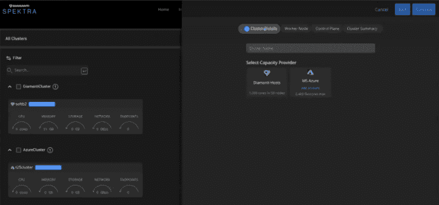

# Diamanti 为多集群扩展了 Spektra，为有状态应用扩展了多云 K8

> 原文：<https://thenewstack.io/diamanti-extends-spektra-for-multicluster-and-multicloud-k8-for-stateful-apps/>

Diamanti 正在扩展其 [Spektra 平台](https://diamanti.com/product/diamanti-spektra/)上的 Kubernetes 管理功能，以适应有状态应用的多租户和多云环境。

据该公司称，随着 Spektra 3.0 在今年年底的正式发布，组织将有一个单一的面板来管理他们在多云和本地环境中的 Kubernetes 部署。

“在这一点上，我们实际上正在朝着在单一控制台和控制平面内支持多个集群的方向前进，” [Brian Waldon](https://www.linkedin.com/in/bcwaldon/) ， [Diamanti](https://diamanti.com/) 产品副总裁告诉新堆栈。

Diamanti 的发布也反映了工具提供商的雄心，以满足寻求管理多云和本地云原生环境的组织的需求，同时确保存储、数据库和其他有状态应用程序也集成到组合中。

鉴于企业正在“寻求容器化更多的应用程序，包括有状态的应用程序，我们预计容器中的数据丰富的应用程序和服务将持续增长，以及容器应用程序中数据服务的扩展使用，”[cloud native and devo PS，](https://451research.com/analyst-team/analyst/Jay+Lyman) [451 Research](https://451research.com/) (现为 S&P Global Market Intelligence 的一部分)首席分析师 Jay Lyman 表示。

事实上，随着有状态应用程序越来越多地在云本地和多云环境中容器化，跨多个和混合云部署 Kubernetes 以及管理多个 Kubernetes 集群的需求也在增加。

Diamanti 营销副总裁 Jenny Fong 告诉新堆栈，运行“跨内部和多个云中的真正混合云体验，同时还支持有状态应用程序”是 Diamanti 希望通过其 Spektra 3.0 版本帮助解决的问题之一。Fong 说，这还包括“将有状态的应用程序从内部迁移、保护和复制到云，反之亦然”的能力。

Spektra 的早期版本允许组织利用上面描述的一些功能，但是很大程度上局限于 Diamanti 集群的管理。“现在的关键是能够在 Diamanti 集群，一种自带基础设施的集群和公共云集群之间做到这一点，”Fong 说。

Fong 说，Spektra 3.0 提供的一个关键功能是帮助支持组织“进入多集群情况，当他们通常也有多个租户时”。“从租户的角度来看，如果我是一个项目的团队成员，我可以访问我的环境视图，这是我已经制定的，但我希望能够自由决定在哪里部署我的应用程序，以及如何迁移它们，甚至在它们上面实施策略的想法，”Fong 说。

从表面上看，Diamanti 的发布似乎将允许组织在支持现有“状态问题”的同时，接受并迁移现有工作负载，Longbottom Associates 的分析师 Clive Longbottom 告诉新堆栈。

Spektra 3.0 提供的其他联合 Kubernetes 管理功能包括:

*   **跨裸机和公共云的多集群管理** : Diamanti Spektra 将首先添加对微软 Azure 的支持，然后是亚马逊网络服务(AWS)和谷歌云平台。

*   **面向企业和 MSP 的基于策略的多租户**:管理员可以跨多个托管集群组织租户和项目。

*   **集成的应用程序部署迁移和有状态应用程序的灾难恢复**:项目成员能够通过“单一控制台”部署和迁移应用程序，并为其他托管集群设置有状态应用程序策略

Diamanti 和亚马逊网络服务公司(AWS)是新堆栈的赞助商。

由[布莱恩·戈夫](https://unsplash.com/@bryangoffphoto?utm_source=unsplash&utm_medium=referral&utm_content=creditCopyText)在 [Unsplash](https://unsplash.com/s/photos/galaxies?utm_source=unsplash&utm_medium=referral&utm_content=creditCopyText) 上拍摄的特征图像。

目前，新堆栈不允许直接在该网站上发表评论。我们邀请所有希望讨论某个故事的读者通过推特或脸书与我们联系。我们也欢迎您通过电子邮件发送新闻提示和反馈:[feedback @ thenewstack . io](mailto:feedback@thenewstack.io)。

<svg xmlns:xlink="http://www.w3.org/1999/xlink" viewBox="0 0 68 31" version="1.1"><title>Group</title> <desc>Created with Sketch.</desc></svg>