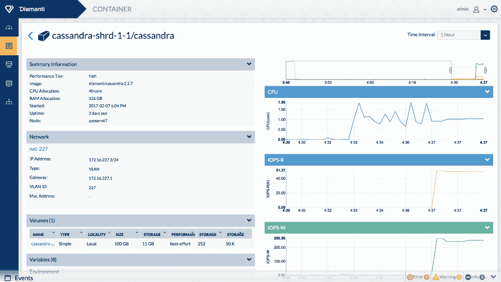

# Diamanti 提供即插即用的 Kubernetes 部署

> 原文：<https://thenewstack.io/diamanti-one-stop-shop-docker-kubernetes/>

在 Docker 和 Kubernetes 的世界里，即插即用基础设施的概念似乎不太可能。但是对于试图缩短上市时间的组织来说，时间是最重要的，因此打包设备可能会提供一条前进的道路。

在新 Stack 的电子书*[中，Kubernetes 生态系统的状态](https://thenewstack.io/ebooks/kubernetes/state-of-kubernetes-ecosystem/) *，*研究总监 [Lawrence Hecht](https://thenewstack.io/author/lawrence-hecht/) 探究了 Kubernetes 的[复杂性声誉](https://thenewstack.io/week-numbers-kubernetes-implementations-good-bad-ugly/) *，*指出随着时间的推移，开源容器编排引擎的学习曲线会变得更好。*

 *[Diamanti](https://diamanti.com) 专注于快速启动和运行的网络和存储方面，尤其适用于大型企业。因此，该公司发布 Kubernetes 套装设备是有意义的，该公司声称，该设备可以在 15 分钟内启动并运行。

Diamanti 首席执行官兼创始人杰弗里·周(Jeffrey Chou)说:“IT 面临的挑战之一是建立基础设施、下载软件并将其整合在一起。“我们的前提是一站式服务，一个喉咙哽住。插上电源就能用了。你不必雇佣一个工程师团队来建造东西。”

## 超融合+裸机

总部位于加利福尼亚州圣何塞的 Diamanti 于 2014 年由 Cisco、Veritas 和 VMware 的资深人士创建，他们认为 VMware、HP 和 Cisco 等传统基础架构并不能真正解决未来的新架构问题。 [Gartner](https://www.gartner.com/doc/3688824/cool-vendors-compute-platforms-) 已将 Diamanti 评为 2017 年计算平台酷派供应商之一。

他说，预打包的计算、网络和存储适用于许多大型企业仍在使用的传统数据中心，尽管该公司未来可能会提供不同的解决方案。

该设备将超融合与裸机容器的性能和效率相结合，使用标准的 Linux 网络接口和 NVMe 块存储卷，可降低 CPU 开销并提供 100 微秒的读/写延迟；每个容器具有可配置的实时流量优先级的 10 Gb 以太网将 NVMe 扩展到整个集群，以提供数据移动性。

设置包括四个命令:创建集群、设置网络、添加持久存储和部署。用户可以通过 GUI、命令行或灵活的 REST API 创建网络和块存储卷。

“我们提供一种解决方案，它可以在几分钟内建立起来，可以为开发人员提供自助服务容器，开发人员可以使用他们自己的开源工具，而不必学习其他任何东西，”Chou 说。

开发人员可以定义与 Kubernetes 和 Docker 集成的基础设施策略，以可预测的应用程序性能将容器从开发转移到生产。

“我们的很多知识产权都是如何将裸机容器与网络和存储相集成的。网络方面的一个问题是，您有所有这些覆盖网络，有 Docker、端口映射、VLANS 等等，网络管理员需要为网络创建一个单独的孤岛。我们整合了一种 Cisco 模型，它可以与您可能拥有的任何交换机一起工作。网络管理员不需要做任何特别的事情，我们与所有现有的网络服务合作，周说。

它通过快照、镜像等功能提供持久存储。

该公司一直参与上游 Kubernetes 项目，贡献了 [Flexvolume](https://gist.github.com/feiskyer/8d41ec27ce449e162d8e18f643fcca29) ，该项目扩展了您在为容器创建存储卷时可以指定的策略和标签。

Diamanti 自动控制隔离边界，以提供可重复的计算、网络和存储分段。设备中的嵌入式性能队列将每个容器与其网络和存储资源连接起来，以提供专用的 I/O 路径并消除噪音邻居。借助基于角色的访问，it 部门可以确保性能不受在同一基础架构上运行的其他开发人员或其他应用程序的影响。

它的[容器网络](https://www.diamanti.com/blog/simplifying-container-networking/)方法侧重于使用现有的交换机和熟悉的网络服务。

Chou 说，它的一个客户在其设备上运行数据库即服务产品。其客户包括 NBC 环球、ShoreTel 和 MemSQL。

https://vimeo.com/189051971

据周说，DIY 方式是该公司最大的竞争对手。但是运行您自己的 Kubernetes 部署可能会很昂贵并且很难维护。

“说到开源支持，我们会全力支持您。如果您发现 Docker 或 Kubernetes 与您的存储或网络之间的交互存在问题；如果你把它们拼凑在一起，你怎么解决这个问题？”他说。“我们在那里，一个单一的供应商，我们提供修复、补丁、升级，我们将与开源上游合作…我们将支持所有的方式，直到位和字节。”

通过 Pixabay 的特征图像。

<svg xmlns:xlink="http://www.w3.org/1999/xlink" viewBox="0 0 68 31" version="1.1"><title>Group</title> <desc>Created with Sketch.</desc></svg>*