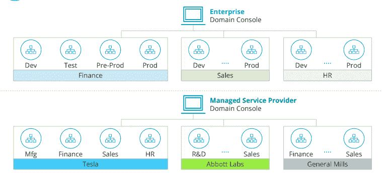
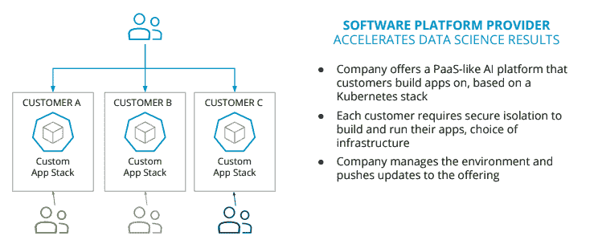
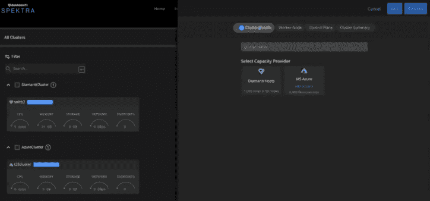

# Diamanti 的 Spektra 3.0 提供多租户 Kubernetes 管理

> 原文：<https://thenewstack.io/diamantis-spektra-3-0-offers-multitenant-kubernetes-management/>

Diamanti 的 Spektra 3.0 今天的正式发布反映了开源软件公司的一个转折点，因为它试图为那些希望依赖单一平台过渡到和管理 Kubernetes 环境的组织提供更广泛的网络。

在过去，Diamanti 寻求定制其软件，以帮助其 x86 和硬件客户的软件堆栈，如今，Diamanti 继续扩展其提供的功能，以简化通常完全不同的多租户和多云端本机环境的管理，并支持有状态的应用程序。

Diamanti 营销副总裁 Jenny Fong 对新堆栈表示:“这一特定版本真正标志着公司正在从过去的传统中进行转变，过去我们主要关注硬件[与软件堆栈的兼容性]。”“这个版本以及我们在 2020 年所做的开发反映了我们如何真正过渡到以软件为中心的功能。”

Fong 说，在 Diamanti Spektra 3.0 提供的新的多云管理功能中，管理附加集群的能力名列前茅。

“因为我们利用了可用的 API，所以我们也可以将现有的集群附加到管理平面上，”Fong 说。

Diamanti 之前已经披露了 Spektra 3.0 如何能够帮助组织在 Azure 上提供集群，并在单一的集中管理平面上管理集群。此外，多租户功能对于企业和组织以及托管服务和软件即服务(SaaS)提供商来说都非常重要。借助这些多租户功能，可以为组织内的客户或最终用户提供隔离的环境。借助集中控制平台，服务器提供商或运营团队可以为每个租户单独管理更新、安装和其他任务。

多租户用例场景可能包括一个 SaaS 提供商，该提供商为具有不同需求的各种客户提供服务，这可能涉及混合云以及管理分布在不同环境中的多个 Kubernetes 集群。一家拥有多家子公司的公司可能会使用 Spektra 3.0 来描述和管理与作为租户的不同公司相关联的云原生环境。在这两种使用案例中，不同的租户组通常会有不同的法规遵从性和监管要求。

“我们的租用模式从非常严格的隔离角度出发，这对于实现某些合规性目标来说是非常必要的。产品副总裁[布莱恩·瓦尔登](https://www.linkedin.com/in/bcwaldon/)、[迪亚曼蒂](https://diamanti.com/)告诉新堆栈:“对于托管服务提供商，将真正的独立客户相互隔离至关重要。“因此，我们提供这些非常严格的控制，以允许应用最广泛的多租户概念。市场上的许多其他解决方案都是在一个集群内处理多租户，如果安全性是您的多租户模型所追求的角度，这确实不合适。”

Spektra 3.0 提供的其他联合 Kubernetes 管理功能包括:

*   跨裸机和公共云的多集群管理:Diamanti Spektra 将首先添加对 Microsoft Azure 的支持，然后是亚马逊网络服务(AWS)和谷歌云平台。
*   面向企业和 MSP 的基于策略的多租户:管理员可以跨多个托管集群组织租户和项目。
*   集成的应用程序部署迁移和有状态应用程序的灾难恢复:项目成员能够通过“单一控制台”部署和迁移应用程序，并为其他托管集群设置有状态应用程序策略
*   该版本也是 Spektra 功能的扩展，作为一个平台，允许拥有现有 Kubernetes 集群的组织跨不同的多云和本地基础设施进行配置。Spektra 允许组织将工作负载迁移到 Kubernetes 本地集群或通过单一界面管理的云集群。沃尔登说，这样一来，Spektra 就成了一条迁徙路径，或者说是“通往库伯内特的斜坡”。

组织通常还拥有现有的传统基础架构，并且通常希望维持他们在传统应用程序和数据中心方面的投资。一个很少被提及的功能是，Spektra 如何允许现有遗留环境中的虚拟机(VM)在 Spektra 管理的 Kubernetes 集群环境中运行。虽然 Spektra 不是为直接移植遗留系统和应用程序而设计的，但旧的或容器化的非 Diamanti 基础设施也可以转换为虚拟 Diamanti 节点。

“这一切都归结于打包——如果它被打包成虚拟机或容器映像”,那么它可以移植到 Spektra，Waldon 说。

迪亚曼蒂是新堆栈的赞助商。

奥利弗·伊万诺夫在 [Unsplash](https://unsplash.com/photos/qOKQU6KuEU0/download?force=true) 上的特写图片。

<svg xmlns:xlink="http://www.w3.org/1999/xlink" viewBox="0 0 68 31" version="1.1"><title>Group</title> <desc>Created with Sketch.</desc></svg>