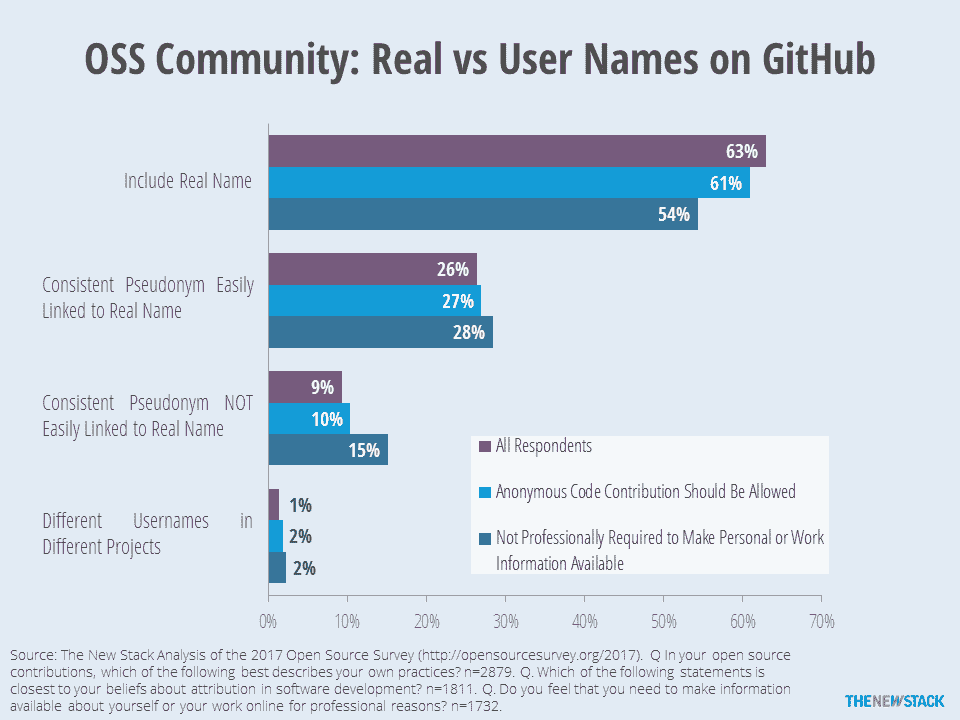

# 红帽的黛安·米勒:在开源中匿名是没有意义的

> 原文：<https://thenewstack.io/diane-mueller-no-point-anonymous-open-source/>

下面的采访是“开源领导者”系列的一部分，在这个系列中，我们描述了开源 IT 社区中的项目领导者，以了解他们如何开发他们的软件，以及运行开源项目带来的挑战和好处。

[社区发展红帽主管黛安·穆勒](https://twitter.com/pythondj)回忆起一个有趣的故事，这个故事强调了为什么在社区工作中保持匿名是没有价值的。她曾经不得不在 OpenStack 峰会上做一个关于 OpenShift 的演讲，这个演讲与来自赛门铁克的两位开发人员的另一个演讲在同一个时间段；他们计划对当时市场上的所有平台即服务(PaaS)产品进行比较。她从未见过他们，也不知道他们的观点会是什么，所以她有点担心他们的意见可能不会有利于 OpenShift，Red Hat 的 PaaS 产品。

她一结束演讲，就去见了团队成员，检查他们的演讲，她惊讶地发现他们是 OpenShift Origin 的超级粉丝。但是他们匿名完成了所有的工作，所以尽管她是社区经理，她并不知道他们的工作。

那件事让她想到了匿名的因素。“这就是为什么在 [OpenShift Commons](https://commons.openshift.org/) 中唯一真正的‘规则’是不能匿名的原因之一。我们要求每个人都自我认同，这样无论是个人还是公司的议程都可以公开，联系也更容易。”

在她的职业生涯中，Mueller 参与了许多开源项目。她就读于马萨诸塞大学阿姆赫斯特分校，学习计算机科学和女性研究。她的教育背景兼具技术和政治两方面。她计划成为一名律师，但很早就迷上了计算机和编程，并最终成为开源世界中非常有影响力的人。

完成学业后，她开始在 VAX 虚拟机的黑暗时代担任系统管理员和数据库管理员(DBA ),然后在耐克公司做了一段时间的 3D 建模 CAD/CAM 软件开发人员。她在不列颠哥伦比亚省温哥华的各种创业公司呆过一段时间。她还为金融部门做了一些 XML 标准工作(XBRL ),并在 ActiveState 工作了两次，第二次负责领导他们的云 R&D 战略，该战略发展成为 Stackato，一种基于 Cloud Foundry 的平台即服务(PaaS)。

“最后一站让我迷上了 Cloud、OpenStack、Containers 和 Kubernetes，这让我认识了 Red Hat 和 OpenShift 团队，”她说。今天，她运营着 [OpenShift Commons](https://commons.openshift.org/) ，这是 Red Hat 的软件开源社区。

## 第一次接触开源软件

她是一名 Python 开发人员，早期曾与 Drupal 合作，并在 Django 问世时深深爱上了它。“Django 社区是我参与的第一批开放源码社区之一，它让我感到热情和包容，”她说。

她承认了一个难以忽视的事实，即开源和技术社区并不总是最支持来自不同背景的人的社区。但是姜戈是一个惊喜。

“作为 20 世纪 80 年代早期以来 LGBTQ 社区的一员，围绕 Python 和 Django 建立的自由/开源软件社区对我来说是创造良好包容性社区的潜力的启示，并使我想确保我参与的所有项目都为参与者创造类似的授权体验，”她说。“我们还有很长的路要走，还有很多工作要做，但一些繁重的工作已经完成，自由/开源软件社区正在看到拥有更多样化的投入来推动创新的好处。”

## “我只是想写代码”

她最初参与开放源码是非常实际的。她开发并部署了一些移动应用，部署了数百个网站，在业余时间开发了几款游戏，还创办了几家初创企业，并在 R&D 从事过产品管理工作。

“我喜欢编写应用程序，但多年来，作为一名程序员变成了“拥有”应用程序下的堆栈，也就是作为一名系统管理员、打包员、数据库管理员，做问答工作，通过公司的繁文缛节获得开发和部署应用程序的资源——这变得“毫无意义”我只是想写代码，”她说。

随着云计算的出现，计算资源变得更加容易获得，穆勒仍然需要管理和维护底层的“堆栈”。正是 PaaS 的出现带来了一定程度的自动化，有望抽象掉那些让她对编码不感兴趣的烦人的东西；她被迷住了。

“我的第一次云体验是以 Heroku 为主机，但那是专有的，排除了任何形式的内部窥视或参与其开发。所以当[云代工厂](https://www.cloudfoundry.org/)出现在我的雷达上时，它引起了我的注意。现在我可以部署到我想部署的地方，它已经有了开源精神的开端，但不是一个非常包容或欢迎的社区，”她说。

就在那时，她发现了 Red Hat 和 OpenShift Origin，她决定接受并帮助将这个蓬勃发展的社区建设成一个包容、开放和友好的自由/开源软件社区。

“致力于围绕 OpenShift 及其上游项目建立社区是我的全职工作，所以我觉得我几乎是这个星球上最幸运的极客。我还没有遇到一个成功的开源项目没有以某种方式货币化，但我肯定见过项目失败时，他们无法围绕他们的愿景发展一个社区。”

## 开源解决真正的商业问题

“OpenShift 使开发人员能够在容器中快速构建和部署应用程序，并在一个将 docker 和 Kubernetes 引入企业的安全、健壮的平台中大规模管理它们。对我来说，这解决了应用程序生命周期管理的所有‘未完成’部分的问题，并使编码再次变得有趣，”她说。

虽然 Red Hat 是 OpenShift Origin 项目的“企业”赞助商，但该项目是一个典型的开源项目，其周围有一个非常多样化的社区。 [OpenShift Origin](https://github.com/openshift) 是 OpenShift 的社区分发版，截至发稿时已有超过 885 名贡献者，来自 941 名提交者的 26，750 个拉请求，超过 50 个组织贡献代码。

Mueller 补充说，红帽的 DNA 就是让一切都开源。在谈到贡献和合作的价值时，她说:“当我们与他人在项目上合作时，获得的洞察力是不可估量的。通过与其他组织在容器、安全性、集群管理等方面的合作，我们避免了重复发明轮子和分散维护负担，同时随着技术的发展增加了功能集。通过合作，我们可以更有效地推动创新，并能够创建满足客户需求的容器平台和生态系统。”

黛安·穆勒将于 12 月 5 日在奥斯汀共同主持下一次 OpenShift Commons 聚会。

新堆栈的劳伦斯·赫克特为这份报告提供了研究。

[Cloud Foundry Foundation](https://www.cloudfoundry.org/) 和 [Red Hat](https://www.openshift.com/) 是新堆栈的赞助商。

<svg xmlns:xlink="http://www.w3.org/1999/xlink" viewBox="0 0 68 31" version="1.1"><title>Group</title> <desc>Created with Sketch.</desc></svg>