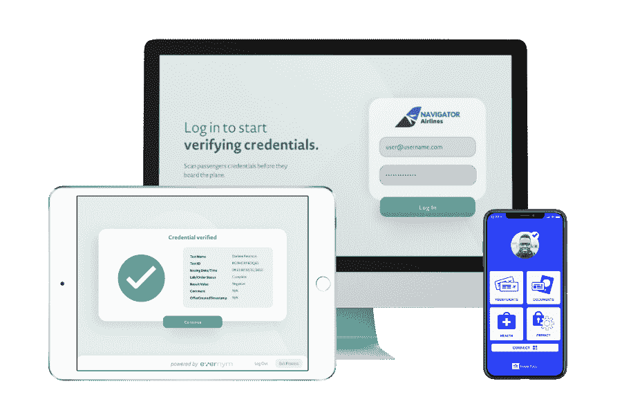

# 你听说了吗？分散标识符即将到来

> 原文：<https://thenewstack.io/did-you-hear-decentralized-identifiers-are-coming/>

多年来，去中心化网络一直是一项很有前景的技术——我不是在谈论加密货币。如果有什么不同的话，围绕加密货币的炒作和金融投机分散了人们对去中心化所取得的非常真实的技术进步的注意力。正如我们将在本帖中探讨的那样，它甚至开始被纳入 web 标准。

 [理查德·麦克马努斯

Richard 是 New Stack 的高级编辑，每周撰写一篇关于 web 和应用程序开发趋势的专栏文章。此前，他在 2003 年创立了读写网，并将其打造为全球最具影响力的科技新闻和分析网站之一。](https://twitter.com/ricmac) 

那么我们为什么需要去中心化呢？简单地说，是因为像脸书、谷歌和苹果这样的“围墙花园”公司的力量。去中心化为用户带来了夺回个人身份和数据控制权的可能性；这就是它如此重要的原因。

也许去中心化网络的关键是身份。想想你的谷歌、脸书和苹果登录对你在网上做的几乎所有事情有多重要。但最终，在这些商业平台上，你无法控制自己的身份。谷歌或苹果可以随时关闭你通常用来登录的电子邮件地址。至于脸书，它在过去的一年里已经表明，如果你被认为违反了它的规则，它可以而且将会“取消”你的平台。还有一个事实是，在这些平台上，你的数据可能会在你不知情的情况下被政府[传唤](https://www.nytimes.com/2021/06/13/us/politics/justice-department-apple-donald-mcgahn.html)(或者更糟)。

## 输入 DIDs:分散标识符

如果来自[万维网联盟](https://www.w3.org/) (W3C)的新规范获得支持，我们可能很快就会有一个网络标准，使用户能够选择分散的身份。6 月底，[分散标识符](https://www.w3.org/TR/did-core/) (DIDs)规范的 1.0 版本作为建议草案发布。did(读作“DID”)被定义为“一种新型的标识符，能够实现可验证的、分散的数字身份。”DID 可以指任何主体——从一个人到一个组织，基本上是“由 DID 的控制者确定的”任何东西

DID 规范是对加密可验证数字证书的[可验证证书](https://www.w3.org/TR/vc-data-model/)标准的补充，该标准于 2019 年 11 月由 W3C 批准。

did 基本上与 URL(统一资源定位符)相同，也称为网址。它是某个东西的标识符，只有在 DID 的情况下，这个标识符才是基于分散技术的(相比之下，URL 是通过域注册管理的，通常是集中的)。

分散标识符(DID)的简单示例；来源:W3C

在评估 DIDs 时,“控制”一词是关键。在[的一次采访](https://the-rubric.castos.com/episodes/dids-are-magical)中，DID 工作组的联合主席 [Daniel Burnett](https://www.linkedin.com/in/daburnett/) 谈到了 W3C 工作组是如何从“拥有”身份的概念转变为“控制”身份的。

Burnett 说:“我的驱动力一直是需要一个可验证的凭证，一个你可以控制的标识符(特别是主题标识符)。没有人能把它从你这里拿走，事实上，你想铸造多少就铸造多少。”

## 这是区块链技术吗？

如今，当你听到“铸币”这个词时，你可能会想到区块链——或许最近会想到不可替代代币(NFT)。碰巧的是，伯内特和他的联席主席[布伦特·尊德尔](https://www.linkedin.com/in/bzundel/)都有区块链科技的背景。伯内特领导着[企业以太坊联盟](https://entethalliance.org/)，而尊德尔在 LinkedIn 上的简介称他是一家名为 [Evernym](https://www.evernym.com/) 的数字身份公司的“首席加密工程师”。

尽管去年 12 月出版的 DID 初级读本描述 DIDs 是“可密码验证的”，但刚刚发布的草案规范却更加模糊。该规范将 DID 定义为“全球唯一的永久标识符，它不需要集中的注册机构，并且通常以加密方式生成和/或注册。”

“经常”为 DID 留下了不可密码验证的回旋余地。在规范的后面，它声明“实现者可以基于在联合或集中的身份管理系统中注册的标识符创建分散的标识符。”因此，DID 的各个部分可能是集中式的，尽管可验证的凭证规范意味着理想的情况是密码可验证的 DID。DID 规范将其语言描述为“集中式、联邦式和分散式标识符世界之间的互操作性桥梁”。

## 你做出信任的决定

不管 DID 是如何被验证的，最终它完全在你的控制之下。然而，这并不意味着 DID 引用的信息一定是*真实的*。可能是“假新闻！”正如 Burnett 解释的那样，这是在设计 DID 系统时经过深思熟虑的选择。DID 的全部意义在于，只有你才能决定你信任谁或什么——没有第三方来替你决定。

DID 架构概述和基本组件之间的关系；来源:W3C

Burnett 说:“作为接收包含该信息的可验证凭证的验证者，由您来决定您信任哪些发行者来做出已经做出的声明。”“我认为所有其他身份系统都试图将可信任的一方放入其中，这是错误的。这就是身份系统的陷阱——因为当受信任的一方遭到黑客攻击，或者出现某种欺诈，或者他们做了你个人不同意的事情时，你会怎么做？”

## 用例:带有新冠肺炎数据的旅行通行证

虽然 DIDs 还处于早期阶段(该规范仍然是一个建议草案)，但已经有一些有趣的用例了。在专题播客中，Zundel 谈到了他的公司 [Evernym](https://www.evernym.com/) 为[国际航空运输协会](https://www.iata.org/) (IATA)开发的[旅行通行证](https://www.evernym.com/travelpass/)。在 Evernym 的网站上，是这样描述的:

“IATA Travel Pass 是一种数字凭证解决方案，使航空公司、政府和其他组织能够以高度安全和保护隐私的方式即时验证旅行和健康文档(如新冠肺炎测试结果)。”

资料来源:Evernym

国际航空运输协会(IATA)的一份数据表(T9)指出，旅行通行证使用了可验证凭证和 DID 开放标准，以及 Evernym 的“数字凭证组件”。值得注意的是，情况说明书没有提到“密码”或“区块链”这两个词它向用户强调的关键点是，他们可以控制自己的敏感健康数据:

“没有中央数据库。所有数据都存储在用户自己的手机上。乘客可以完全控制自己手机上的数据，并可以选择与航空公司和其他方分享这些数据。”

回到 Burnett 关于信任的观点，最终由使用旅行通行证系统的航空公司和其他组织决定他们是否信任 DID 发行者。但据推测，卫生或政府组织发布了旅行通行证报告的新冠肺炎测试和/或疫苗——所以“信任圈”(可以这么说)是牢固的。

## 结论

旅行通行证是 DIDs 的一个很好的测试案例；随着疫情(希望如此)逐渐结束，这显然也是一个非常重要的用例。但看看 DIDs 是否也能成为更多的消费者工具，例如作为社交媒体服务的数字身份，将会很有趣。我敢肯定，在不久的将来，会有许多初创公司渴望绕过脸书、谷歌和苹果的身份系统。

<svg xmlns:xlink="http://www.w3.org/1999/xlink" viewBox="0 0 68 31" version="1.1"><title>Group</title> <desc>Created with Sketch.</desc></svg>