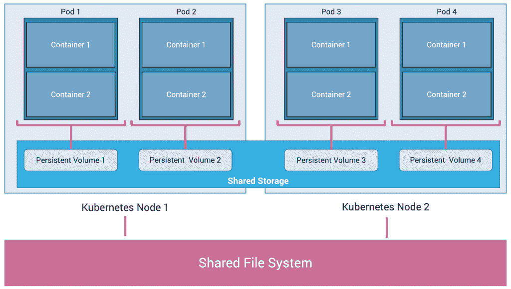
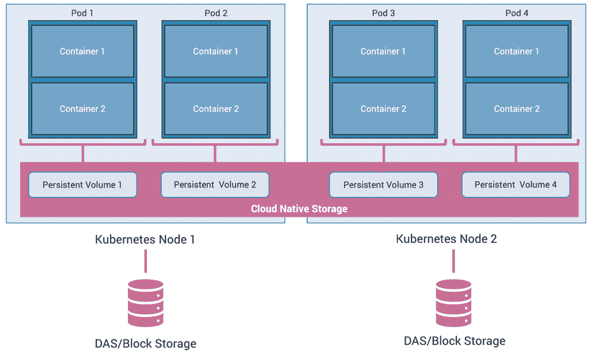

# 构建有状态 Kubernetes 应用程序的不同方法

> 原文：<https://thenewstack.io/different-approaches-for-building-stateful-kubernetes-applications/>

这篇文章是一个为期三个月的系列文章的一部分，探讨了 2020 年 Kubernetes 面临的挑战。本周，我们将研究在 Kubernetes 上运行有状态工作负载的挑战。

Kubernetes 是计算史上发展最快的基础设施项目之一。在短短的五年时间里，它已经成熟到成为现代基础设施的基础。从公共云中的托管容器即服务(CaaS)到数据中心到边缘的企业平台即服务(PaaS)，Kubernetes 正变得无处不在。

在 Kubernetes 的早期，它主要被认为是运行网络规模的无状态服务的平台。数据库和分析工作负载等有状态服务要么在虚拟机中运行，要么作为基于云的托管服务运行。但是随着 Kubernetes 成为最受欢迎的基础设施层，生态系统努力使有状态应用程序成为 Kubernetes 世界中的一等公民。

在 Kubernetes 中运行有状态应用程序有多种技术，每种技术都有自己的优缺点。

本文试图强调在 Kubernetes 中运行有状态应用程序的主要方法、可用的选择以及与每种方法相适应的工作负载类型。我假设读者熟悉 Kubernetes 存储基础设施的关键构建块，如[持久卷](https://kubernetes.io/docs/concepts/storage/persistent-volumes/)、[持久卷声明](https://kubernetes.io/docs/concepts/storage/persistent-volumes/#persistentvolumeclaims)和[存储类](https://kubernetes.io/docs/concepts/storage/storage-classes/)。

## 群集的共享存储

第一种方法是将 Kubernetes 集群与通过 Samba、NFS 或 GlusterFS 公开的传统存储基础设施相集成。这种方法可以很容易地扩展到基于云的共享文件系统，如亚马逊 EFS、Azure Files 和 Google Cloud Filestore。

在这个架构中，存储层与 Kubernetes 管理的计算层完全分离。Kubernetes Pods 中有两种使用共享存储的方式:

**1)本地供应**:幸运的是，大多数共享文件系统都有内置于上游 Kubernetes 发行版的卷插件，或者它们有一个[容器存储接口(CSI)](https://kubernetes.io/blog/2019/01/15/container-storage-interface-ga/) 驱动程序。这使得集群管理员能够用特定于共享文件系统或托管服务的参数来声明性地定义持久卷(PV)。

**2)基于主机的供应**:在这种方法中，启动脚本在负责装载共享存储的每个节点上运行。Kubernetes 集群中的每个节点都有一个一致的、众所周知的挂载点，暴露在工作负载中。一个持久卷通过 [hostPath](https://kubernetes.io/docs/concepts/storage/volumes/#hostpath) 或 [Local PV](https://kubernetes.io/docs/concepts/storage/volumes/#local) 指向主机目录。

由于底层存储管理持久性和持久性，因此工作负载与 it 完全分离。这使得 Pod 能够在任何节点上被调度，而不需要定义节点关联性，这确保了 Pod 总是在所选择的节点上被调度。

但是，这种方法对于需要高 I/O 吞吐量的有状态工作负载并不理想。共享文件系统不是为提供关系数据库、NoSQL 数据库和其他写密集型工作负载所需的 IOPS 而设计的。

***存储选择:** [GlusterFS](https://www.gluster.org/) ， [Samba](https://www.samba.org/) ， [NFS](https://en.wikipedia.org/wiki/Network_File_System) ，[亚马逊 EFS](https://aws.amazon.com/efs/) ， [Azure Files](https://azure.microsoft.com/en-us/services/storage/files/) ，[Google Cloud Filestore](https://cloud.google.com/filestore)*

***典型工作负载:**内容管理系统、机器学习训练/推理作业、数字资产管理系统。*

## 状态集

Kubernetes 通过控制器保持所需的配置状态。[部署](https://kubernetes.io/docs/concepts/workloads/controllers/deployment/)、[复制集](https://kubernetes.io/docs/concepts/workloads/controllers/replicaset/)、[守护集](https://kubernetes.io/docs/concepts/workloads/controllers/daemonset/)和[状态集](https://kubernetes.io/docs/concepts/workloads/controllers/statefulset/)是一些常用的控制器。

StatefulSet 是一种特殊类型的控制器，它使得在 Kubernetes 中运行集群工作负载变得很容易。集群工作负载通常可能有一个或多个主节点和多个从节点。大多数数据库都设计为以集群模式运行，以提供高可用性和容错能力。

有状态的集群工作负载不断地在主服务器和从服务器之间复制数据。为此，集群基础设施期望参与实体(主&从)具有一致的和众所周知的端点来可靠地同步状态。但是在 Kubernetes 中，Pods 被设计成短暂的，不能保证有相同的名字和 IP 地址。

有状态集群工作负载的另一个要求是具有容错能力并能够处理 IOPS 的持久存储后端。

为了便于在 Kubernetes 中运行有状态的集群工作负载，引入了 StatefulSets。属于 StatefulSet 的 pod 保证具有稳定的、唯一的标识符。它们遵循可预测的命名约定，并且还支持有序、优雅的部署和扩展。

参与 StatefulSet 的每个 Pod 都有一个相应的永久卷声明(PVC ),遵循类似的命名约定。当一个 Pod 被终止并在不同的节点上被重新调度时，Kubernetes 控制器将确保该 Pod 与同一个 PVC 相关联，这将保证状态是完整的。

由于 StatefulSet 中的每个 Pod 都有一个专用的 PVC 和 PV，因此使用共享存储没有硬性规定。但预计 StatefulSet 由快速、可靠、耐用的存储层支持，如基于 SSD 的块存储设备。在确保写入完全提交到磁盘后，可以从数据块存储设备中获取定期备份和快照。

***存储选择:**固态硬盘，块存储设备如[亚马逊 EBS](https://aws.amazon.com/ebs/) ， [Azure Disks](https://azure.microsoft.com/en-us/services/storage/disks/) ， [GCE PD](https://cloud.google.com/persistent-disk)*

***典型工作负载:** [Apache ZooKeeper](https://zookeeper.apache.org) ， [Apache Kafka](https://kafka.apache.org/) ， [Percona Server for MySQL](https://www.percona.com/software/mysql-database/percona-server) ， [PostgreSQL 自动故障转移](https://clusterlabs.github.io/PAF/)，以及 [JupyterHub](https://jupyter.org/hub)*

### 云原生存储

Kubernetes 的崛起创造了与云原生计算计划相一致的新细分市场。由于存储是云原生基础架构的关键构建模块之一，云原生存储市场的一个新细分市场在最近几年迅速发展。

云原生存储为 Kubernetes 带来了传统的存储原语和工作流。像其他服务一样，它是从底层硬件和操作系统中抽象出来的。从供应到退役，工作流遵循典型 Kubernetes 资源的相同生命周期。云原生存储以应用程序为中心，这意味着它了解工作负载的上下文，而不是群集之外的独立层。与其他资源一样，云原生存储可以根据工作负载条件和特征进行扩展和收缩。它能够将连接到每个节点的单个磁盘汇集在一起，并将它们作为一个统一的逻辑卷暴露给 Kubernetes Pods。

从安装存储集群到调整卷的大小，云原生存储使 Kubernetes 管理员能够使用由强大的 kubectl CLI 管理的熟悉的 YAML 工件。云原生存储附带了动态配置、对多个文件系统的支持、快照、本地和远程备份、动态卷大小调整等等。

云原生存储平台的唯一期望是群集中原始存储的可用性，这些存储可以聚合并汇集到一个逻辑卷中。原始存储可以采用直连存储(DAS)的形式用于本地集群，也可以采用块存储的形式用于公共云中运行的托管集群。

云原生存储对于容器就像块存储对于虚拟机一样。两者都是从底层物理存储中划分出来的逻辑存储块。块存储连接到虚拟机，而云原生存储则通过容器使用的持久卷提供。

大多数云原生存储平台都带有自定义调度程序，以支持存储和计算的超融合。定制调度程序与 Kubernetes 的内置调度程序一起工作，以确保 Pod 始终位于拥有数据的同一个节点上。

***存储选择:** [NetApp Trident](https://github.com/NetApp/trident) ， [Maya Data](https://mayadata.io/) ， [Portworx](http://www.portworx.com/) ，Reduxio， [Red Hat OpenShift 容器存储](https://www.redhat.com/en/technologies/cloud-computing/openshift-container-storage)， [Robin Systems](https://robin.io/) ， [Rook](https://rook.io) ， [StorageOS](https://storageos.com/)*

***典型工作负载:**任何需要耐用性和持久性的工作负载*

<svg xmlns:xlink="http://www.w3.org/1999/xlink" viewBox="0 0 68 31" version="1.1"><title>Group</title> <desc>Created with Sketch.</desc></svg>