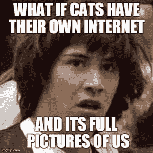

# 数字无政府状态:废除国家

> 原文：<https://thenewstack.io/digital-anarchy-abolishing-state/>

想想田径比赛中的跳高。你向上跑，几乎与横杠平行，然后向横杠跳去，蹬开你的外腿。在空中，你转身，让你的头朝向酒吧，但背对着酒吧。跳高运动员把他们的头举过横杆，然后当他们的头开始下落时拱起背部，保持他们的臀部向上运动。然后当他们的臀部下降时，他们的膝盖停留在杠上，当他们的膝盖开始下降时，他们的脚在杠上轻弹。

这种方法被称为背越式跳高，在迪克·背越式跳高在 1968 年奥运会上用这种方法赢得金牌后，它风靡了田径界。

在那之前，跳高运动员使用的跳跃技术是[在横杆上剪短双腿](https://en.wikipedia.org/wiki/Scissors_jump)，或者其他脚先着地的跳跃方法。这些是主要的，因为跳高起源于高质量的深垫出现之前，所以它们被设计成跳高运动员可以用脚着地。一旦有了更好的着陆表面，跳伞者可以使用不同的、革命性的技术。

就像任何革命性的东西一样，许多珍珠都被跳高传统主义者抓住了，我敢肯定那些深垫子对那些“但这不是我们一直做的方式”的人群来说很方便。

> 在许多方面，当我们经历一个又一个的技术突破时，技术专家已经跳过了性能和用户体验的更高标准。

在许多方面，当我们经历一个又一个的技术突破时，技术专家已经跳过了性能和用户体验的更高标准。回到计算机时代(DotCA)的初期，计算机非常大、昂贵、精致且难以使用。因此，它们是共享资源，被锁在需要无限空间的房间里。

随着[网络](https://thenewstack.io/networking/)能力的发展，用户可以在与更强大的计算机(以下称为服务器)不同的位置，通过终端客户端与它们交互，这是非常轻型的计算机。这成为标准的使用模式，仍然是我们今天拥有的主要方法。

图片 1

甚至我们花哨的多层、负载平衡、基于 Kubernetes 的云原生应用架构也仍然基于这个前提:大型、强大的计算机组将托管代码和数据，并运行复杂的数字炼金术。只为了那些看起来像是我们的猫的照片。

然而，自互联网时代以来，发生了一些事情，让人们对这种基本架构的必要性产生了质疑:电脑变得更便宜、功能更强大、更便携。Adobe 对 20 世纪 80 年代的 Cray 超级计算机和 iPhone 12 进行了比较，展示了我们手掌所拥有的能量的差异。家用电脑、笔记本电脑、电话、智能设备、相机、汽车，甚至你的家用电器都有强大的计算机，有千兆字节甚至兆兆字节的存储空间，并连接到互联网。

计算需要生活在数据中心的想法早已不复存在，我们在这些平台的应用程序开发中看到了这一点，这些客户端的计算能力为代码提供了一个软着陆的地方。边缘计算和快速蜂窝网络的采用进一步分散了计算，这一趋势看起来不会改变。

当我们处理状态和其他数据存储时，这种去中心化就脱离了轨道，我们突然回到了 1965 年。

在应用程序中保持[状态](https://thenewstack.io/the-state-of-state-in-cloud-native-applications/)需要某种数据存储。自 DotCA 以来，网络应用的状态主要保存在服务器上。也就是说，当客户端系统能够拥有硬盘或可移动介质时，您可以用客户端保存一些应用程序的状态。

我们中许多年纪较大的人都记得需要有一张特定的软盘来存储数据，以便随身携带到各种计算机上并运行应用程序。这有点方便，因为您只需要访问应用程序本身，并且随身携带您自己的数据。

> 有多少网站和应用有你的邮箱，你的名字，你的生日，信用卡信息，你的地址等等？

在现代，客户端计算机没有磁性或光学可移动存储，并且对于几乎每一个实际用途，他们都不需要它们。你可以将文档、照片、视频、猫迷因、你的食谱和冒险自拍的 pdf 文件保存在基于云的[存储器](https://thenewstack.io/cloud-native/the-most-popular-cloud-native-storage-solutions/)中。它们在任何地方都可以访问，而且理论上，只有那些艺术品的所有者才能访问。

为了生态系统内设备之间的易用性和互操作性，将这种存储整合到单个提供商是非常常见的。您可以从特定的授权设备使用生物认证来访问您的文件，并且通常使用多因素认证。例如，虽然侵入 iPhone 获取 iCloud 中某人的文件并非不可能，但这也不是小事。

对于现代 web 和云原生应用，情况远非如此。每个应用程序都有自己的数据存储来保存自己的状态，以平面文件的形式存储在对象存储、关系和非关系数据库、缓存等中。而后端服务则是标配(MySQL，PostgreSQL， [Redis](https://redis.com/?utm_content=inline-mention) ，Elasticsearch， [Oracle](https://developer.oracle.com/?utm_content=inline-mention) 等)。)，这些数据的结构和模式对于它们所服务的应用程序来说通常是唯一的。

另一件要考虑的事情是，在不同的应用程序之间有多少数据是冗余的。有多少网站和应用有你的邮箱，你的名字，你的生日，信用卡信息，你的地址等等？您为其填写数据的每个应用程序都是同一数据在不同位置的另一个副本。

这种冗余带来了更大的风险，也是数据受损的又一个机会。目前，全人类的数字存储总量在 200 艾字节范围内，尽管其中大部分可能只是存储在 S3 的模因，但想想有多少数据是冗余的。

> 想象一个架构，其中一个人有自己的状态存储。

另一件需要考虑的事情是，一旦数据被写入，如何处理这些数据。为了合规，它需要永远存在下去吗？有没有被删除过？当一家公司被另一家公司收购后会发生什么？是用来模拟人工智能的吗，你在所有那些你没看过的 TOS/EULA 里都同意了？GitHub Copilot 和 OpenAI 已经[对簿公堂](https://www.theverge.com/2022/11/8/23446821/microsoft-openai-github-copilot-class-action-lawsuit-ai-copyright-violation-training-data)，因为它们正在发布受版权保护的代码，而人工智能驱动的插图也因类似的问题被艺术家们提出。我们对提供给这些服务的数据有多少控制权，以便它们可以自己保存状态？

因此，有了客户端计算和存储能力，以及边缘计算机作为我们的深层缓冲来分散数据，如果我们做一些革命性的事情，放弃应用程序需要保持服务器端状态的概念，会怎么样？

让我们想象一个架构，其中一个人有自己的状态存储。它可以在本地设备上，在单一的基于云的存储上，甚至在有意短暂的存储平台上。应用程序被构建为在设备上或浏览器中本地运行，并且它们访问客户端数据存储以保存状态。这些应用程序将使用通用的架构和模式，因此它们可以读取现有的状态数据，并且只编写它们特定应用程序所需的数据。

这些客户端数据存储将允许应用程序仅读取客户端允许的数据，并且可以对文档/表格/密钥进行加密，这样任何两个应用程序都不能读取彼此的数据，并且客户端可以随意撤销加密密钥，以防止应用程序读取任何数据。

这种架构将彻底改变应用程序开发和部署实践，因为只需要提供静态代码，任何动态执行都将发生在客户端。这方面并不新鲜，但是这些应用程序不会调用自己的服务器和对象存储来读取和记录事务；他们将访问客户端的数据存储。

很明显，在一些用例中，这可能不是最好的主意(想到了金融机构和商业智能工具)，并且在某些情况下，您设计这些应用程序的方式可能会有很大的不同，但是请考虑一下可能性。客户可以在一个地方控制他们的数据。对该数据的访问可以使用生物特征多因素认证。除非你选择这样做，否则你不会将同一信息的多个副本存放在世界各地各种嘈杂的房间里。

> 想象一下，如果你不用燃烧旧的植物来给电脑供电，来保存你对“你在哪条街上长大的？”这个问题的第 28175 个答案的话，电力消耗会有什么不同

你不需要大型、强大的服务器一直做这么多的计算，因为计算是在客户端完成的，所以你有更小、更高效的数据中心。想象一下，如果你不用燃烧旧的植物来给电脑供电，来保存你对“你在哪条街上长大的？”这个问题的第 28175 个答案的话，电力消耗会有什么不同基础设施部署看起来有很大的不同，因为状态存储不是一个驱动因素。甚至更多的服务器端计算负载可以在边缘产生，如果您做得好，甚至可以变得与计算架构无关。

在接下来的几个星期和几个月里，我会更深入地挖掘这个未来的一些细节和方面，但我想挑战你，亲爱的读者，也这样做。我们已经开发了深度缓冲，现在是时候做一些革命性的事情了，让我们在 2023 年及以后超越性能、安全性、数据保护和可持续发展的更高标准。

<svg xmlns:xlink="http://www.w3.org/1999/xlink" viewBox="0 0 68 31" version="1.1"><title>Group</title> <desc>Created with Sketch.</desc></svg>