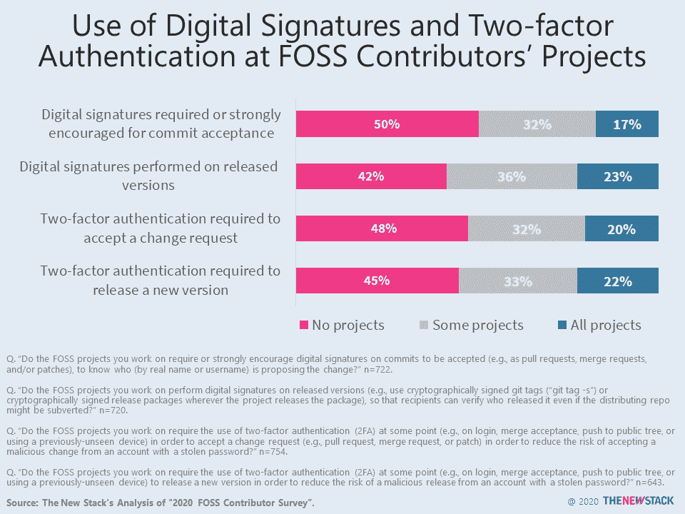
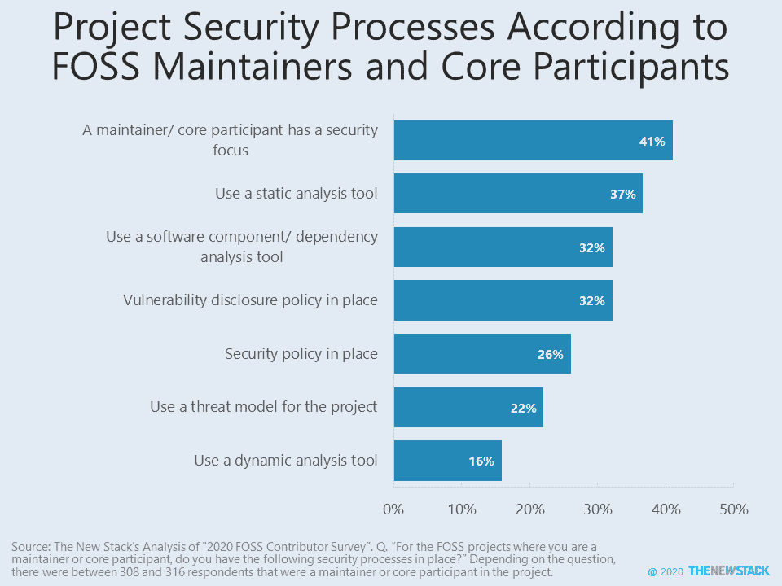

# 数字证书是保护开源供应链的关键，尽管很少有开发者使用它们

> 原文：<https://thenewstack.io/digital-certs-key-to-securing-open-source-supply-chain-though-few-devs-use-them/>

根据“2020 年自由/开源软件贡献者调查”，有一半的开源软件贡献者在对他们参与的开源项目进行修改时从来没有被鼓励使用数字签名相比之下，17%的人通常需要在所有提交中使用数字签名。稍微多一点的项目要求在发布最终的包之前对某人的身份进行加密证明。

特别是考虑到最近的[网络安全管理软件产品攻击](https://thenewstack.io/solarwinds-the-worlds-biggest-security-failure-and-open-sources-better-answer/)，要求数字证书是在整个软件供应链中追踪开源代码监管链的一种强有力的方式。

由于实施该系统需要时间和精力，要求数字签名可能是投稿的一个障碍。如果一个开源项目只有几个贡献者，它可能不值得努力。然而，48%的项目也不要求使用双因素认证(例如，Google 认证器或 SMS 消息)来接受变更请求。如果没有这种常用的安全方法，被盗或丢失的密码很容易被用来入侵系统。

自 [2004 年](https://opensource.com/article/18/3/cla-vs-dco-whats-difference)以来，开发商原产地证书(dco)一直是给予项目使用开发商知识产权的法律许可的一种方式，但其作为增加社区参与者之间信任的一种方式的价值很少被强调。事实上，当被问及 dco 的重要性时，三分之一的贡献者甚至不知道它们是什么，更不用说它们是否有用了。

这些方法展示了保护代码库平台本身和其中的用户操作的尝试，但是在 CI/CD 管道中还有无数其他攻击面。很多时候，识别代码作者的需要与调试有关，而与安全问题无关。

选择许可和治理模型是使项目准备就绪的基本要素。制定行为准则和投稿指南也很重要，但促进安全性的政策也很重要。然而，只有 26%的维护者或核心参与者说他们参与的项目有适当的安全策略。稍微乐观一点的是，41%的受访者表示项目中有人关注安全问题。让我们希望每个项目都有一个安全冠军。

通过 Pixabay 的特征图像。

<svg xmlns:xlink="http://www.w3.org/1999/xlink" viewBox="0 0 68 31" version="1.1"><title>Group</title> <desc>Created with Sketch.</desc></svg>