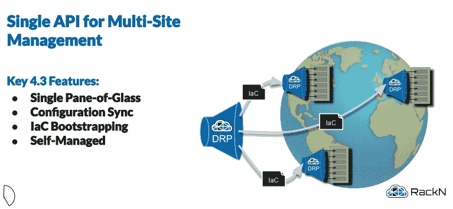
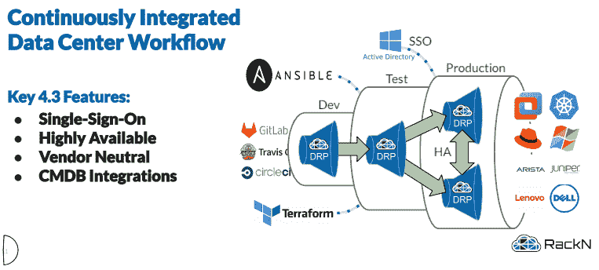

# 数字钢筋承诺从企业到边缘的分布式现场自动化

> 原文：<https://thenewstack.io/digital-rebar-promises-distributed-site-automation-from-enterprise-to-edge/>

RackN 发布了最新版本的[数字钢筋平台](https://rebar.digital/) (DRP)，其基础设施即代码供应和工作流系统。DRP v4.3 集成到数据中心以管理物理和虚拟计算、网络和存储，引入了在大型企业环境和边缘环境中使用相同的轻量级 Golang 服务，通过基础架构即代码实现分布式站点自动化的能力。RackN 首席执行官[罗布·希施菲尔德](https://www.linkedin.com/in/rhirschfeld)解释说，DRP 的核心是将云基础设施的力量带到裸机上，它被用于从管理硬件到安装 VMware 和 Kubernetes 的一切事情。

“我们实现了数据中心物理层的自动化。希施菲尔德说:“我们有内部部署的防火墙后软件，我们的客户使用这些软件在服务器、交换机和存储的整个生命周期内对它们进行管理。“我们的客户真正使用我们的是一个持续集成的数据中心，他们在这里使用我们为物理层设备公开的 API，然后使用它使其非常像云。那种裸机级别的云一样的体验真的很强大。它改变了客户对其数据中心的看法。”

希施菲尔德解释说，这种持续集成数据中心的想法是 DRP 在大型企业部署和边缘场景中可靠运行的核心，在大型企业部署中，一个错误可能需要花费同样多的时间来修复，在边缘场景中，零接触是必要的。

“通过快速告知操作员存在问题或配置错误，可以获得大量的价值实现时间。我们实际上有很多自动运行的验证测试，以确保系统达到速度。希施菲尔德解释道:“没有桥的时候，光是往前走就浪费了很多数据中心的时间。“如果我们将整个数据中心视为一个持续集成的环境，我们可以通过管道方式构建我们想要的整个堆栈，然后以安全、可靠的部署模式移动它，会怎么样？我们采用 CI/CD 的概念，然后将它应用到您的基础架构的物理部署中。”

借助 DRP v4.3，该平台能够通过单个 API 端点提供分布式部署。每个 DRP 实例既可以充当供应工具，也可以充当代理，以便在分发中进一步传递指令。

除此之外，DRP 可以与管道中的其他工具一起工作，以执行提供这种“持续集成的数据中心”体验所必需的构建和测试。

DRP 功能的另一个关键是，它以小于 30MB 的单个 golang 二进制文件的形式存在，没有依赖性，这意味着它可以在服务器、交换机甚至 Raspberry Pi 上运行。希施菲尔德强调，不管你是使用 DRP 每天部署 10，000 台服务器，就像他说的一位金融领域的客户所做的那样，还是在该领域的小型设备上单独创建实例，都是一样的。

“您可以想象，如果您要部署这么多基础架构，这必须是一个小时的过程。不可能是六个月的过程。然后对他们来说，他们实际上会进行第二天的操作，他们会重新部署它，并告诉所有他们已经部署的系统重新部署，并重建整个堆栈-重新声明编写的 bios，重新安装 VMware，重新加入群集，拉入它需要的任何新证书，整个过程，”希施菲尔德说。“对我们来说重要的是，这不是一个专门针对 edge 的代码。我们的基础架构管理策略是相同的，无论您是在运行四个 Pi 群集的边缘实验室中运行，价格都不超过 500 美元，这与银行中运行的代码完全相同。”

目前，DRP v4.3 的测试版在[可供下载](https://portal.rackn.io/#/)，计划于 3 月 13 日全面上市。

VMware 是新体系的赞助商

通过 Pixabay 的特征图像。

<svg xmlns:xlink="http://www.w3.org/1999/xlink" viewBox="0 0 68 31" version="1.1"><title>Group</title> <desc>Created with Sketch.</desc></svg>