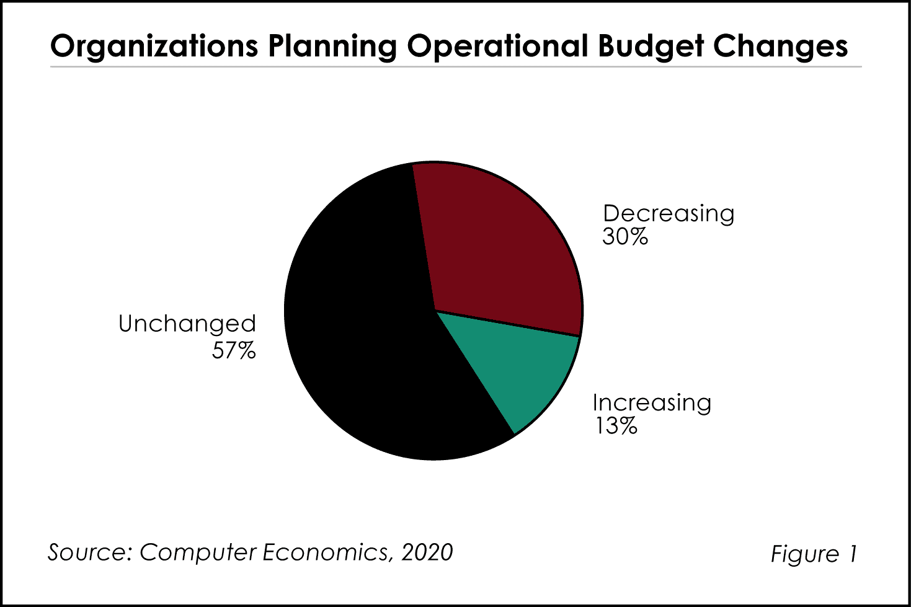
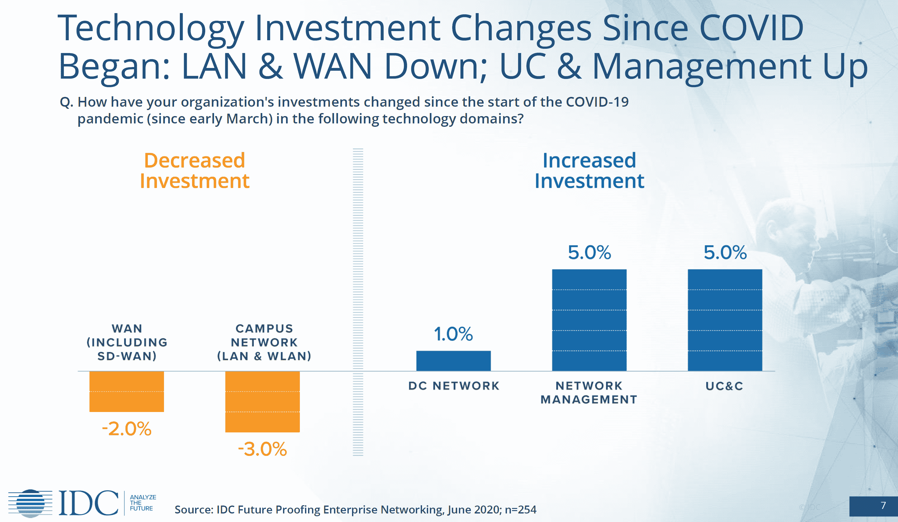

# 疫情时期的数字化转型

> 原文：<https://thenewstack.io/digital-transformation-during-the-pandemic/>

你的同行可能过于强调他们在过去三个月处理新冠肺炎危机的经验。远程工作增加的破坏性影响可以刺激支出，但经济衰退造成的创造性破坏不容小觑。

根据 2020 年 6 月对 2500 多名企业决策者的调查，所有人(97%)都认为疫情加快了他们组织内的数字化转型。几乎同样多的人(79%)认为数字化转型的预算因为新冠肺炎而增加了。但是钱从哪里来呢？

IT 运营和资本支出正在削减。根据 Avasant Research 的[报告](https://www.computereconomics.com/article.cfm?id=2865)，截至 2020 年 5 月，30%的组织预计 IT 运营预算将因疫情而减少，只有 13%的组织预计会增加。六月在 T4，IDC 对网络专业人士的调查发现，超过一半的企业已经取消或推迟了对校园网的投资，软件定义的广域网也急剧下降。好消息是，自 3 月份以来，在网络管理和统一通信方面的支出超过了这些下降。

适应更多远程工作人员的短期支出将逐渐消失，长期影响是网络安全和将更多工作负载转移到云。然而，在过去的十年里，云革命确实导致了资金向 IaaS、PaaS 和 SaaS 的进一步转移。

根据 VMware 赞助的一份[报告](https://www.vmware.com/radius/businesscontinues)，数字化转型的首要任务是改善客户体验和提高业务效率。如果一个项目的目标是彻底反思过程和产品，那么它就是变革性的。如果不是，那么 Twilio 调查中的受访者将数字化转型误认为战术性 IT 支出。

该调查的问题是关于疫情将如何改变 IT 运营预算。

## 更多分析和阅读

通过 [Flickr](https://www.flickr.com/photos/thx_1139_gallery_flickr/11775894626/sizes/l/) 获取特征图像。

目前，新堆栈不允许直接在该网站上发表评论。我们邀请所有希望讨论某个故事的读者通过推特(Twitter)或脸书(T2)与我们联系。我们也欢迎您通过电子邮件发送新闻提示和反馈:[反馈@thenewstack.io](mailto:feedback@thenewstack.io) 。

<svg xmlns:xlink="http://www.w3.org/1999/xlink" viewBox="0 0 68 31" version="1.1"><title>Group</title> <desc>Created with Sketch.</desc></svg>