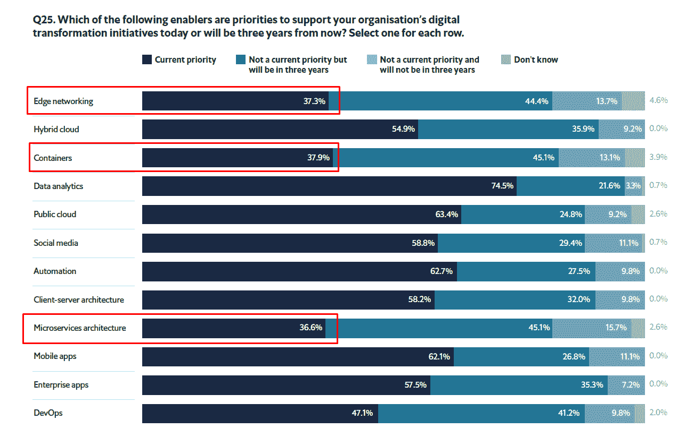
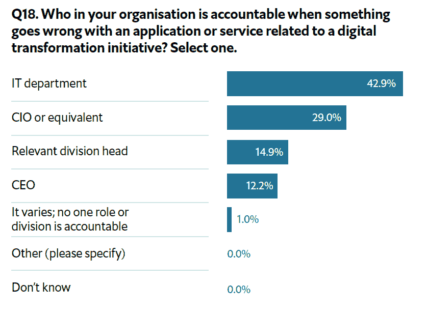

# 数字化转型、IT 和公司的其他部门

> 原文：<https://thenewstack.io/digital-transformation-it-and-the-rest-of-the-company/>

不要被骗去相信数字化转型(DX)可以证明你的技术创新清单是正确的。作为支持 DX 的一种方式，根据经济学人智库刚刚发布的由 BMC Software 赞助的[报告](http://eiuperspectives.com),容器、微服务和边缘网络(新堆栈的覆盖最佳点)等技术仅是大约 37%的组织的优先事项。

在这项针对 IT 和非 IT 高管的调查中，四分之三的受访者认为数据分析能力是 DX 的首要推动因素。有趣的是，65%的人表示他们正在向云/多云基础设施迁移，但这似乎是指向云的总体迁移，而不是更令人兴奋的事情。

此外，不要被骗去相信 IT 部门和公司其他部门之间的关系已经破裂。业务部门有不同的优先事项是很自然的。DX 工作通常由首席执行官或董事会领导，以便他们可以平衡不同业务职能的支出优先级。

资料来源:经济学人信息部/ BMC [报告](https://eiuperspectives.economist.com/technology-innovation/gatekeeper-enabler-role-it-when-digital-transformation-norm/white-paper/gatekeeper-enabler-role-it-when-digital-transformation-norm)未公布的附录。

IT 部门和公司的其他部门并不总是意见一致，但每个人都同意实现更高的运营效率是 DX 的首要任务。非 IT 部门认为创收和降低成本是数字化转型的首要任务，而这些对于 IT 部门来说只是次要问题。相比之下，它对集成、安全性和维护系统弹性更感兴趣。

> 78%的受访者对 IT 和非 IT 主管在数字化转型工作中的合作水平感到满意。

IT 部门通常被认为比应用程序开发更保守，首席信息官通常通过卓越中心和孵化器推动创新。然而，根据 IDG 的“ [2019 年首席信息官状况](https://resources.idg.com/download/executive-summary/2019-state-of-the-cio)”，与业务线(LOB)高管相比，IT 主管认为首席信息官应对创新负责的可能性降低了 56%。四分之一的业务线受访者表示，项目管理是首席信息官的数字业务角色，这一比例几乎是 IT 人员的三倍。

这并不意味着创新本身变得不那么重要了。事实上，[Vanson Bourne](https://www.vansonbourne.com/about)“[2019 年企业 IT 状况](https://www.stateofenterpriseit.com/)”报告发现，与去年相比，IT 更有可能推动创新，而不太可能运行面向客户的项目。尽管该报告认为 IT 正在重新控制数字化转型，但我们认为这一发现的另一个原因是，他们采访的首席信息官少于首席技术官。

IT 和其他业务部门之间的合作程度似乎不是一个高层次的问题，因为《经济学人》研究的 90%的受访者表示，部门主管经常与 IT 部门合作进行数字化转型。此外，78%的人说他们至少对这种程度的合作非常满意。然而，合作也带来了官僚主义的困扰。DX 的两大挑战是 1)实施决策所需的时间，以及 2)对变革的内部阻力。一个值得注意的问题领域是它的采购过程；三分之二的受访者表示，为帮助实现数字化转型目标而购买和使用的 IT 系统和解决方案通常不经过由 IT 部门领导的采购流程。

绕过它会引起问题。例如，43%的受访者表示，当用于 DX 的应用程序或服务出现问题时，IT 部门最有可能承担责任。显而易见的是，作为利益相关者，如果 IT 需要某种程度的控制，如果他们去面对数字化转型失败的后果。另一方面，团队合作也有它的好处。拥有强大 IT 和非 IT 部门协作的组织对未来三年内克服 DX 挑战的信心是其他组织的三倍(35%对 12%)。

资料来源:经济学人智库/ BMC [报告](https://eiuperspectives.economist.com/technology-innovation/gatekeeper-enabler-role-it-when-digital-transformation-norm/white-paper/gatekeeper-enabler-role-it-when-digital-transformation-norm)未公布的附录。

除了上面引用的报告之外，以下是其他三项相关研究的发现:

*   正式的数字化转型团队正在崛起。51%的调查受访者拥有正式的指导委员会或工作组，拥有执行支持和资源分配，包括跨职能和跨部门成员。相比之下，27%的人在去年的调查中说了同样的话。([)数字转换的状态。2018-2019 版](http://insights.prophet.com/the-state-of-digital-transformation-2018-2019)由[高度计，先知公司](https://www.prophet.com/altimeter/about/)
*   在数字业务中，跨业务职能部门共享知识更为常见。2018 年，44%的人在跨业务职能部门分享知识，高于 2016 年的 19%。为其数字业务开发成熟的按需模型的组织从 44%下降到 28%。(“[戴尔技术数字化转型指数 II](https://www.dellemc.com/resources/en-us/asset/analyst-reports/solutions/dell_technologies_digital_transformation_index_ii_full_findings_report.pdf) ”)
*   虽然深度参与，但通常不负责数字化转型。近一半(46%)的中端市场公司表示，他们的非技术高管(如首席执行官，CMO，首席运营官)负责领导他们组织的数字化转型。(" [BDO 中间市场数字化转型调查](https://www.bdo.com/thought-leadership/digital-transformation-survey)")

通过 Pixabay 的特征图像。

<svg xmlns:xlink="http://www.w3.org/1999/xlink" viewBox="0 0 68 31" version="1.1"><title>Group</title> <desc>Created with Sketch.</desc></svg>