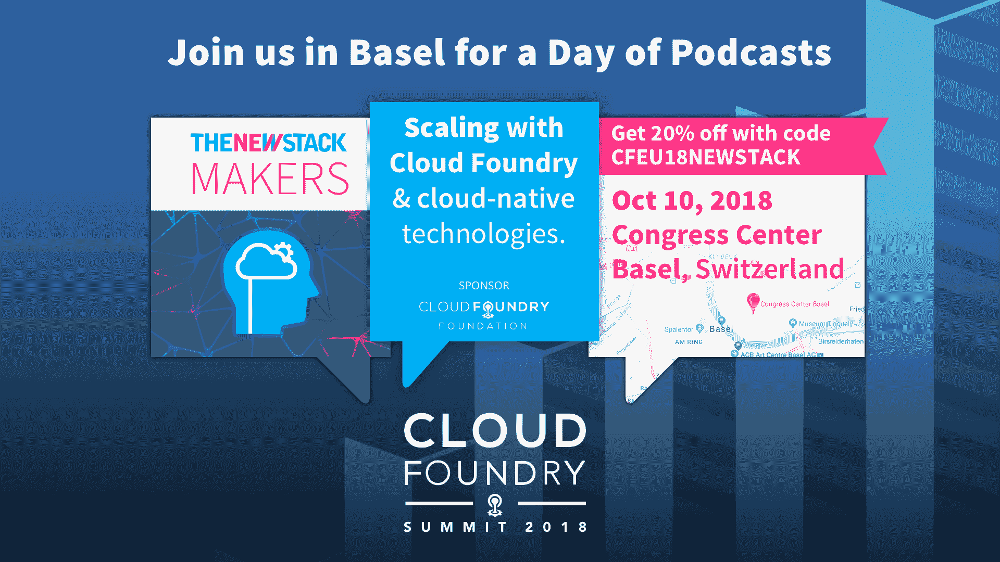

# 数字化转型的人性一面:7 条建议和 3 个陷阱(第二部分)

> 原文：<https://thenewstack.io/digital-transformation-tips-and-pitfalls-to-avoid/>

[云代工厂](https://www.cloudfoundry.org/)赞助本帖。

*以下是云铸造基金会关于数字化转型系列文章的第二篇，为即将在 T4 举行的[云铸造峰会做准备。](https://www.cloudfoundry.org/event/eusummit2018/)*

我们认为，数字技术不仅关乎技术，也同样关乎人。在我们之前的帖子“[数字化转型的人性一面](https://thenewstack.io/the-human-side-of-digital-transformation-7-recommendations-and-3-pitfalls/)”中，我们从三个建议开始:设定明确的目标，只有在项目将产生收入的情况下才说“是”，以及获得合适的人才。

在这篇文章中，我们继续我们离开的地方，用更多的指南来获得正确的数字——以及三个要避免的陷阱。

### 4.给团队提供沟通的工具

故事是这样的，三个被蒙住眼睛的人问他们在摸什么，给出三种不同的答案:一条蛇、一棵树或一堵墙。只有通过交流，他们才意识到他们位于同一只大象的不同部位。

当开发人员、安全和运营团队孤立工作时，也会出现同样的脱节。确保他们都知道并同意共同的目标。从你用户的角度来表达。通过建立 MVP 并持续衡量它们对用户的价值，保持对目标的关注。

### 5.设计鼓励创新的组织结构

组成两队。指派一个小组通过进行小规模实验来评估新兴技术。这个团队的工作是快速评估技术是否有潜力区分你的产品或服务。预计有很高的失败率。没关系；每一次失败都让你更接近正确的道路。创建另一个团队来推广你认为有前途的创新。这个团队的工作就是迭代和提炼。

你可以这样想:第一个小组在受控的环境中培育幼苗，而第二个小组将它们移植到可以生长和繁殖的田地里。

### 6.减少浪费和在制品

 [布莱恩·罗奇

Brian 是 Cogni zant 数字业务部门的产品和战略副总裁。在这个职位上，他帮助定义和执行组织的产品战略，特别关注构建云原生应用程序，帮助客户加速向云的过渡，并重新定义他们的竞争优势。](https://www.linkedin.com/in/brianroche/) 

Digital 的目标是将产品发布周期从 9 到 18 个月缩短到 1 到 3 个月。怎么会？通过制定假设和进行小规模实验来构建 MVP。两周后你应该知道继续实验是否有意义。

这种改变不会在一夜之间发生。思考如何将组织的不同部分整合在一起，以便快速行动。人们需要学习什么才能获得 MVP？你的组织的哪些部分需要改变？

不要试图煮沸海洋。取而代之的是，寻找渐进改进的机会。改变文化，变得更能接受小而频繁的改变。给转向或坚持的决定设定一个时间限制。在你知道之前，你将会以更高的速度交付软件，让你的用户高兴。

### 7.培养学习文化

你从数字产品中获得的价值取决于你在决定是转向还是坚持使用一种产品方面做得有多好。从每一次成功和失败中学习。如果你只记得一件事，那就是:*不要因为失败而惩罚团队。*如果产品不能满足用户的需求，一个敢于改变的团队会更快地推出正确的产品。通过保持实验规模小和经常执行，让失败变得不那么可怕。

### 避免这些陷阱

 [Chip Childers

Chip Childers 在大规模计算和开源软件领域已经工作了 20 年。他在 2015 年联合创立了 Cloud Foundry Foundation，并担任 Apache Cloudstack 的第一任副总裁，这是一个他在 SunGard 领导企业云服务时帮助推动的平台，然后担任 Cumulogic 的产品战略副总裁。](https://www.cloudfoundry.org/) 

与做什么同样重要的是*不*做什么。我们见过的一些错误:

*   追逐闪亮的新事物:一个例子是在没有商业案例的时候研究区块链。将资源分配给商业价值不确定的项目会使有价值的项目陷入饥饿。
*   **打造你能买到的东西:**仔细看看你在哪里投入了开发时间和金钱。如果是改造您的考勤卡应用程序的前端，或者提供 web 服务器，请三思。无情地只投资那些会给你带来竞争优势的项目。
*   **盲目地走另一家公司的老路，只是因为这条路对他们有用:**如果你在沙漠中漫步，跟随其他已经成功的流浪者是很有诱惑力的。那是不明智的。你所关注的组织可能有不同的目标、资源或时间表。在开始您的数字化之旅之前，请评估您的起点、优势和劣势。另一条路可能会带你到一个更好的目的地，或者更快地到达同一个目的地。

### 我们总是在转变，从未转变

你的数字化之旅不会在某一天结束。客户期望和业务目标永远不会冻结，走在他们前面的必要性也不会冻结。

如果你从这些建议中只拿走了一件事，那就是:培养一种不会因为失败而惩罚他人的学习文化。拥抱失败，因为它是实验的荣誉徽章。然后快速失败，快速转向。

通过 Pixabay 的特征图像。

<svg xmlns:xlink="http://www.w3.org/1999/xlink" viewBox="0 0 68 31" version="1.1"><title>Group</title> <desc>Created with Sketch.</desc></svg>