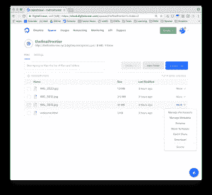
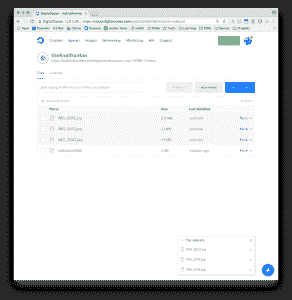

# 数字海洋增加了对象存储和机器学习

> 原文：<https://thenewstack.io/digitalocean-adds-object-storage-machine-learning/>

总部位于纽约的云提供商 DigitalOcean 的两项新服务旨在提供对可扩展对象存储的访问，并让开发人员快速了解机器学习。

[DigitalOcean](https://www.digitalocean.com) 的新对象存储服务被称为 [DigitalOcean Spaces](https://blog.digitalocean.com/introducing-spaces-object-storage/) ，据 DigitalOcean 产品副总裁 Shiven Ramji 称，该服务旨在将数据存储扩展到 Pb 级。

管理数字海洋空间(点击放大)

“我们以典型的数字海洋风格交付它，”拉姆奇说，“这意味着我们为客户提供了一个非常友好和易于使用的界面。”

继 2 月份[推出负载平衡器](https://thenewstack.io/digitalocean-upgrades-load-balancing/)、4 月份[水滴监控](https://thenewstack.io/digitalocean-now-provides-droplet-monitoring/)、6 月份[可扩展防火墙](https://thenewstack.io/digitalocean-adds-scalable-firewall-service-cloud-feature-portfolio/)和 7 月份[高容量 CPU](https://thenewstack.io/digitaloceans-4x-high-cpu-servers/)之后，Spaces 是 DigitalOcean 首席技术官 [Julia Austin](https://twitter.com/austinfish) 的又一举措，旨在提高 DigitalOcean 的企业能力并简化云基础设施，同时创造开发人员喜爱的体验。DigitalOcean 最近在惠普、Atlassian 和 TaskRabbit 等公司拥有超过 50，000 个工程团队，突破了 100 万用户大关，因此升级似乎正在发挥作用。

他说，Spaces 几乎不需要任何配置。开发人员可以存储静态资产、图像和电影，以及备份文件和日志。他们可以拖放文件，或者使用附带的 DigitalOcean API 来自动上传他们想要存储的任何资产。

数字海洋空间上传屏幕

如果您是当前客户，Spaces 是现有套件的一部分。有两个月的免费试用期。之后，250 GB 存储和 1 TB 出站传输的起价为 5 美元。附加存储每月每 GB 2 美分，互联网每 GB 1 美分。上传到共享空间是免费的。

凭借这种巨大的存储能力，DigitalOcean 进军机器学习(ML)，上个月晚些时候推出了[机器学习一键式产品](https://blog.digitalocean.com/how-data-and-models-feed-computing/)。它是为空间设计的。

Ramji 解释说，任何数据科学家都可以进入该平台，并可以快速使用 ML 平台进行数据分析。

该产品捆绑了数据科学工具，包括 R 和 Jupiter 笔记本，一些深度学习工具，如 TensorFlow 和 PiTorch，以及数据挖掘库，如 Pandas 和 Shiny。

因此，想要处理大量去隔离数据的数据科学家现在可以将日志文件转储到空间中，启动机器学习服务来分析庞大的数据集。拉姆奇说，机器学习服务带有深入的教程。

Spaces 将在两三个地区推出，计划于 2018 年前几个月在全球推出。

DigitalOcean 是新堆栈的赞助商。

<svg xmlns:xlink="http://www.w3.org/1999/xlink" viewBox="0 0 68 31" version="1.1"><title>Group</title> <desc>Created with Sketch.</desc></svg>