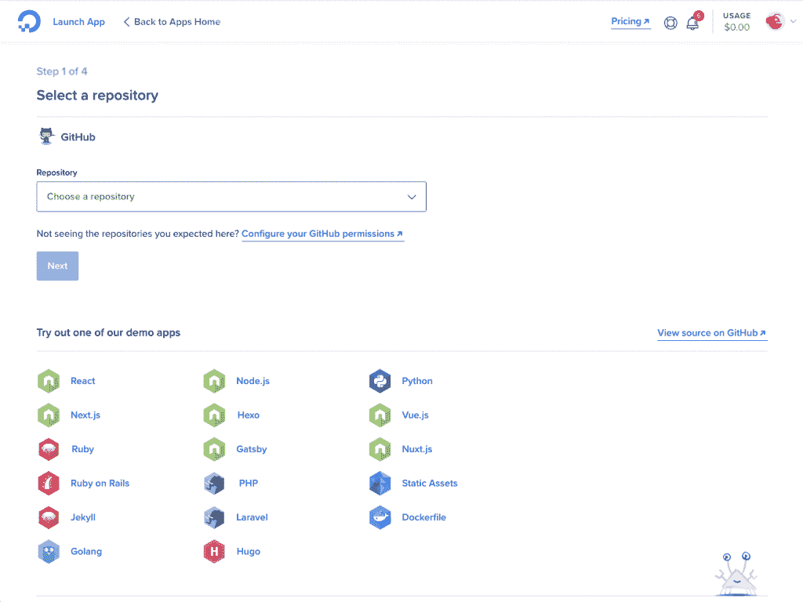

# 数字海洋应用平台简化了开发人员的 Kubernetes 部署

> 原文：<https://thenewstack.io/digitalocean-app-platform-eases-kubernetes-deployments-for-developers/>

在 Kubernetes 上运行的好处可能会被运营 Kubernetes 本身的困难所掩盖。作为回应，近年来许多大型云提供商已经引入了托管 Kubernetes 产品，解决了安装、配置和操作容器编排工具的许多困难。虽然这些托管产品有助于解决一些复杂性，但它们仍然提供了一种专注于 Kubernetes 的观点，而不是运行和管理一个为客户提供价值的应用程序。

2019 年，DigitalOcean [发布了自己的托管 Kubernetes 产品](https://thenewstack.io/digitalocean-opens-up-its-managed-kubernetes-service/)，但现在该公司通过 [DigitalOcean 应用平台](https://www.digitalocean.com/docs/app-platform/)的[发布](https://www.digitalocean.com/blog/introducing-digitalocean-app-platform-reimagining-paas-to-make-it-simpler-for-you-to-build-deploy-and-scale-apps)更进了一步，这是一个基于 Kubernetes 的平台即服务(PaaS)，旨在为希望享受 Kubernetes 好处而无需处理其复杂性的开发人员提供以应用为中心的视图。

“Kubernetes 提供了一个很好的开端，消除了一些常见的基础设施管理，但最终，它仍然是 API，仍然很复杂。人们越来越多地要求在其上建立下一层抽象，这样可以让你更快地迭代，你只需专注于编写代码，然后你想从生态系统中享受的所有这些好处都将为你内置，”DigitalOcean 产品副总裁在接受采访时说。“我们推出了托管 Kubernetes，我们希望在它的基础上提供另一个抽象层，所以我们在共享集群环境中使用我们自己的托管 Kubernetes 产品，我们在 Kubernetes 的基础上使用开放标准进行多租户。”

用于构建应用平台的开放标准之一包括谷歌的 [gVisor](https://github.com/google/gvisor) ，这是一个应用内核，它在应用和主机内核之间提供了一个隔离边界，并允许 DigitalOcean 在共享的 Kubernetes 集群中安全地运行工作负载。另一个，[云本地构建包](https://buildpacks.io/)，最初是在 Heroku 构思的，它帮助将应用程序源代码转换成可以在任何云上运行的映像。第三个， [Kaniko](https://github.com/GoogleContainerTools/kaniko) ，是一个在容器或 Kubernetes 集群中从 docker 文件构建容器映像的工具。

目前，应用平台用户可以指向他们的 GitHub 存储库——git lab 和 Bitbucket 集成正在进行中——该平台采用 Python、Node.js、Go、PHP 或 Ruby 代码，将其构建到容器中，并进行部署。对于列表中没有的语言，App Platform 只需要一个 docker 文件，并使用 Kaniko 来构建和部署容器。

“当您向我们提供您的代码时，我们会获取代码，并在您部署站点之前，在这些集群中免费为您进行构建、打包和构建。所有这些都需要良好的净化，以获得更高的安全性，在 gVisor 和 Cillium 这样的东西上下注可以让我们更快地移动，”Joshi 说。

[https://www.youtube.com/embed/fE0ybwkW9Pw?feature=oembed](https://www.youtube.com/embed/fE0ybwkW9Pw?feature=oembed)

视频

当然，在共享集群上运行工作负载的部分原因与成本有关，这是 Joshi 关注的一点。该公司表示，通过在自己的服务基础上构建应用平台，并控制基础设施本身，它可以在工作负载扩大的情况下保持低成本——其他公司通常不得不增加成本。

Joshi 说:“生态系统的发展使我们能够利用一些开源的业务流程，并使我们具有竞争力，我们可以将在共享集群中以更低的成本运行工作负载所节省的成本回馈给我们的客户。

App Platform 目前分为三层，一层是针对静态网站的免费入门层，两层是针对动态内容的，一层是用于原型开发的基础层，一层是用于部署到生产的专业层。Joshi 在他的介绍性博客文章中详细介绍了许多即将推出的功能，但分别强调了功能即服务和边缘计算是该公司在不久的将来将关注的两个领域，由云原生生态系统中的开放技术提供支持。

“我们希望在开源标准、开源方式的创新浪潮中乘风破浪。最关键的方面是倾听客户。如果我们决定提供功能即服务，这只是一个季度或两个季度的问题，因为有这么多其他开源项目，”Joshi 说。“在这些开放标准上押下这些赌注，基本上使我们能够不与现有的 PaaS 提供商区别对待。这个平台是为未来而构建的。如果我想增加新的服务，如果 Kubernetes 生态系统中出现新的创新，我们只需一两个季度就可以开始将这些优势回馈给客户。这就是它强大的原因。”

<svg xmlns:xlink="http://www.w3.org/1999/xlink" viewBox="0 0 68 31" version="1.1"><title>Group</title> <desc>Created with Sketch.</desc></svg>