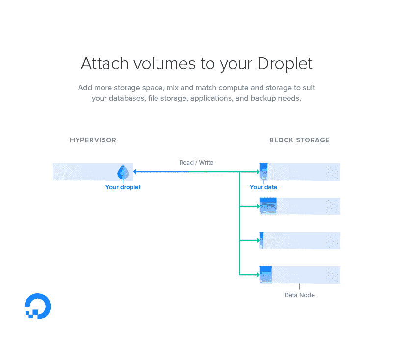

# DigitalOcean 为渴望存储的云用户推出块存储服务

> 原文：<https://thenewstack.io/digitalocean-launches-block-storage-service-storage-hungry-cloud-users/>

为了应对强劲的客户需求， [DigitalOcean](https://www.digitalocean.com/) 正在通过增加新的块存储产品来扩展其云基础设施服务的范围。

[服务](https://www.digitalocean.com/community/tutorials/how-to-use-block-storage-on-digitalocean)将使用固态硬盘(SSD)，每月费用为 0.10 美元/GB，没有额外的数据接收或输出费用。块存储将通过 DigitalOcean droplets 访问，这是基于操作系统的虚拟机，是该公司的核心产品。每个 SSD 卷可以容纳 1GB 到 16TB 的容量。

数字海洋“最初是由个人开发者建立网站和简单的解决方案开始的”， [Julia Austin](https://www.linkedin.com/in/juliaaustin) 说，她[最近以首席技术官的身份加入](https://www.digitalocean.com/company/press/releases/digitalocean-hires-julia-austin-as-cto/)数字海洋，解释这项新产品。“我们现在从我们的客户群中看到的是对产品更复杂的使用 bases 应用程序、完整的应用程序，都有自己的客户群。我们正在解决这个问题，努力为他们提供运营业务所需的一切。”

最初，DigitalOcean 的纽约和旧金山地区将提供这项服务，法兰克福也将很快推出。DigitalOcean droplets 本身可以配备多达 80GB 的固态硬盘存储。附加存储将与液滴分开放置，并且可以由多个液滴访问。

[块存储](http://searchstorage.techtarget.com/definition/block-storage)为用户提供原始存储卷，可以根据用户选择的文件系统进行格式化和分区。它不同于提供文件系统的文件存储，也不同于允许应用程序直接访问数据对象的对象存储。

DigitalOcean 的块存储价格大致与亚马逊网络服务对其固态硬盘风格的弹性块存储的价格一致，尽管 AWS 的价格因使用模式和地区而有很大差异。例如，法兰克福地区的 ESB SSD 存储每月运行 0.119 美元。

就像 AWS 发誓要做的那样，DigitalOcean 承诺降低存储价格，因为底层固态硬盘的成本持续下降。“随着时间的推移，随着硬件变得越来越便宜，我们能够优化我们这边的东西，我们希望将节省的成本回馈给客户，”奥斯汀说。

DigitalOcean 将复制客户的块存储，以确保数据不会因硬件故障而丢失(尽管建议客户也这样做)。所有存储的区块数据都将由 DigitalOcean 加密，尽管用户仍将在本地访问这些数据。

DigitalOcean 的一个热心客户是 [GitLab](https://about.gitlab.com/) 代码托管服务。GitLab 开发人员 [Patricio Cano](https://twitter.com/suprnova32) 在一份声明中表示:“有了块存储，客户现在可以根据他们团队的需求(RAM 和处理器的数量)选择正确的方案，而不必担心有限的磁盘空间。”。

DigitalOcean 是增长最快的云托管公司之一。自 2011 年推出以来，该公司已经积累了超过 70 万名客户，他们共同创造了超过 1800 万个液滴。

DigitalOcean 的新标识也于本周亮相。

数字海洋是新堆栈的赞助商。

特色图片:Cabo 圣卢卡斯，通过 Pixabay。

<svg xmlns:xlink="http://www.w3.org/1999/xlink" viewBox="0 0 68 31" version="1.1"><title>Group</title> <desc>Created with Sketch.</desc></svg>