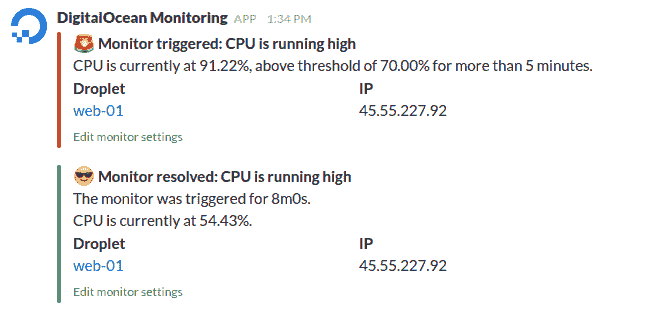

# 数字海洋现在提供液滴监测

> 原文：<https://thenewstack.io/digitalocean-now-provides-droplet-monitoring/>

总部位于纽约的云服务提供商 [DigitalOcean](https://www.digitalocean.com) 推出了一项集成监控服务，该服务为每个液滴(DigitalOcean 的术语，指单个云服务器)提供运行健康和资源利用数据。)

此次发布紧随二月份[发布负载平衡器](https://thenewstack.io/digitalocean-upgrades-load-balancing/)之后，这是实现数字海洋首席技术官 [Julia Austin](https://twitter.com/austinfish) 的承诺的又一步，即扩展数字海洋的功能，使云更易于使用。

DigitalOcean 的联合创始人米奇·怀纳(Mitch Wainer)在一次电话采访中说，所有的标准监控功能都提供了。“它让开发人员能够更好地了解他们的基础设施，从而做出更好的决策来优化他们的应用。”

开发人员可以监控入站和出站带宽，收集指标并按百分比设置特定阈值(例如，如果您的 CPU 使用率超过 70%，就会生成警报)。警报可以通过电子邮件或 Slack 发送，这取决于开发人员的偏好。

如果这一切听起来很熟悉，确实如此。Wainer 承认，功能上没有什么新的东西。这是为了让他们的客户远离外部监控服务，如 [DataDog](https://www.datadoghq.com) 或 [NewRelic](https://newrelic.com) 。不同的是，该服务被集成到一个易于查看的界面中的每个 Droplet 中，不需要任何配置。

而且是免费的。

## 入门指南

在启动新的数字海洋云服务器的同时增加监控是一件轻而易举的事情，除了通过几个复选框之外，不需要任何配置。可以通过他们的控制面板或 API 进行监控。根据 Wainer 的说法，这种方法使用和安装都很简单。

已经有水滴了还想加监控？还是设置 Droplet 时没有配置？没问题:一个开放源码的图形代理可以监控一个现有的微滴。

只需添加一行 curl 代码。不是认真的。一行。在这里:

```
curl  -sSL https://agent.digitalocean.com/install.sh | sh

```

注意:完整的说明在这里。

## 让它变得简单

“这一切都是为了简化工具集来管理、监控和配置他们的环境，”Wainer 说。

他说，DigitalOcean 正在重新定义云空间，让设置变得更容易、更简单。该公司的核心是开发人员的忠诚度。他说，数字海洋是为开发者而非企业设计的。



数字海洋监测

这是一个关键的区别，他解释说。“作为一名开发人员，您希望热爱您所使用的工具。我们希望向开发人员提供这种体验，因为这是我们长期的制胜之道。”

Wainer 解释说，在过去，增长大多是自下而上的。开发人员在家里使用 Droplets，然后在公司开始需要云解决方案时带着 DigitalOcean 去工作。

DigitalOcean 现在每天有超过 50，000 个团队使用他们的产品。他说，简单的设置节省了时间，使企业能够更快地行动。

## 下一步是什么？

多亏了奥斯汀，该公司继续其积极的路线图。“她在帮助我们提高水平，”温纳说。他说，有很多产品正在开发中，其中很多都专注于能够轻松扩展，并在数字海洋的基础上使用分布式服务。到今年年底，该产品将更加强大，能够支持更大的生产工作负载。

接下来:扩展的安全功能。

“我们将继续通过简化基础设施的复杂性来建立一个(开发者)喜欢的平台，”Wainer 说。“我们不断迭代和发展我们的平台，以支持更大的应用。”

<svg xmlns:xlink="http://www.w3.org/1999/xlink" viewBox="0 0 68 31" version="1.1"><title>Group</title> <desc>Created with Sketch.</desc></svg>