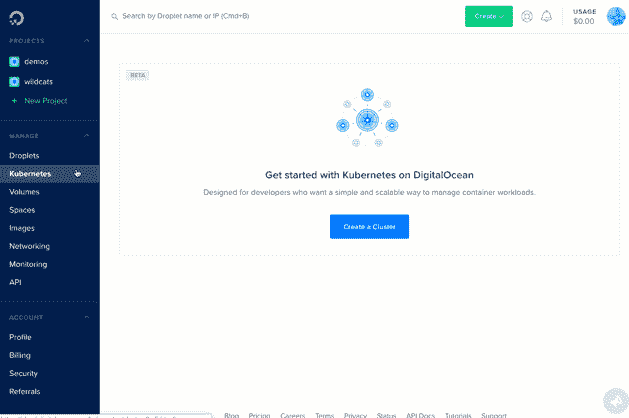

# 数字海洋开放其托管的 Kubernetes 服务

> 原文：<https://thenewstack.io/digitalocean-opens-up-its-managed-kubernetes-service/>

开发人员不想把所有的时间都花在解决基础设施问题上，他们想尽可能简单快捷地编写代码并运行起来。这是由 [DigitalOcean](http://www.digitalocean.com/) 推出的新托管 Kubernetes 服务背后的想法，该云服务自称是“开发者和团队最简单的云平台”

这项服务于本周在华盛顿州西雅图举行的[kube con+CloudNativeCon 2018](https://events.linuxfoundation.org/events/kubecon-cloudnativecon-north-america-2018/schedule/)大会上推出。

虽然已经有几个成熟的托管 Kubernetes 服务，如谷歌 Kubernetes 引擎(GKE)和微软 Azure Kubernetes 服务(AKS)，但 DigitalOcean 的集成了它的其他服务，提供一年 365 天的全面支持，并作为一种产品提供给它已经蓬勃发展的社区。

在 5 月份首次提供对其 Kubernetes 即服务产品的早期访问后，近 3 万名开发人员已经注册了早期访问，该公司现在表示，从今天开始，“全球所有开发人员”都可以使用它。尽管该公司拒绝声称“全面上市”，因为它说一些关键功能尚未实现，但它在一份声明中表示，该产品“生产就绪，并得到全面支持。”

根据数字海洋产品副总裁 [Shiven Ramji](https://www.linkedin.com/in/shivenramji) 的说法，正式的 GA 版本可能会在明年第一季度的某个时候发布。

“它不是 GA 版本的唯一原因只是因为我们有一些正在构建的附加功能，它们将变得非常重要，”Ramji 说。“我们仍在努力提供一个私有注册表组件，并希望将其与我们的私有网络功能、更新集群的能力以及一些其他安全功能相集成。”

尽管如此，这一最新版本建立在第一版的基础上，该公司表示，“专注于简化开发人员在部署 Kubernetes 容器化应用程序时最关键的需求。”这些功能包括“节点配置、持久存储可用性、安全性和可扩展性”，以及实施持续集成和持续交付(CI/CD)工作流的能力。在听取了早期用户的意见后，DigitalOcean 表示，该产品现在提供了有指导的配置体验，以帮助供应、配置和部署，开放 API 以简化开发人员工具集成和编程集群和节点管理，以及扩展的版本支持。

具体来说，Ramji 表示，该公司打算支持 Kubernetes 的三个最新稳定版本，对最新版本的支持将在发布后的一两个月内到来。在 alpha 和 beta 功能支持方面，Ramji 表示，他们希望随着时间的推移开放对 beta 功能的支持，但 alpha 功能尚未确定。

在描述 DigitalOcean 时，Ramji 强调该公司不是专注于提供每一种功能和可能性，而是那些最常用和最需要的功能和可能性，似乎其管理的 Kubernetes 产品将遵循类似的道路。

Ramji 说:“与其他云提供商不同，我们一直保持我们的产品分类相当简单，并限制我们提供的产品数量。“我们不需要开发人员有五种不同的方式来部署 Node.js 应用程序，而是支持两种最流行的方式。”

至于下一步，Ramji 说，该项目旨在始终支持 Kubernetes 的开箱即用能力，但也计划在明年的某个时候提供可观测性功能。他说，所有用户都将获得一些基本的定制监控，并有能力升级以获得更详细的指标。同样可能在明年，该公司计划提供与其他 CNCF 工具集成的能力，如 Prometheus。

除了所有这些新功能，该公司表示，它正在 KubeCon 上发布其他几项公告，包括最近成为 [Kubernetes 认证服务提供商](https://www.cncf.io/certification/kcsp/)的成就，提供数字海洋 API，该 API 还提供完整的 Kubernetes 支持，允许用户连接基础设施供应工作流，以及 [Terraform](https://www.terraform.io/) 集成。

云计算原生计算基金会是新堆栈的赞助商。

通过 Pixabay 的特征图像。

<svg xmlns:xlink="http://www.w3.org/1999/xlink" viewBox="0 0 68 31" version="1.1"><title>Group</title> <desc>Created with Sketch.</desc></svg>